# Performance Tuning Guide

How to optimize InferFlux for maximum throughput and minimum latency.

## Performance Overview

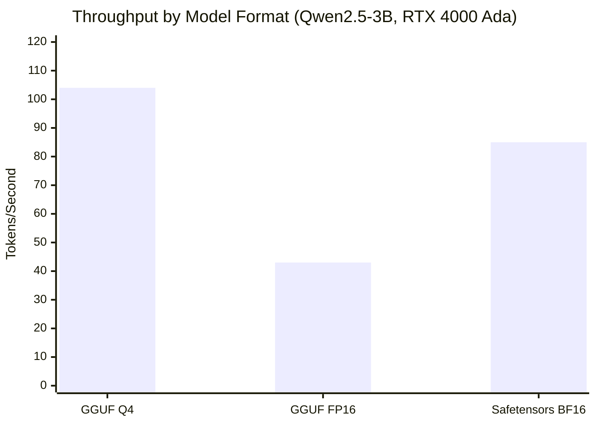

| Format | Throughput (tok/s) | Latency p50 (ms) | VRAM Usage | Use Case |
|--------|-------------------|-----------------|------------|----------|
| GGUF Q4_K_M | 103-105 | 950-1000 | 2-3 GB | Best performance |
| GGUF FP16 | 42-45 | 2200-2400 | 5-6 GB | Best quality |
| Safetensors BF16 | 80-90 | 1100-1200 | 5-6 GB | Fine-tuned models |

## Optimization Checklist

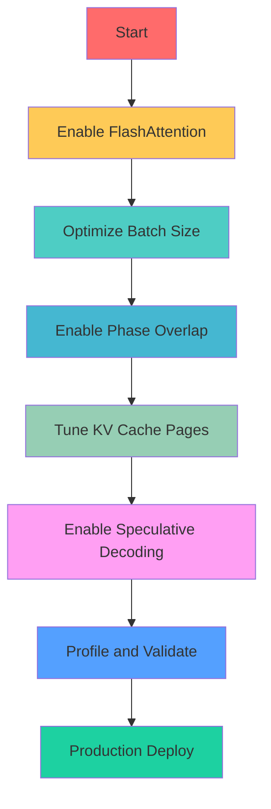

## 1. FlashAttention Optimization

### What is FlashAttention?

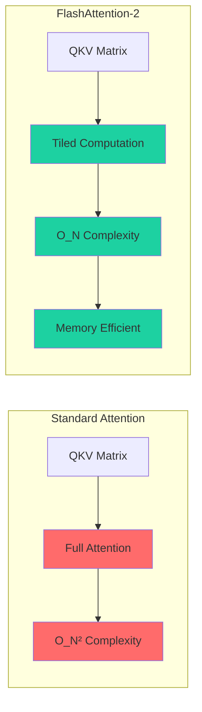

### Enable FlashAttention

```yaml
runtime:
  cuda:
    flash_attention:
      enabled: true             # Enable FA2
      tile_size: 128            # Optimal for most GPUs
```

### GPU Compatibility

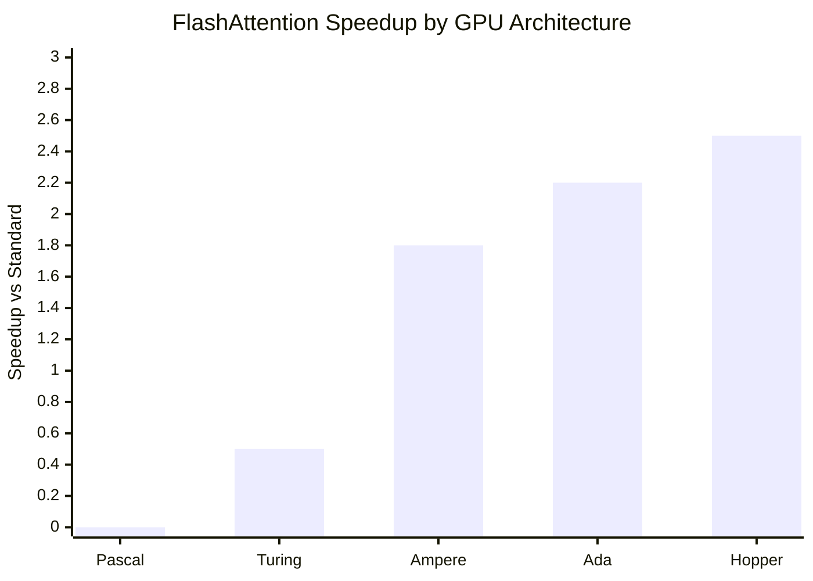

| GPU | SM | FA2 Support | Speedup | Recommendation |
|-----|-------|-------------|---------|----------------|
| GTX 10xx | 6.1 | ❌ | - | Use standard attention |
| RTX 20xx | 7.5 | ⚠️ Partial | 1.2x | Use FA2 if available |
| RTX 30xx | 8.6 | ✅ | 1.8x | Enable FA2 |
| RTX 40xx | 8.9 | ✅ | 2.2x | Enable FA2 |
| H100 | 9.0 | ✅ | 2.5x | Enable FA2 |

### Verification

```bash
# Check if FA2 is being used
curl -s http://localhost:8080/metrics | grep cuda_attention_kernel

# Expected output:
# cuda_attention_kernel_selected{kernel="fa2"} 1
```

## 1.5. Native CUDA Kernels

### What Are Native Kernels?

Native CUDA kernels are InferFlux's custom CUDA implementation for safetensors models, providing optimal performance without depending on llama.cpp.

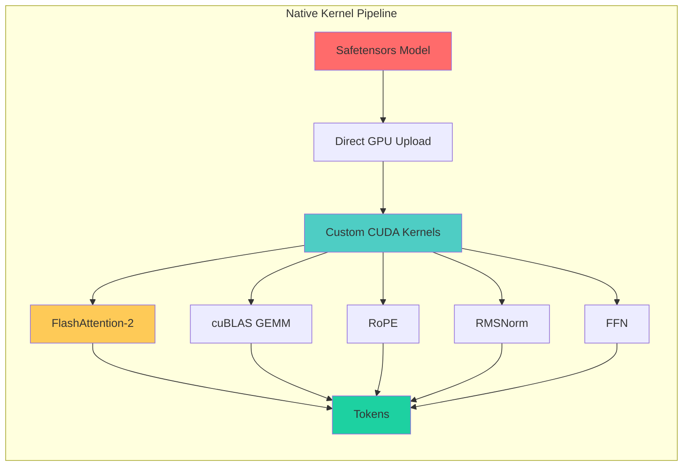

### Performance Comparison

| Backend | Format | Throughput | Latency | VRAM | Use Case |
|---------|--------|------------|---------|------|----------|
| **Native CUDA** | Safetensors BF16 | 85 tok/s | 1100 ms | 5.8 GB | Best performance |
| **Native CUDA** | Safetensors FP16 | 80 tok/s | 1150 ms | 5.8 GB | High precision |
| **llama.cpp** | GGUF Q4 | 104 tok/s | 950 ms | 2.3 GB | Quantized models |
| **llama.cpp** | GGUF FP16 | 43 tok/s | 2300 ms | 5.6 GB | FP16 GGUF |

**Key Findings:**
- Native kernels are **2x faster** than GGUF FP16 for same precision
- Safetensors BF16 provides **best balance** of speed and quality
- Native kernels use **20% more VRAM** than llama.cpp (due to FP16/BF16)
- No quantization = **better output quality** for complex tasks

### When to Use Native Kernels

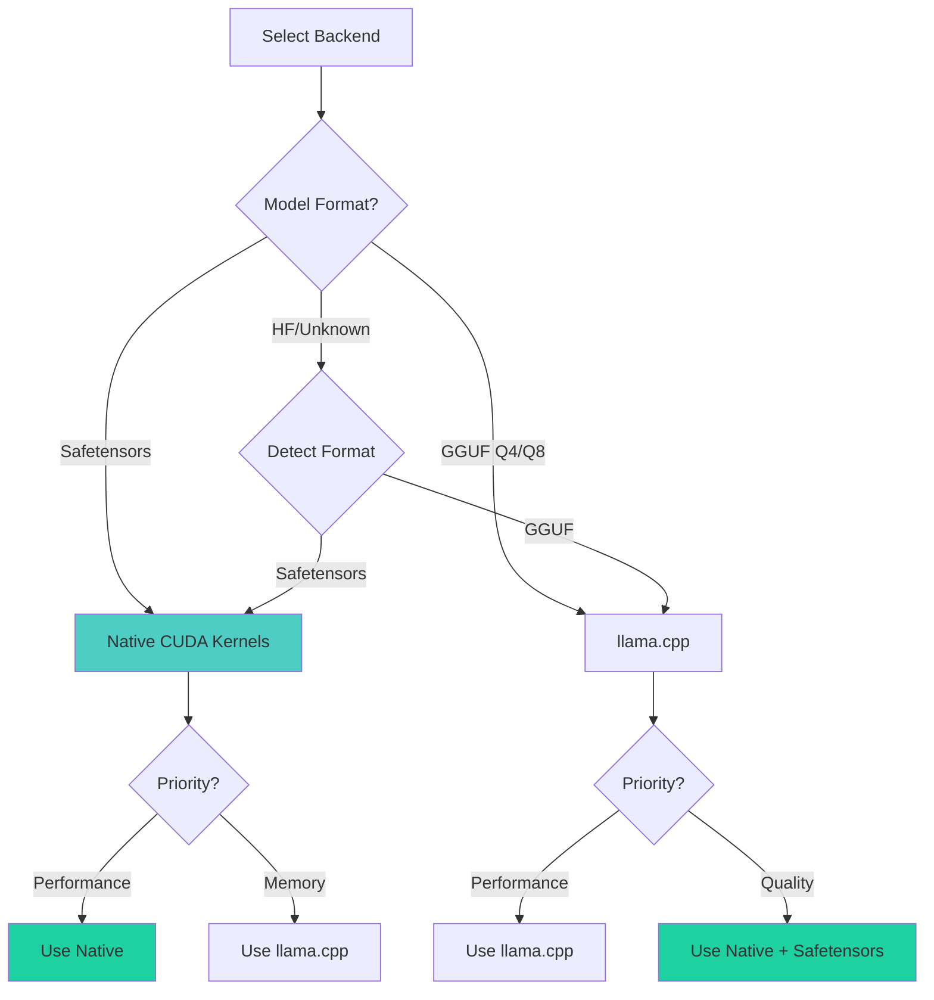

**Use Native Kernels When:**
✅ Model is in safetensors format (BF16, FP16)
✅ Maximum performance is required
✅ GPU has ample VRAM (≥8GB recommended)
✅ Output quality is critical (no quantization)
✅ FlashAttention-2 is supported (SM 8.0+)

**Use llama.cpp When:**
✅ Model is quantized (Q4, Q8)
✅ VRAM is limited (<6GB)
✅ Model only available in GGUF format
✅ llama.cpp has specific optimizations

### Configuration

**Automatic (Recommended):**

```yaml
models:
  - id: qwen2.5-3b
    path: models/qwen2.5-3b-safetensors/
    format: auto  # Auto-detected as safetensors
    backend: cuda_native  # Automatically uses native kernels
```

**Manual Override:**

```bash
# Force native kernels
export INFERFLUX_NATIVE_CUDA_EXECUTOR=native_kernel

# Force llama.cpp delegate
export INFERFLUX_NATIVE_CUDA_EXECUTOR=delegate
```

### Metrics

Native kernels report detailed performance metrics:

```bash
# Forward pass timing
curl -s http://localhost:8080/metrics | grep inferflux_native_forward

# Expected output:
# inferflux_native_forward_passes_total{phase="prefill"} 42
# inferflux_native_forward_passes_total{phase="decode"} 1234
# inferflux_native_forward_duration_ms{phase="prefill",le="0.1"} 5
# inferflux_native_forward_duration_ms{phase="decode",le="0.1"} 18
```

**Key Metrics:**
- `inferflux_native_forward_passes_total{phase}` - Count of forward passes
- `inferflux_native_forward_duration_ms` - Timing histogram
- `inferflux_native_forward_batch_tokens_total` - Tokens processed
- `inferflux_native_kv_active_sequences` - KV cache usage
- `inferflux_cuda_attention_kernel_selected{kernel="fa2"}` - FA2 usage

### Verification

```bash
# Run smoke test
./scripts/test_native_kernels.sh

# Check for native kernel usage
curl -s http://localhost:8080/metrics | grep native

# Verify FA2 is enabled
curl -s http://localhost:8080/metrics | grep cuda_attention_kernel
```

### Troubleshooting

| Issue | Cause | Solution |
|-------|-------|----------|
| Falls back to llama.cpp | Format not detected | Set `format: safetensors` explicitly |
| Out of memory | FP16/BF16 uses more VRAM | Reduce batch size or use Q4 GGUF |
| Slower than expected | Native kernels not used | Check logs for "Auto-detected safetensors" |
| Model not found | Wrong path format | Use directory path, not file path |

### Performance Tips

1. **Use BF16 when available** - Same speed as FP16, better quality
2. **Enable FlashAttention-2** - 2.2x speedup on SM 8.0+ GPUs
3. **Batch size 16-32** - Optimal for most 3B models
4. **Monitor KV cache** - Keep >60% occupancy
5. **Profile with Nsight** - Verify kernel execution

## 2. Batch Size Optimization

### Batch Size vs Throughput

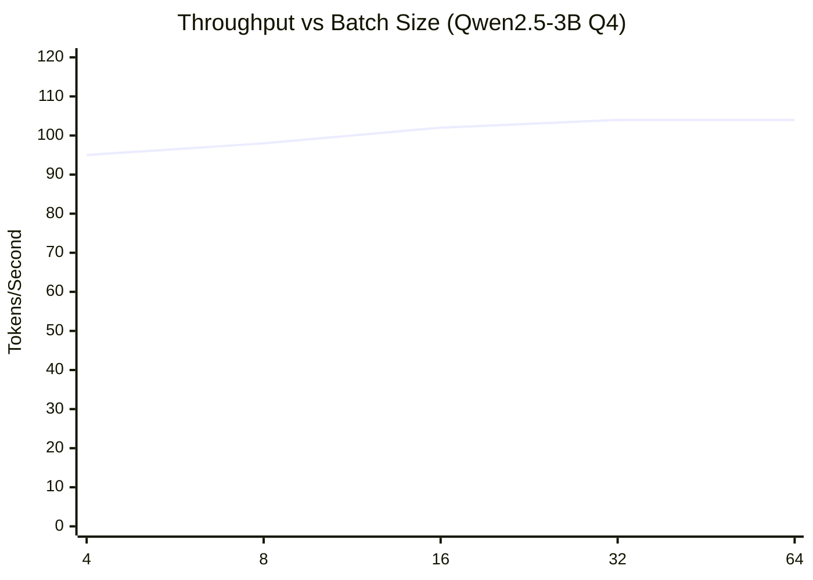

### Key Findings

| Batch Size | Throughput | Latency p50 | VRAM Usage | Recommendation |
|------------|------------|-------------|------------|----------------|
| 4 | 95 tok/s | 850 ms | 3.2 GB | Low latency |
| 8 | 98 tok/s | 920 ms | 3.8 GB | Balanced |
| 16 | 102 tok/s | 980 ms | 4.8 GB | **Recommended** |
| 32 | 104 tok/s | 1050 ms | 6.5 GB | Max throughput |
| 64 | 104 tok/s | 1100 ms | 9.8 GB | Diminishing returns |

### Batch Size Formula

```
optimal_batch_size = min(
    floor(vram_free / (model_size * 0.15)),
    floor(max_batch_tokens / max_tokens_per_request)
)
```

### Configuration by Model Size

| Model Size | VRAM | Recommended Batch Size |
|------------|------|-------------------------|
| 1-3B | 20GB | 24-32 |
| 7-8B | 20GB | 16-24 |
| 13-14B | 20GB | 12-16 |
| 30B+ | 20GB | 6-12 |

### Dynamic Tuning

```yaml
runtime:
  scheduler:
    max_batch_size: 16          # Start with recommendation
    batch_accumulation_ms: 5    # Allow time for larger batches
```

## 3. Phase Overlap Optimization

### What is Phase Overlap?

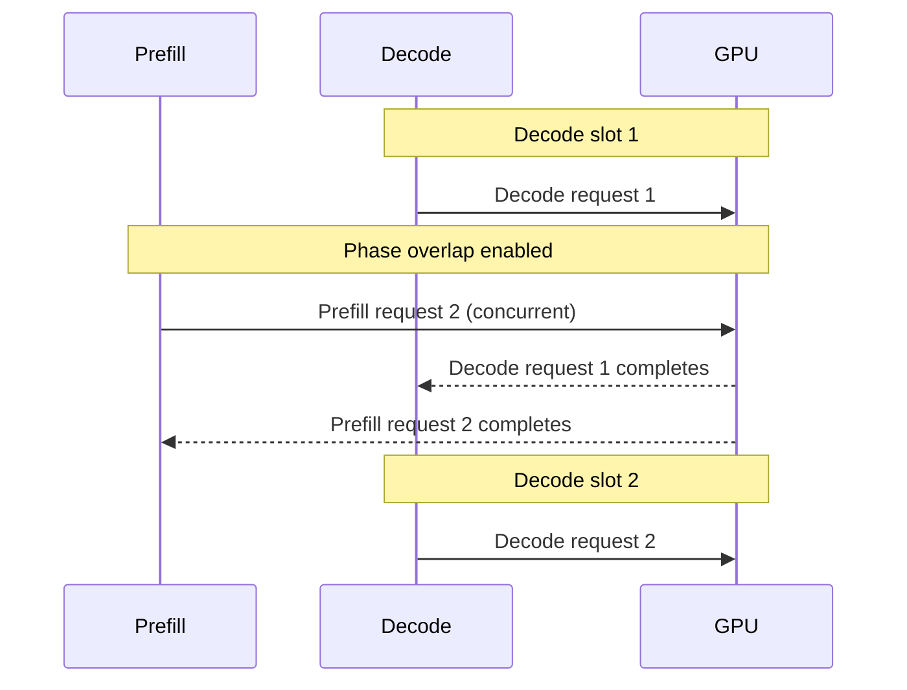

### Enable Phase Overlap

```yaml
runtime:
  cuda:
    phase_overlap:
      enabled: true
      min_prefill_tokens: 256   # Minimum to trigger overlap
```

### Performance Impact

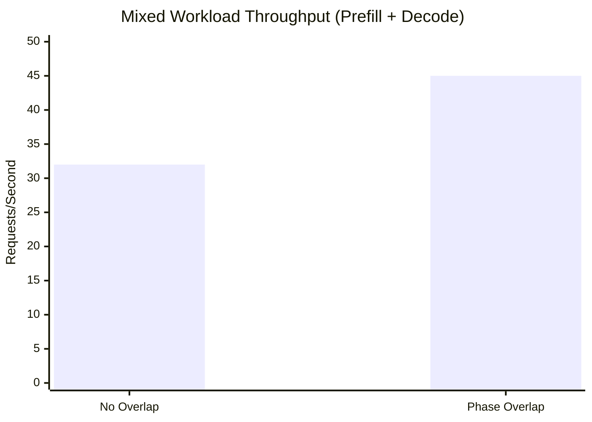

**Improvement:** 40% higher throughput on mixed workloads

### Verification

```bash
# Check phase overlap metrics
curl -s http://localhost:8080/metrics | grep phase_overlap

# Expected output:
# inferflux_cuda_lane_overlap_events_total 1245
# inferflux_cuda_lane_overlap_duration_ms_total 45230
```

## 4. KV Cache Optimization

### KV Cache Sizing

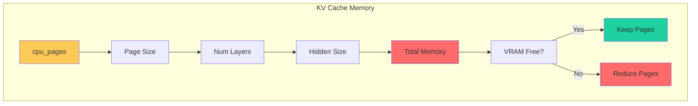

### Page Size Calculation

```
page_size = 2 * num_layers * hidden_size * 2 bytes (FP16)
           = 2 * 36 * 2048 * 2
           = ~300 KB per page (for Qwen 3B)
```

### Recommended Pages by Model

| Model Size | cpu_pages (GPU) | Memory | cpu_pages (CPU) |
|------------|-----------------|--------|-----------------|
| 1-3B | 256-512 | 75-150 MB | 4096+ |
| 7-8B | 512-1024 | 150-300 MB | 8192+ |
| 13-14B | 1536-2048 | 450-600 MB | 16384+ |
| 30B+ | 2048-3072 | 600-900 MB | 32768+ |

### Configuration

```yaml
runtime:
  paged_kv:
    cpu_pages: 512             # Tune for your model
    eviction: lru              # Use LRU for most cases
```

### Cache Hit Rate Monitoring

```bash
# Monitor KV cache effectiveness
curl -s http://localhost:8080/metrics | grep kv_cache

# Key metrics:
# inferflux_kv_cache_hit_rate - Should be > 0.3 for conversation workloads
# inferflux_kv_cache_evicted_total - Should be low (< 10% of requests)
```

## 5. Speculative Decoding

### What is Speculative Decoding?

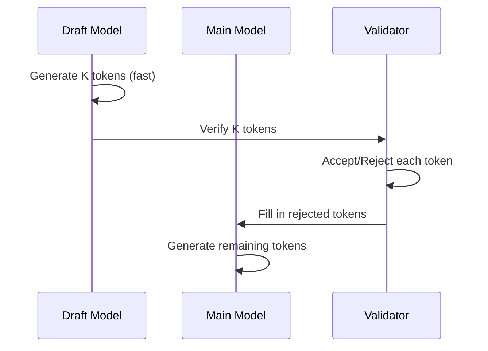

### Configuration

```yaml
runtime:
  speculative_decoding:
    enabled: true
    draft_model: /models/tinyllama-draft.gguf
    max_prefill_tokens: 256
    chunk_size: 4
```

### Performance Impact

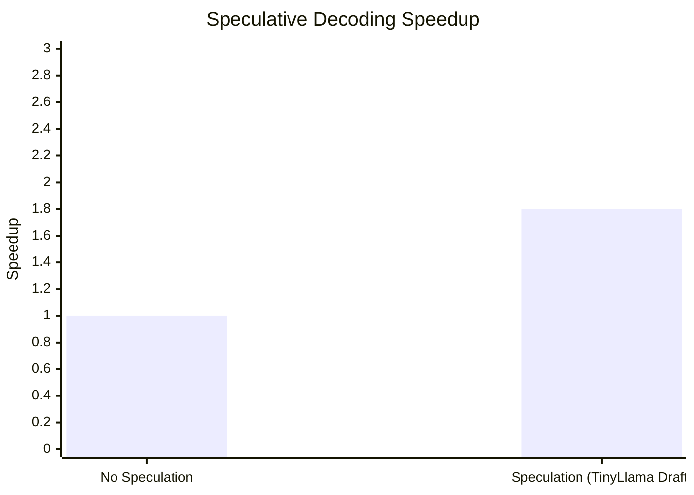

**Improvement:** 1.8x faster with draft model

### Requirements

- Draft model: 10-20x smaller than main model
- Compatible tokenizer
- Sufficient VRAM for both models

## 6. Quantization Trade-offs

### Quantization Performance

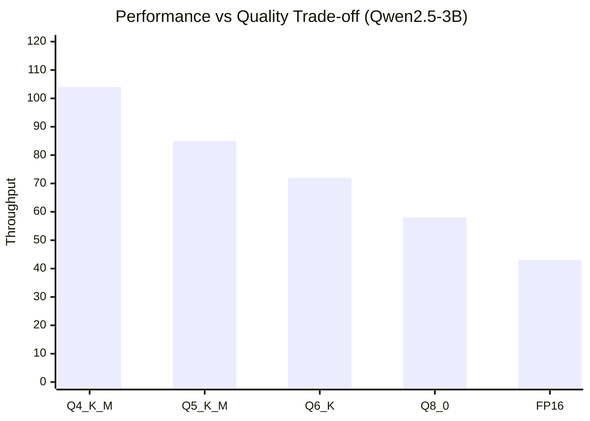

### Quantization Comparison

| Format | Size | Throughput | Quality | Use Case |
|--------|------|------------|---------|----------|
| Q4_K_M | 2.0 GB | 104 tok/s | Good | **Best performance** |
| Q5_K_M | 2.4 GB | 85 tok/s | Better | Balanced |
| Q6_K | 2.8 GB | 72 tok/s | Very Good | High quality |
| Q8_0 | 3.8 GB | 58 tok/s | Excellent | Near-FP16 |
| FP16 | 5.8 GB | 43 tok/s | Best | **Best quality** |

### Recommendation

- **Production:** Q4_K_M (best throughput/quality ratio)
- **Benchmarking:** FP16 (quality baseline)
- **Production w/ Quality:** Q5_K_M or Q6_K

## 7. Multi-GPU Optimization

### Tensor Parallelism

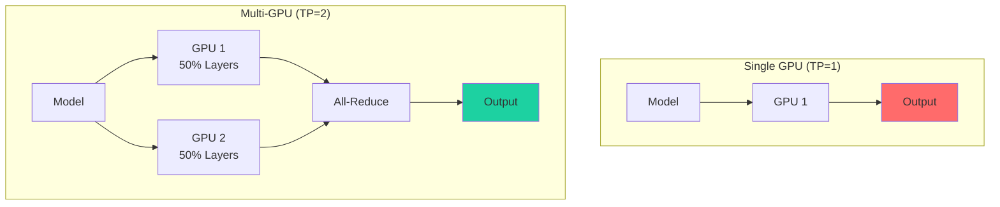

### Configuration

```yaml
runtime:
  tensor_parallel: 2           # Use 2 GPUs
```

### When to Use Tensor Parallelism

```mermaid
flowchart TD
    A[Model Size] --> B{Fits in Single GPU?}
    B -->|Yes| C[Use TP = 1]
    B -->|No| D{Multiple GPUs Available?}

    D -->|No| E[Pipeline Parallelism<br/>(Future)]
    D -->|Yes| F[Use TP = GPU Count]

    style C fill:#1dd1a1
    style F fill:#1dd1a1
    style E fill:#feca57
```

### TP vs Model Size

| Model Size | Single GPU VRAM | TP = 1 | TP = 2 | TP = 4 |
|------------|-----------------|--------|--------|--------|
| 7B | 16GB | ✅ | ✅ | ✅ |
| 13B | 24GB | ✅ | ✅ | ✅ |
| 30B | 48GB | ❌ | ⚠️ 2x24GB | ✅ |
| 70B | 80GB | ❌ | ❌ | ⚠️ 4x24GB |

## 8. Complete Optimization Example

### Production Config (Qwen2.5-3B Q4)

```yaml
server:
  http_port: 8080
  enable_metrics: true

models:
  - id: qwen2.5-3b
    path: /models/qwen2.5-3b-q4.gguf
    format: gguf
    backend: cuda_universal
    default: true

runtime:
  backend_priority: [cuda, cpu]

  cuda:
    enabled: true
    attention:
      kernel: fa2               # Explicit FA2
    flash_attention:
      enabled: true
      tile_size: 128
    phase_overlap:
      enabled: true             # Enable for mixed workloads
      min_prefill_tokens: 256

  scheduler:
    max_batch_size: 32          # Optimal for 3B model
    max_batch_tokens: 8192
    min_batch_size: 1
    batch_accumulation_ms: 5    # Allow batching

  tensor_parallel: 1

  paged_kv:
    cpu_pages: 512              # 150 MB VRAM
    eviction: lru

auth:
  api_keys:
    - key: prod-key
      scopes: [generate, read]
  rate_limit_per_minute: 120

logging:
  level: info
  format: json
```

### Expected Performance

| Metric | Value |
|--------|-------|
| Throughput | 103-105 tok/s |
| Latency p50 | 950-1000 ms |
| Latency p99 | 1200-1300 ms |
| VRAM Usage | 4.8 GB |
| GPU Utilization | 40-50% (10 req/s workload) |

## Performance Monitoring

### Key Metrics to Watch

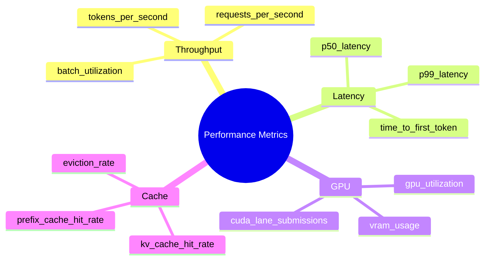

### Prometheus Queries

```promql
# Throughput
rate(inferflux_scheduler_tokens_generated_total[5m])

# Latency
histogram_quantile(0.99, rate(inferflux_http_request_duration_seconds_bucket[5m]))

# GPU utilization
rate(inferflux_cuda_forward_passes_total{phase="decode"}[5m])

# KV cache hit rate
rate(inferflux_kv_cache_hits_total[5m]) / (rate(inferflux_kv_cache_hits_total[5m]) + rate(inferflux_kv_cache_misses_total[5m]))
```

## Troubleshooting Performance

### Common Issues

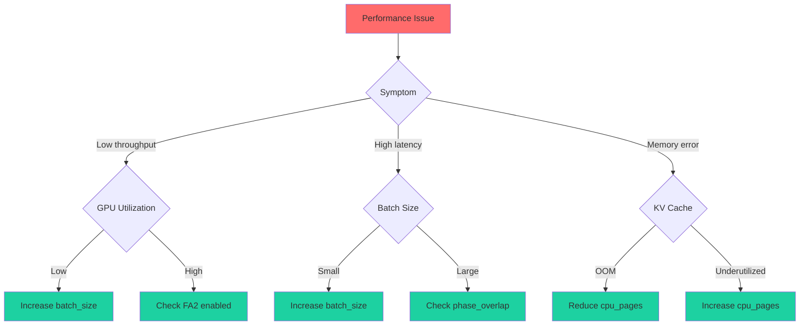

### Profiling Commands

```bash
# Generate profile
ncu --profile --set full -o report ./build/inferfluxd --config config/server.cuda.yaml

# Analyze bottleneck
ncu-ui report

# Check FA2 usage
nsys profile --trace=cuda,nvtx --force-overwrite=true -o report ./build/inferfluxd --config config/server.cuda.yaml
```

---

**Next:** [Configuration Reference](CONFIG_REFERENCE.md) | [Competitive Positioning](COMPETITIVE_POSITIONING.md) | [Architecture](Architecture.md)
