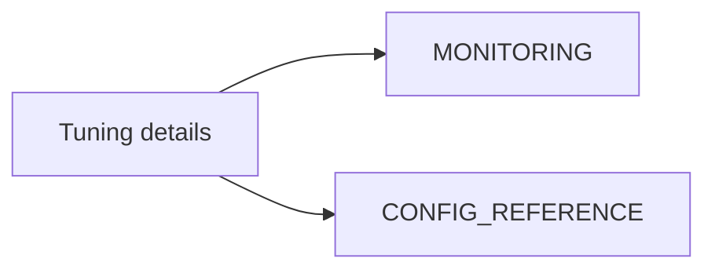

# Performance Tuning (Consolidated)

**Status:** Consolidated

## Canonical Source Map

| Need | Source of truth |
|---|---|
| Runtime tuning workflow | [MONITORING](MONITORING.md) |
| Config knobs and ranges | [CONFIG_REFERENCE](CONFIG_REFERENCE.md) |
| Startup recommendations | [STARTUP_ADVISOR](STARTUP_ADVISOR.md) |
| Benchmark / native burst workflow | [benchmark_multi_backend_steps](benchmark_multi_backend_steps.md) |

## Archived Full Guide

- [PERFORMANCE_TUNING_2026_03_05](archive/evidence/PERFORMANCE_TUNING_2026_03_05.md)
