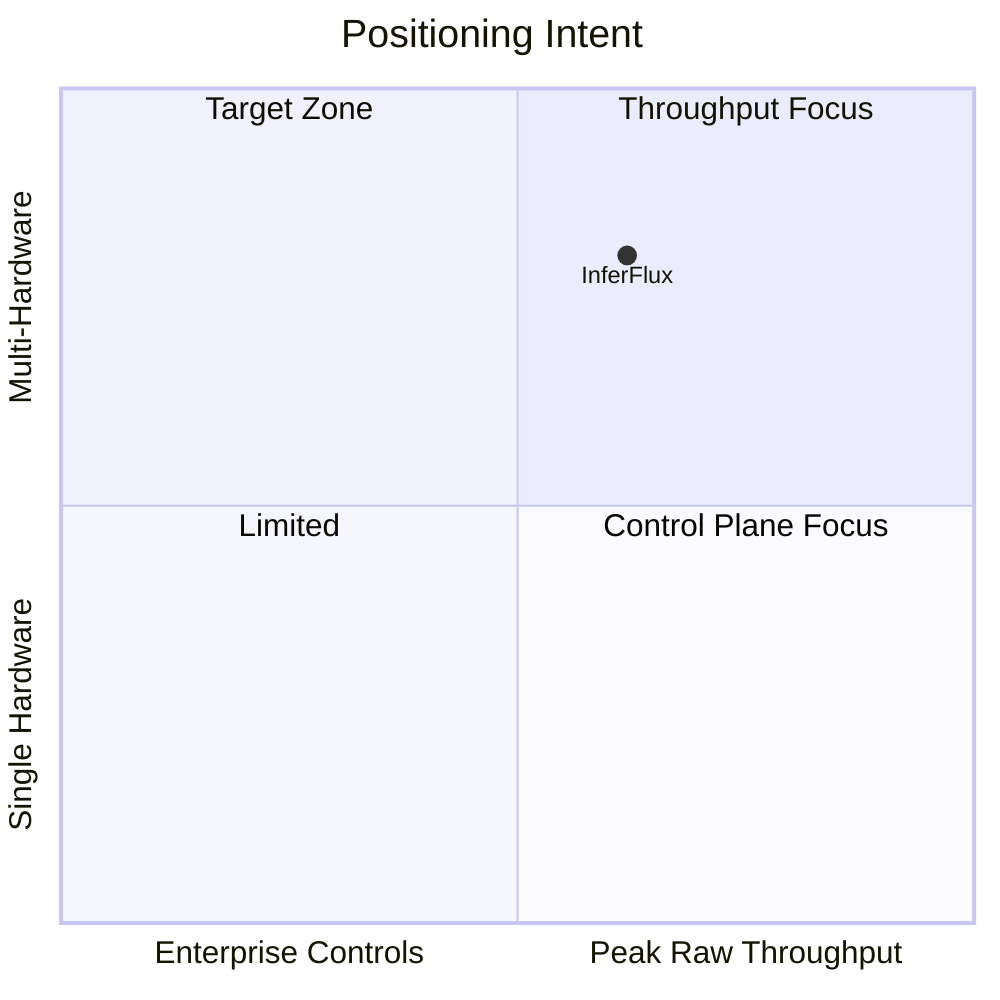

# Product Requirements (Canonical OSS)

**Status:** Canonical  
**Snapshot date:** March 5, 2026

## 1) Product Contract

| Dimension | Requirement |
|---|---|
| Product category | Enterprise-ready inference server with OpenAI-compatible API |
| Primary value | One control plane across CPU/CUDA/ROCm/MPS paths |
| Core differentiator | Security + policy + observability integrated with serving path |
| Primary interfaces | `inferfluxd` HTTP API and `inferctl` CLI |
| Deployment intent | local dev, single-node GPU, Kubernetes |

## 2) Personas and KPI Targets

| Persona | Job-to-be-done | KPI target |
|---|---|---|
| OSS builder | Run first chat/completion quickly | time-to-first-response < 5 min from Quickstart |
| Platform engineer | Operate reliable inference tier | readiness/health contract + auditability enabled |
| Agent developer | Depend on structured output/tool paths | schema/tool contract pass rate >= 99% in integration gates |
| Enterprise operator | Enforce access + governance | scoped auth + policy + audit paths enabled by default |

## 3) Functional Scope (Must Have)

| Area | Requirement |
|---|---|
| Public API | `/v1/completions`, `/v1/chat/completions`, `/v1/models`, `/v1/models/{id}`, `/v1/embeddings` |
| Admin API | `/v1/admin/models`, `/v1/admin/models/default`, `/v1/admin/routing`, `/v1/admin/cache`, `/v1/admin/api_keys`, `/v1/admin/guardrails`, `/v1/admin/rate_limit` |
| Health/ops | `/livez`, `/readyz`, `/healthz`, `/metrics` |
| Runtime | phase-aware scheduling, capability routing, prefix/KV reuse, model lifecycle |
| Security | API key auth, scope checks (`generate/read/admin`), optional OIDC, audit logging |
| CLI | `inferctl` parity for user + admin contracts |

## 4) Non-Functional Gates (Release Quality)

| Gate | Requirement |
|---|---|
| Performance | batching/throughput guardrails must pass configured gate thresholds |
| Reliability | no-backend and capability failures are explicit and deterministic |
| Security | keys/scopes/policy/audit paths tested for expected failure behavior |
| Observability | Prometheus metrics available for scheduler, backend, and API health |
| Compatibility | OpenAI-style request/response contract preserved for core endpoints |

## 5) Competitive Intent (Execution Lens)

| Area | Current posture | Target posture |
|---|---|---|
| Throughput | improving; native GPU maturity in progress | close sustained gap with GPU batching + KV reuse |
| Hardware coverage | strong baseline | maintain parity across CUDA/ROCm/MPS/CPU |
| Enterprise controls | strong | keep lead with strict contracts |
| CI contract enforcement | moderate-to-strong | mandatory GPU behavioral gate |

## 6) Delivery Phases

| Phase | Outcome | Primary references |
|---|---|---|
| Foundation | API/admin/CLI contracts hardened | [API Surface](API_SURFACE.md), [Developer Guide](DeveloperGuide.md) |
| Throughput core | GPU batching + KV efficiency + native policy correctness | [Roadmap](Roadmap.md), [TechDebt](TechDebt_and_Competitive_Roadmap.md), `docs/issues/P0-*` |
| Enterprise runtime | distributed failure contracts + operations maturity | [Admin Guide](AdminGuide.md), [Architecture](Architecture.md) |

## 7) Out of Scope

| Not included | Reason |
|---|---|
| Training/fine-tuning pipelines | serving platform focus |
| Custom frontend product | API/CLI-first OSS scope |
| Proprietary kernel stack rewrite | leverage existing backend foundations first |

## 8) Consolidation Notes

The previous long-form narratives are preserved as evidence snapshots:

- [VISION_2026_03_05](archive/evidence/VISION_2026_03_05.md)
- [COMPETITIVE_POSITIONING_2026_03_05](archive/evidence/COMPETITIVE_POSITIONING_2026_03_05.md)
- [NFR_2026_03_05](archive/evidence/NFR_2026_03_05.md)

Canonical sources for active planning:

- [Roadmap](Roadmap.md)
- [TechDebt and Competitive Roadmap](TechDebt_and_Competitive_Roadmap.md)
- [INDEX](INDEX.md)
