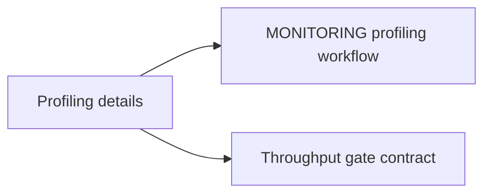

# Profiling Operations Guide (Consolidated)

**Status:** Consolidated

## Canonical Source Map

| Need | Source of truth |
|---|---|
| End-to-end profiling workflow | [MONITORING](MONITORING.md) |
| Throughput gate procedure | [Developer Guide](DeveloperGuide.md) |
| Release-quality validation | [ReleaseProcess](ReleaseProcess.md) |

## Archived Full Guide

- [PROFILING_OPERATIONS_GUIDE_2026_03_05](archive/evidence/PROFILING_OPERATIONS_GUIDE_2026_03_05.md)
