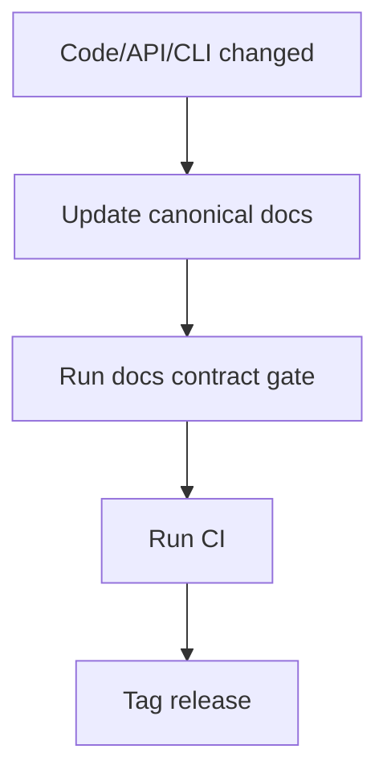

# Release Process (Canonical OSS)

**Status:** Canonical

## 1) Trigger Contract

| Trigger | Workflow path | Output |
|---|---|---|
| `CI` success on `main` | `release.yml` via `workflow_run` | pre-release artifacts (Linux/macOS/Windows + manifests) |
| `CI` success on `v*.*.*` tag | same packaging jobs + release job | GitHub Release with installers + manifests |

## 2) Artifact Contract

| Platform | Artifacts |
|---|---|
| Linux | `inferflux-<version>-Linux.tar.gz`, `.deb`, `.rpm` |
| macOS | `inferflux-<version>-Darwin.tar.gz`, `.pkg`, `.dmg` |
| Windows | `inferflux-<version>-win64.msi`, `.zip` |
| Package metadata | `homebrew/inferflux.rb`, `winget/inferencial.inferflux.yaml` |

## 3) Promotion Runbook

1. Merge to `main` and wait for green `CI`.
2. Confirm pre-release packaging completed from `release.yml`.
3. Smoke-test installers from artifacts.
4. Tag the tested commit: `git tag vX.Y.Z && git push origin vX.Y.Z`.
5. Confirm tagged run publishes a GitHub Release.
6. Verify release assets and checksums.

## 4) Release Docs Gate (Must Pass)

| Check | Command |
|---|---|
| Canonical docs contract | `python3 scripts/check_docs_contract.py` |
| Unit/integration baseline | `ctest --test-dir build --output-on-failure --timeout 90` |
| API + CLI docs consistency | covered by docs gate |

## 5) Pre-Tag Checklist

- `README.md` reflects current binaries and endpoints.
- `docs/INDEX.md` links only valid canonical docs.
- `docs/Quickstart.md` commands are runnable.
- `docs/API_SURFACE.md` matches implemented endpoints.
- [DOCS_STYLE_GUIDE](DOCS_STYLE_GUIDE.md) constraints are met.

## 6) References

- [Installer](Installer.md)
- [INDEX](INDEX.md)
- [DOCS_STYLE_GUIDE](DOCS_STYLE_GUIDE.md)
