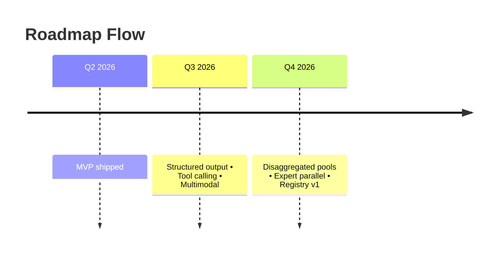

# InferFlux Roadmap

| Workstream | Focus | Status |
| --- | --- | --- |
| Q2 MVP | CPU/MPS runtime + policy/audit foundation | ✅ Complete |
| Workstream A | Throughput foundations | ⚙️ In progress |
| Workstream B | Security & observability | ⚙️ In progress |
| Workstream C | Developer experience & multimodal | ⚙️ In progress |
| Workstream D | Distributed ops & fairness | 🔜 Q4 focus |

## Q2 — MVP (complete)
- [x] CPU & MPS backends with SSE streaming via llama.cpp.
- [x] Policy store with RBAC scopes, guardrail/rate-limit admin APIs (AES-GCM encryption).
- [x] CLI interactive mode (`inferctl chat --interactive`), admin commands.
- [x] Prometheus metrics endpoint (`/metrics`).
- [x] Audit logging (JSON lines).
- [x] API-key auth (SHA-256 hashed) + OIDC JWT validation (RS256 + exp/nbf).
- [x] Adopted nlohmann/json (DAT-1) and Catch2 test framework (TST-2).
- [x] 44 unit tests across 9 modules (TST-1).
- [x] Dynamic HTTP buffer (INF-3), graceful shutdown (CQ-5).
- [x] Security fixes: OPA JSON injection (SEC-3), audit logger injection (SEC-4).
- [x] Thread safety: ApiKeyAuth, RateLimiter, MetricsRegistry, BackendManager.
- **KPIs**: 30 tok/s/request on CPU; policy updates <250 ms; admin CLI task success >=95%.

## H2 Workstreams Overview
Roadmap execution from Q3 onward is organized into themed workstreams. Each stream has an explicit Definition of Done (DoD) checklist referencing the Tech Debt tracker so that sign-off is tied to objective debt burndown.

### Workstream A — Throughput Foundation (Q3 focus)
Goal: reach competitive continuous batching throughput on CPU/MPS today while paving the way for future CUDA deployments once compatible hardware is available.

- **DoD**
  - [x] Continuous batching replaces global mutex; `RequestBatch` wired end-to-end (INF-2).
  - [x] Unified phased batching now groups by backend instance so mixed-model batches keep backend-local coalescing (INF-2 follow-up).
  - [x] Shared llama.cpp/CUDA backend traits shard (`runtime/backends/llama/llama_backend_traits.*`) centralizes target parsing + config tuning.
  - [x] Backend exposure policy recorded in factory: native-preferred with universal llama fallback (`INFERFLUX_BACKEND_PREFER_NATIVE`, `INFERFLUX_BACKEND_ALLOW_LLAMA_FALLBACK`).
  - [x] Backend priority chain + exposure provenance wired end-to-end (`runtime.backend_priority` / `INFERFLUX_BACKEND_PRIORITY`, per-model `backend_exposure` fields, `inferflux_backend_exposures_total` metric).
  - [x] Request-time capability fallback for default model routing (same-path backend reroute, explicit model pinning preserved, `inferflux_capability_route_fallbacks_total` metric).
  - [x] Backend capability contract + request-time feature gating shipped (`runtime/backends/backend_capabilities.*`, `/v1/models` capability metadata, 422 reject path + `inferflux_capability_rejections_total`).
  - [x] Prefix cache online with metrics + eviction policies (INF-6/§2.4) — `RadixPrefixCache` (compressed trie, partial-match tracking, LRU eviction, 12 unit tests).
  - [ ] CUDA backend with FlashAttention-3 kernels validated on L40S (INF-2, §2.7 KPIs). **Progress:** backend strategy/factory wiring + CUDA default-route plumbing are complete. Remaining: FA3 kernels, prefill/decode overlap in BatchExecutor, GPU KV cache, and KPI sign-off.
- [x] Priority-aware fairness scheduler on CPU/MPS (preemption + cancellation) — `FairnessController`, timeslice, preemption, per-priority metrics (§2.9).
  - [x] ModelRouter routes multi-model requests with hot load/unload (ARCH-4/5/6) — `SingleModelRouter`, `/v1/admin/models` CRUD, `/v1/models` OpenAI-standard list (4 integration tests).
  - [x] Priority fairness queue + preemption hooks (ARCH-5 follow-up); `runtime.fairness.*` knobs (`enable_preemption`, `high_priority_threshold`, `max_timeslice_tokens`) live in config/env.
  - [x] SSE cancellation regression tests (`SSECancel` ctest target) kept green.
  - [x] SimpleTokenizer metrics replaced with llama.cpp tokenizer (INF-7) — `TokenizeForCache` + BPE prefix matching in KV prefix store.
  - [x] Per-model prompt/completion token counters exported (`inferflux_model_prompt_tokens_total`, `inferflux_model_completion_tokens_total`) so Prometheus `rate(...)` can track backend/model throughput.
  - [x] Latency histograms + queue-depth gauges emitted (OBS-1) to prove KPI gains; add fairness counters (preemptions, per-priority tokens).
  - [ ] Record-only (macOS/MLX): add an MLX trait adapter + parity checklist so MLX capability reporting aligns with llama.cpp/CUDA without changing MLX runtime behavior yet.
  - [ ] Design scaffolding for Intel GPU + AMD ROCm backends (build flags, DeviceContext hooks) so hardware bring-up is unblocked once samples arrive.
  - **Exit KPIs**: ≥400 tok/s aggregate on L40S (future), prefix cache hit rate >60%, TTFT <250 ms with guardrails enabled, fairness tests demonstrate <5% variance across priorities on CPU/MPS.

### Workstream B — Enterprise Security & Observability (Q3 gating)
Goal: close SEC/OBS debts required for enterprise pilots and comply with PRD security caveats.

- **DoD**
- [x] Native TLS for HttpServer + HttpClient (SEC-5) with e2e tests.
  - [x] JWKS fetch + signature verification for OIDCValidator (SEC-1).
  - [x] PolicyStore hashes API keys on write/read (SEC-2) — SHA-256 hashing on write/read; `AddKeyHashed` for load-from-disk path; migration via CLI.
  - [x] Audit logger defaults to prompt hashing + configurable redaction (OBS-4) — SHA-256 by default; `debug_mode=true`/`INFERFLUX_AUDIT_DEBUG` for raw logging.
  - [x] OpenTelemetry traces cover tokenize→schedule→backend pipeline (OBS-2) — W3C traceparent propagation, `Span` RAII abstraction (`server/tracing/span.h`), prefill/decode duration histograms, 11 tracing unit tests.
  - [ ] Guardrail verdict latency profiled and <500 ms P95 (NFR / KPI table) — **remaining debt before we can call Workstream B complete.**
  - **Exit KPIs**: Policy replication lag <30 s, zero plaintext secrets on disk, tracing coverage ≥90% of request path.

### Workstream C — Developer Experience & Multimodal (Q3 completion)
Goal: ship the customer-facing differentiators promised in the PRD.

- **DoD**
  - [x] Structured output / JSON mode via llama.cpp grammar sampling (§2.1) — `StructuredOutputAdapter`, schema→GBNF, `response_format` HTTP parsing, `InferenceRequest.response_constraint`, grammar hooks end-to-end.
  - [x] Tool/function calling parity with OpenAI semantics (§2.3) — `tools[]`/`tool_choice` parsing, schema-as-preamble, streaming 4-chunk delta sequence, model-native chat templates, multi-format detection (InferFlux/generic/Hermes/Mistral).
  - [x] Multimodal (vision) ingestion path via `libmtmd` including preprocessing metrics (TechDebt §2.2) — `ImagePreprocessor` (base64/URL decode, SHA-256 image IDs, `<__media__>` marker injection), `LlamaCPUBackend::LoadMmproj()`/`GenerateWithImages()`, Prometheus counters, 11 unit tests. Full vision inference requires `-DENABLE_MTMD=ON` with a compatible mmproj GGUF.
  - [ ] Prefix cache APIs exposed to `inferctl` for agent workflows, plus CLI/docs showing cache warmers and status.
- [x] `inferctl pull` + model registry CLI with progress reporting (§2.8) — `SelectBestGguf`, `DownloadToFile`, HuggingFace Hub, Q4_K_M preference, redirect following, `~/.cache/inferflux/models/`.
- [x] CLI quickstart/serve workflow + embedded WebUI docs — `inferctl quickstart`, `inferctl serve`, `docs/Quickstart.md`, `/ui` litehtml shell.
  - [ ] Developer docs + examples updated for new params and guardrails.
  - **Exit KPIs**: 99.5% JSON schema conformance, multimodal preprocessing <80 ms/image on CUDA, CLI SUS ≥80.

### Workstream D — Distributed Ops & Fairness (Q4 focus)
Goal: unlock large-cluster deployments and SLO-aware scheduling.

- **DoD**
  - [x] Disaggregated prefill/decode path with KV transfer latency <5 ms (TechDebt §2.5):
    - [x] Split scheduler queues + metrics for prefill vs decode.
    - [x] Implement `runtime/disaggregated/kv_channel` (SHM + RDMA adapters) with trace hooks.
    - [x] Stand up dedicated prefill workers that emit KV tickets into the decode queue.
    - [x] Extend decode workers/BatchExecutor to hydrate KV from the channel and stream tokens.
    - [x] Wire `/readyz`, Prometheus gauges, and chaos tests for independent pool failures.
    - [x] Publish Helm/docker overlays that scale pools independently; add CI smoke test.
    - [x] KV warm prefix store: `CopySequencePrefix`+`PrefillPartial` bypass re-evaluation of shared prompt prefixes; 4-slot LRU store with `weak_ptr` backends, BPE-correct position counts, KV eviction guard, expired-entry purge. (§2.5 Item 5)
  - [ ] Expert parallelism + tensor/pipeline parallel knobs exposed (TechDebt §2.6).
  - [x] Request priority/fairness scheduling with starvation prevention (TechDebt §2.9) — `FairnessController` (timeslice, preemption, resume), per-priority metrics, `UpdateFairnessConfig()` live API, 3 `[fairness]` unit tests.
  - [ ] Model registry with signed manifests + attestation (Roadmap Q4).
  - [x] YAML parser replaced with supported config stack (DAT-2) — `server/main.cpp` rewritten with yaml-cpp; `INFERCTL_API_KEY`/`INFERFLUX_API_KEYS` env var registration.
  - [ ] Web admin console surfaces queue depth, guardrail decisions, and live traces.
  - **Exit KPIs**: Guardrail verdict latency <500 ms, policy replication consistency 99.95%, admin UX SUS ≥80.

## Stretch Goals (post-Workstream D)
- Multi-region active/active with workload-aware routing and autoscaler hints (queue depth, KV fragmentation).
- Budget-aware autoscaling (cost per token) and GPU sharing controls.
- Frontend SDKs for major frameworks (LangChain, LlamaIndex).
- LoRA stacking and hot adapter reloads.
