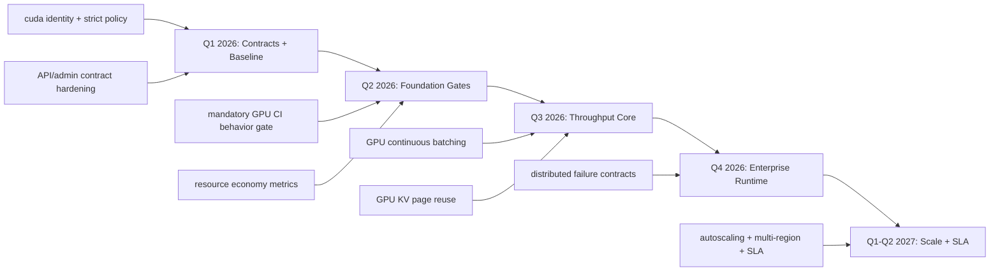

# InferFlux Roadmap

**Snapshot date:** March 5, 2026  
**Current overall grade:** C+  
**Target overall grade:** B- (2026), B (2027)

## 1) One-Screen Plan

```mermaid
flowchart LR
    A[Q1 2026: Contracts + Baseline] --> B[Q2 2026: Foundation Gates]
    B --> C[Q3 2026: Throughput Core]
    C --> D[Q4 2026: Enterprise Runtime]
    D --> E[Q1-Q2 2027: Scale + SLA]

    A1[cuda identity + strict policy] --> A
    A2[API/admin contract hardening] --> A
    B1[mandatory GPU CI behavior gate] --> B
    B2[resource economy metrics] --> B
    C1[GPU continuous batching] --> C
    C2[GPU KV page reuse] --> C
    D1[distributed failure contracts] --> D
    E1[autoscaling + multi-region + SLA] --> E
```

## 2) Current vs Target Scorecard

| Dimension | Current | Target | Primary Blocker | Primary Issues |
|---|---|---|---|---|
| Throughput | C+ | B | Native path + batching maturity gap | [#3](https://github.com/vjsingh1984/inferflux/issues/3), [#4](https://github.com/vjsingh1984/inferflux/issues/4), [#6](https://github.com/vjsingh1984/inferflux/issues/6), [#7](https://github.com/vjsingh1984/inferflux/issues/7) |
| Continuous batching | D | B | No full GPU iteration scheduler | [#3](https://github.com/vjsingh1984/inferflux/issues/3) |
| Resource economy | C | B | Missing first-class efficiency SLO metrics | [#9](https://github.com/vjsingh1984/inferflux/issues/9) |
| CI/TDD enforcement | B | A- | GPU behavior lane not mandatory everywhere | [#5](https://github.com/vjsingh1984/inferflux/issues/5), [#10](https://github.com/vjsingh1984/inferflux/issues/10) |
| Distributed runtime | D | C+ | Failure-path contracts incomplete | [#11](https://github.com/vjsingh1984/inferflux/issues/11) |
| Capability identity | C+ | B+ | Native/universal CUDA ambiguity risk | [#1](https://github.com/vjsingh1984/inferflux/issues/1), [#2](https://github.com/vjsingh1984/inferflux/issues/2) |

## 3) Foundational Program (Priority Order)

| Priority | Foundation | Definition of Done | KPI Gate |
|---|---|---|---|
| P0 | Native CUDA identity contract | API/CLI/metrics show explicit provider identity and strict-fail unsupported native requests | 0 ambiguous provider reports in contract tests |
| P1 | GPU continuous batching | Iteration scheduler active with stable fairness + no throughput regressions | Throughput gate passes with target batch packing and skip ceilings |
| P1 | GPU KV page reuse | Prefix/KV page reuse enabled with correctness and accounting tests | Prefix-reuse hit metrics up, no KV corruption regressions |
| P1 | Resource efficiency metrics | Batch-loss + skip-reason + efficiency metrics published and documented | Autoscaling/economy docs use those metrics as inputs |
| P2 | Mandatory GPU CI lane | At least one stable GPU lane is merge-blocking for behavioral gates | No release without passing GPU behavioral suite |
| P2 | Distributed failure-path contracts | Prefill/decode split failure injections validated end-to-end | Fault-injection matrix passes in CI |

## 4) Quarter Plan (Concise)

| Quarter | Outcomes | Exit Criteria |
|---|---|---|
| Q2 2026 | Lock policy/identity contracts and CI observability base | #1/#2/#5/#9/#10 merged and enforced |
| Q3 2026 | Land throughput core (batching + KV reuse + native kernel maturity) | #3/#4 plus #6/#7 show sustained throughput lift |
| Q4 2026 | Raise enterprise runtime resilience | #11 failure-path contracts + distributed readiness checks |
| Q1-Q2 2027 | Scale and SLA | Autoscaling + multi-region + SLA reporting integrated |

## 5) Workstream Board

### A) Runtime Throughput

| Status | Items |
|---|---|
| Done | Fairness scheduler, phased prefill/decode, prefix cache, capability routing, throughput harness |
| In progress | Native identity hardening, strict policy path, CI behavioral gates |
| Next | GPU iteration scheduler, GPU KV paging/reuse, quantized/native fused path |

### B) Security and Operations

| Status | Items |
|---|---|
| Done | TLS, OIDC/JWKS, hashed API keys, audit logging, tracing baseline |
| In progress | Metrics-backed operational docs and startup checks |
| Next | Enterprise-grade failover and policy replication contracts |

### C) Developer Experience

| Status | Items |
|---|---|
| Done | OpenAI-compatible APIs, model lifecycle admin ops, CLI contract hardening |
| In progress | Infographic-first OSS docs and contract-focused CLI coverage |
| Next | Prefix cache CLI surfaces and advanced diagnostics UX |

### D) Distributed Runtime

| Status | Items |
|---|---|
| Done | SHM transport path, split-pool hooks, readiness surfaces |
| In progress | Failure-mode contract coverage |
| Next | Multi-node transport hardening and recovery SLOs |

## 6) Issue Map

- Native CUDA identity and strict policy: [#1](https://github.com/vjsingh1984/inferflux/issues/1), [#2](https://github.com/vjsingh1984/inferflux/issues/2)
- GPU batching and KV reuse: [#3](https://github.com/vjsingh1984/inferflux/issues/3), [#4](https://github.com/vjsingh1984/inferflux/issues/4)
- GPU CI and coverage hardening: [#5](https://github.com/vjsingh1984/inferflux/issues/5), [#10](https://github.com/vjsingh1984/inferflux/issues/10)
- Native kernel maturity: [#6](https://github.com/vjsingh1984/inferflux/issues/6), [#7](https://github.com/vjsingh1984/inferflux/issues/7)
- Scheduler lock partitioning: [#8](https://github.com/vjsingh1984/inferflux/issues/8)
- Efficiency/economy metrics: [#9](https://github.com/vjsingh1984/inferflux/issues/9)
- Distributed failure-path contracts: [#11](https://github.com/vjsingh1984/inferflux/issues/11)

## 7) Canonical References

- [INDEX](INDEX.md)
- [TechDebt and Competitive Roadmap](TechDebt_and_Competitive_Roadmap.md)
- [Architecture](Architecture.md)
- [ARCHIVE_INDEX](ARCHIVE_INDEX.md)
