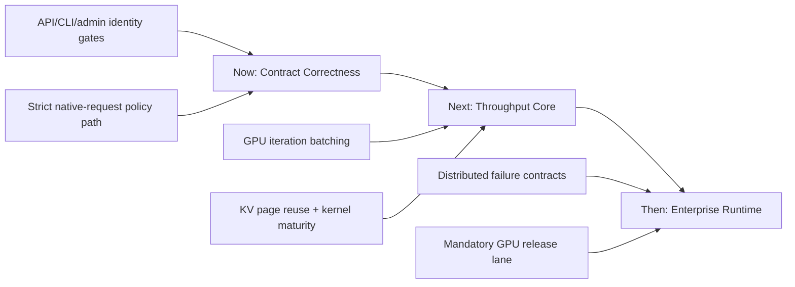

# InferFlux Roadmap

**Snapshot date:** March 5, 2026  
**Current overall grade:** C+  
**Target overall grade:** B- (2026), B (2027)

```mermaid
flowchart LR
    A[Now: Contract Correctness] --> B[Next: Throughput Core]
    B --> C[Then: Enterprise Runtime]

    A1[API/CLI/admin identity gates] --> A
    A2[Strict native-request policy path] --> A

    B1[GPU iteration batching] --> B
    B2[KV page reuse + kernel maturity] --> B

    C1[Distributed failure contracts] --> C
    C2[Mandatory GPU release lane] --> C
```

## 1) Grade Scorecard (Code-Aligned)

| Dimension | Current | Evidence in code today | Blocker to next grade | Primary issues |
|---|---|---|---|---|
| Throughput | C+ | Request-layer concurrency improved (`server/main.cpp` default workers `16`) | CUDA lane/overlap path still not active in default `backend=cuda` flow | [#3](https://github.com/vjsingh1984/inferflux/issues/3), [#4](https://github.com/vjsingh1984/inferflux/issues/4), [#6](https://github.com/vjsingh1984/inferflux/issues/6), [#7](https://github.com/vjsingh1984/inferflux/issues/7) |
| Continuous batching | C | Phase-aware scheduler exists; fairness and token-budget controls are in place | No production-grade GPU iteration scheduler yet | [#3](https://github.com/vjsingh1984/inferflux/issues/3) |
| Capability identity | B | Provider contract is explicit in runtime (`kNative`/`kLlamaCpp`) and surfaced by router/API | Native path readiness is still gated/scaffolded | [#1](https://github.com/vjsingh1984/inferflux/issues/1), [#2](https://github.com/vjsingh1984/inferflux/issues/2) |
| Resource efficiency | B- | Startup advisor + policy/runtime safety hardening landed with tests | Economy metrics and autoscaling signals are still partial | [#9](https://github.com/vjsingh1984/inferflux/issues/9) |
| CI/TDD enforcement | B+ | Contract suites are explicit in CI logs (including CLI arg-contract blocks) | Merge-blocking GPU behavior lane is not yet universally guaranteed | [#5](https://github.com/vjsingh1984/inferflux/issues/5), [#10](https://github.com/vjsingh1984/inferflux/issues/10) |
| Distributed runtime | C- | Split/runtime hooks exist | Failure-path contract matrix is incomplete | [#11](https://github.com/vjsingh1984/inferflux/issues/11) |

## 2) Evidence Ledger (What Was Reconciled)

| Evidence type | Current reading | Grade impact |
|---|---|---|
| Provider identity contract | Runtime provider enum is `kLlamaCpp`/`kNative`; exposure policy is `prefer_native`, `allow_llama_cpp_fallback`, `strict_native_request` | Removes naming ambiguity in canonical docs and API semantics |
| Native readiness gate | `NativeCudaBackend::NativeKernelsReady()` now auto-enables when native kernels are compiled and CUDA device is available (unless scaffold is forced via env) | `backend=cuda` can prefer native by default on ready CUDA nodes |
| API/CLI identity exposure | `/v1/models` and CLI surfaces include requested/exposed backend + provider/fallback fields | Supports deterministic automation and policy checks |
| CUDA fallback chain | Model-load routing now uses `cuda -> cuda_llama_cpp -> rocm -> mlx -> mps -> cpu` (compiled targets only) | Improves resilience while preserving deterministic fallback ordering |
| Throughput gate (Qwen14B prefill/batching snapshot, March 6, 2026) | `cuda_native` passed baseline/prefill/batch-medium but failed strict native-forward check in batch-heavy profile; `cuda_llama_cpp` passed all four profiles | Throughput grade stays constrained until native heavy-batch behavior is stable and lane/overlap activation is proven |

## 3) Priority Order

| Priority | Foundation | Done when |
|---|---|---|
| P0 | Native CUDA identity + strict policy | Explicit native requests fail fast correctly and provider identity is unambiguous end-to-end |
| P1 | GPU continuous batching | Iteration scheduler is active with stable fairness and no regression in contract tests |
| P1 | GPU KV reuse + kernel maturity | Reuse accounting is correct and native kernel path shows sustained uplift |
| P2 | Mandatory GPU CI behavior lane | Release cannot pass without GPU behavioral gate |
| P2 | Distributed failure contracts | Fault matrix is covered by integration tests and runbooks |

## 4) Quarter Targets

| Quarter | Exit criteria |
|---|---|
| Q2 2026 | Identity/policy contracts + CI visibility complete |
| Q3 2026 | Throughput-core items (#3/#4/#6/#7) show sustained gains |
| Q4 2026 | Distributed failure-path contracts land |
| Q1-Q2 2027 | SLA-oriented scale and operations maturity |

## 5) Canonical References

- [TechDebt and Competitive Roadmap](TechDebt_and_Competitive_Roadmap.md)
- [PRD](PRD.md)
- [Architecture](Architecture.md)
- [ARCHIVE_INDEX](ARCHIVE_INDEX.md)
