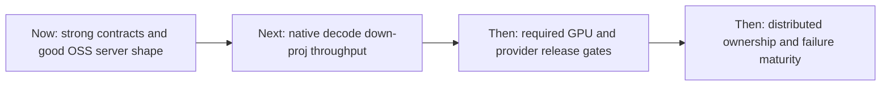

# InferFlux Roadmap

**Snapshot date:** March 29, 2026  
**Current overall grade:** B-  
**Target overall grade:** B after native decode-path and release-gate maturity

```mermaid
flowchart LR
    A[Now: strong contracts and good OSS server shape] --> B[Next: native decode down-proj throughput]
    B --> C[Then: required GPU and provider release gates]
    C --> D[Then: distributed ownership and failure maturity]
```

## 1) Grade Scorecard

| Dimension | Current | Evidence in code today | Blocker to next grade |
|---|---|---|---|
| Throughput | C+ | Native CUDA path is real, profiled, and benchmarked; FFN grouped MMQ3 is active on live decode | Decode down-proj row-pair and row-quad paths still leave native behind at sustained concurrency |
| Continuous batching | C+ | Sync-first batch execution and operator metrics exist; live decode cohorts are measurable | Better decode hot-path cost is still needed to translate batch formation into sustained serving wins |
| Capability identity | A- | Provider/fallback identity is explicit across API, admin, CLI, and metrics | Some advanced behavior still depends on compatibility fallback |
| Resource efficiency | B- | Memory-first GGUF direction, KV planner, and quantized execution are real | Native decode still spends too much work in its current down-proj kernels |
| CI and release enforcement | B- | Good unit/integration coverage and docs contract gate | Required GPU/provider lane is still not a release blocker |
| Distributed runtime | C | Transport-health semantics, pool visibility, and failure signaling exist | Sequence ownership cleanup and worker-loss handling still need hardening |
| OSS release readiness | B | Canonical docs and release process exist, and the repo can expose conventional OSS metadata | Release surface still needs tighter benchmark/doc hygiene and stronger GPU validation |

## 2) Roadmap Priorities

| Priority | Workstream | Exit criteria |
|---|---|---|
| P0 | Decode down-proj throughput | Native decode down-proj improvements produce repeated serving wins without regressing nearby envelopes |
| P0 | Required GPU/provider release lane | Native/provider/runtime checks become mandatory for release confidence |
| P1 | Structured-output native ownership | Grammar-constrained generation no longer relies on compatibility fallback for the CUDA path |
| P1 | Distributed ownership maturity | Cleanup and worker-loss behavior are deterministic and covered by tests |
| P2 | Benchmark and release hygiene | Release-facing benchmark narrative stays aligned with one maintained harness and current docs |

## 3) Quarter Targets

| Window | Target |
|---|---|
| Q2 2026 | Keep canonical docs, OSS metadata, and release process aligned with the actual codebase |
| Q3 2026 | Land a real native decode down-proj serving win and convert it into the default policy where appropriate |
| Q4 2026 | Make GPU/provider behavior part of required release gating and improve distributed ownership cleanup |

## 4) Grade Movement Rule

Grades move only when both are true:

1. A representative runtime path has evidence, not just a microbenchmark.
2. The supporting behavior is covered by tests, docs, or release gating as appropriate.

## 5) Immediate Engineering Plan

| Step | Why now |
|---|---|
| Profile and optimize decode down-proj row-pair and row-quad kernels | Current live metrics point to these as the remaining hot path |
| Keep FFN optimization work focused on measured serving impact | FFN fusion alone is no longer the main concurrency gap |
| Convert more GPU validation from ad hoc measurement into repeatable gates | Prevent regression churn during continued kernel work |

## 6) References

- [TechDebt_and_Competitive_Roadmap](TechDebt_and_Competitive_Roadmap.md)
- [benchmarks](benchmarks.md)
- [COMPETITIVE_POSITIONING](COMPETITIVE_POSITIONING.md)
