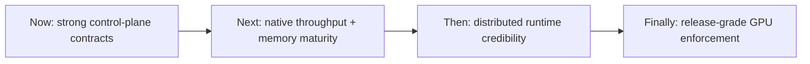

# InferFlux Roadmap

**Snapshot date:** March 9, 2026  
**Current overall grade:** B-  
**Target overall grade:** B (2026), B+ (2027)

```mermaid
flowchart LR
    A[Now: strong control-plane contracts] --> B[Next: native throughput + memory maturity]
    B --> C[Then: distributed runtime credibility]
    C --> D[Finally: release-grade GPU enforcement]
```

## 1) Grade Scorecard

| Dimension | Current | Evidence in code today | Blocker to next grade |
|---|---|---|---|
| Throughput | C+ | Native provider path is real, native forward metrics exist, and sync mixed prefill/decode overlap is active | Quantized GGUF native path is not yet consistently competitive on heavy-batch edge workloads |
| Continuous batching | C | Prefix-affinity scoring and mixed-step knobs exist; sync batch execution preserves real batching | Native async unified-batch contract is intentionally disabled and graph capture is not yet productionized |
| Capability identity | A- | Backend/provider/fallback identity is explicit across API/CLI/admin flows | Some native parity still depends on delegate-backed behavior |
| Resource efficiency | B- | Memory-first dequant policy, KV auto-tune planning, prefix reuse, and optional session leases are in place | Quantized GGUF hot paths still rely on compatibility/fallback paths too often |
| CI/TDD enforcement | B+ | Focused contract suites and docs gates are visible in CI | GPU behavior lane is not yet universally merge-blocking |
| Distributed runtime | C- | Split-role scheduling, SHM transport, and decode readiness semantics exist | Transport lifecycle, ownership cleanup, and failure-path coverage are incomplete |

## 2) Evidence Ledger

| Evidence type | Current reading | Grade impact |
|---|---|---|
| Provider identity contract | `native` vs `llama_cpp` provider semantics are explicit and exposed | Keeps control-plane grades high and automation reliable |
| Native readiness gate | Native can auto-enable when kernels are compiled and CUDA is available | Makes `backend=cuda` native-first without manual executor forcing |
| Endpoint parity contract | Core endpoints are routed with explicit capability/policy semantics | Prevents blanket fallback behavior for completion/chat/embeddings |
| Memory economy foundation | Native quantized path defaults to `dequant_cache_policy=none`; KV planner + native KV metrics are wired | Improves edge-device viability, but not yet enough to move throughput grades alone |
| Session handle foundation | Optional TTL-based `session_id` reuse exists in unified scheduler mode | Enables future sticky reuse without changing baseline API semantics |
| Distributed foundation | Decode readiness checks loaded weights plus all decode workers | Good operational direction, but not yet full distributed runtime maturity |

## 3) Grade-Movement Rule

Grades move only when both conditions are true:

1. The relevant contract/gate is present in CI or integration tests.
2. Representative runtime evidence supports the claim on the affected path.

Single benchmark wins or partial scaffolding do not move the grade.

## 4) Priority Order

| Priority | Foundation | Done when |
|---|---|---|
| P0 | Native quantized throughput core | Quantized GGUF runs stay on fast native hot paths without falling back to memory-expensive compatibility behavior |
| P0 | GPU memory economy | Immutable quantized weights + paged KV + planner policy show stable edge-device gains |
| P1 | Native-first parity independence | Core endpoint behavior does not depend on llama.cpp delegates for critical features |
| P1 | Graph capture + repeatable overlap | Common decode/prefill envelopes reuse graph buckets and expose hit/fallback metrics |
| P1 | Mandatory GPU CI lane | Release cannot pass without native-provider behavioral gates |
| P1 | Distributed ticket + ownership contracts | KV handoff, worker health, and eviction cleanup are deterministic and tested |
| P2 | Session leases in decode-worker mode | Stateful reuse can coexist safely with split-role deployments |

## 5) Quarter Targets

| Quarter | Exit criteria |
|---|---|
| Q2 2026 | Canonical docs, identity contracts, and memory-economy foundations stay aligned with code |
| Q3 2026 | Native quantized GGUF and graph/overlap work show sustained heavy-batch gains |
| Q4 2026 | Distributed runtime moves from scaffold to fault-tested foundation |
| 2027 | Release-grade GPU CI and broader scale/runtime maturity |

## 6) Canonical References

- [VISION](VISION.md)
- [Architecture](Architecture.md)
- [MODERNIZATION_AUDIT](MODERNIZATION_AUDIT.md)
- [TechDebt_and_Competitive_Roadmap](TechDebt_and_Competitive_Roadmap.md)
- [docs/issues/README](issues/README.md)
