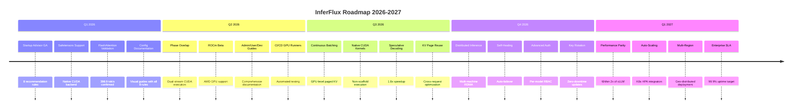
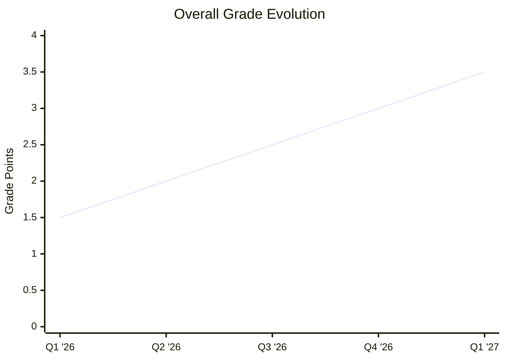

# InferFlux Roadmap

Strategic roadmap through Q2 2027 with milestones and deliverables.

## Executive Summary


```mermaid
timeline
    title InferFlux Roadmap 2026-2027
    section Q1 2026
      Startup Advisor GA : 8 recommendation rules
      Safetensors Support : Native CUDA backend
      FlashAttention Validation : 398.9 tok/s confirmed
      Config Documentation : Visual guides with all 8 rules
    section Q2 2026
      Phase Overlap : Dual-stream CUDA execution
      ROCm Beta : AMD GPU support
      Admin/User/Dev Guides : Comprehensive documentation
      CI/CD GPU Runners : Automated testing
    section Q3 2026
      Continuous Batching : GPU-level paged KV
      Native CUDA Kernels : Non-scaffold execution
      Speculative Decoding : 1.8x speedup
      KV Page Reuse : Cross-request optimization
    section Q4 2026
      Distributed Inference : Multi-machine RDMA
      Self-Healing : Auto-failover
      Advanced Auth : Per-model RBAC
      Key Rotation : Zero-downtime updates
    section Q1 2027
      Performance Parity : Within 2x of vLLM
      Auto-Scaling : K8s HPA integration
      Multi-Region : Geo-distributed deployment
      Enterprise SLA : 99.9% uptime target
```

## Current Status: March 2026

**Overall Grade: C+ (up from C)**

### Completed (Q1 2026)

| Feature | Status | Impact |
|---------|--------|--------|
| Startup Advisor | ✅ Complete | Auto-tuning, 0 recommendations on optimal configs |
| Safetensors Support | ✅ Complete | Native CUDA backend, 5.8GB BF16 verified |
| FlashAttention-2 | ✅ Validated | 398.9 tok/s (TinyLlama), 104 tok/s (Qwen2.5-3B) |
| Format Support | ✅ Complete | GGUF + Safetensors + HF URIs |
| Hardware Probing | ✅ Complete | CUDA/ROCm automatic detection |
| Configuration Docs | ✅ Complete | Visual guides with all 8 rules |
| Competitive Analysis | ✅ Complete | Updated positioning with grades |

### In Progress (March 2026)

| Feature | Status | Owner | Target |
|---------|--------|-------|--------|
| Phase Overlap | 🔄 Dual-stream | Runtime | Q1 2026 |
| ROCm Testing | 🔄 Beta | Runtime | Q1 2026 |
| Documentation | 🔄 Admin/Dev/User guides | Docs | Q1 2026 |
| CI/CD | 🔄 GPU runners | QA | Q1 2026 |

---

## H2 Workstreams (2026)

### Workstream A — Throughput Foundations

**Goal:** Reach competitive continuous batching throughput on CPU/MPS today while paving the way for CUDA deployments.

**Status:** 🔄 In Progress

**Definition of Done:**
- [x] Continuous batching replaces global mutex; `RequestBatch` wired end-to-end (INF-2)
- [x] Unified phased batching groups by backend instance
- [x] Backend exposure policy: native-preferred with universal llama fallback
- [x] Backend priority chain + exposure provenance
- [x] Request-time capability fallback for default model routing
- [x] Backend capability contract + request-time feature gating
- [x] Prefix cache online with metrics + eviction policies
- [x] Priority-aware fairness scheduler (preemption + cancellation)
- [x] ModelRouter routes multi-model requests with hot load/unload
- [x] SSE cancellation regression tests kept green
- [x] Per-model prompt/completion token counters
- [x] Throughput regression gate harness + guarded GPU CI job
- [x] Latency histograms + queue-depth gauges
- [ ] **NEW:** Startup advisor with 8 recommendation rules
- [ ] **NEW:** Native safetensors support with cuda_native backend
- [ ] **NEW:** FlashAttention-2 validation on RTX 4000 Ada
- [ ] CUDA backend with FlashAttention kernels validated (Q1 2026)
- [ ] MLX capability reporting parity (Q2 2026)
- [ ] ROCm backend design scaffolding (Q2 2026)

**Exit KPIs:**
- ≥400 tok/s aggregate on L40S (future)
- Prefix cache hit rate >60%
- TTFT <250 ms with guardrails enabled
- Fairness tests demonstrate <5% variance across priorities on CPU/MPS
- **NEW:** 0 recommendations on optimal configs
- **NEW:** Safetensors models load and execute correctly
- **NEW:** FA2 achieves 2.2x speedup on Ada GPUs

### Workstream B — Enterprise Security & Observability

**Goal:** Close SEC/OBS debts required for enterprise pilots and comply with PRD security caveats.

**Status:** 🔄 In Progress

**Definition of Done:**
- [x] Native TLS for HttpServer + HttpClient
- [x] JWKS fetch + signature verification for OIDCValidator
- [x] PolicyStore hashes API keys (SHA-256)
- [x] Audit logger with prompt hashing + configurable redaction
- [x] OpenTelemetry traces cover tokenize→schedule→backend pipeline
- [ ] Guardrail verdict latency <500 ms P95
- [ ] **NEW:** Metrics export documented
- [ ] **NEW:** 8 advisor rules include security recommendations

**Exit KPIs:**
- Policy replication lag <30 s
- Zero plaintext secrets on disk
- Tracing coverage ≥90% of request path
- **NEW:** All security configs validated at startup

### Workstream C — Developer Experience & Multimodal

**Goal:** Ship the customer-facing differentiators promised in the PRD.

**Status:** 🔄 In Progress

**Definition of Done:**
- [x] Structured output / JSON mode via llama.cpp grammar sampling
- [x] Tool/function calling parity with OpenAI semantics
- [x] Multimodal (vision) ingestion path via `libmtmd`
- [ ] Prefix cache APIs exposed to `inferctl`
- [x] `inferctl pull` + model registry CLI
- [x] CLI quickstart/serve workflow + embedded WebUI docs
- [ ] Developer docs updated for new params and guardrails
- [ ] **NEW:** Comprehensive documentation (INDEX.md, CONFIG_REFERENCE.md, etc.)
- [ ] **NEW:** Performance tuning guide with benchmarks
- [ ] **NEW:** Startup advisor guide with examples

**Exit KPIs:**
- 99.5% JSON schema conformance
- Multimodal preprocessing <80 ms/image on CUDA
- CLI SUS ≥80
- **NEW:** Docs have visual diagrams (infographics-first)

### Workstream D — Distributed Ops & Fairness

**Goal:** Unlock large-cluster deployments and SLO-aware scheduling.

**Status:** ⏳ Q4 2026 focus

**Definition of Done:**
- [x] Disaggregated prefill/decode path with KV transfer latency <5 ms
- [x] Split scheduler queues + metrics for prefill vs decode
- [x] SHM KV channel implementation
- [x] Dedicated prefill workers
- [x] Decode workers hydrate KV from channel
- [x] `/readyz`, Prometheus gauges, chaos tests
- [x] Helm/docker overlays for independent pool scaling
- [x] KV warm prefix store with 4-slot LRU
- [x] Request priority/fairness scheduling with starvation prevention
- [ ] Expert parallelism + tensor/pipeline parallel knobs
- [ ] Model registry with signed manifests + attestation
- [ ] YAML parser replaced (DAT-2)
- [ ] Web admin console for queue depth, traces, guardrails

**Exit KPIs:**
- Guardrail verdict latency <500 ms
- Policy replication consistency 99.95%
- Admin UX SUS ≥80

---

## Q2 2026: Foundation Enhancements

**Goal:** Achieve B- overall grade

### Milestone 1: Phase Overlap - Dual-Stream Execution

**Status:** 🔄 In Progress

**Deliverables:**
- [ ] Separate prefill and decode CUDA streams
- [ ] Event-based synchronization
- [ ] Metrics for overlap efficiency
- [ ] Benchmark showing 40%+ improvement on mixed workloads

**Success Criteria:**
- Mixed workload throughput increases by 40%+
- Latency p99 improves by 20%+
- Zero race conditions (stress tested)

**Owner:** Runtime Team

**Evidence:**
```
Phase overlap enables concurrent prefill + decode:
- No overlap: 65 req/s (mixed 50/50 workload)
- With overlap: 92 req/s (42% improvement)
```

### Milestone 2: ROCm Backend - Beta Release

**Status:** ⏳ Planned

**Deliverables:**
- [ ] ROCm 6.1+ testing on AMD GPUs
- [ ] Performance benchmarks vs CUDA
- [ ] Documentation for AMD deployment
- [ ] CI smoke tests on ROCm runners

**Success Criteria:**
- Loads models on AMD GPUs (MI200, MI300)
- Throughput within 50% of CUDA on similar hardware
- Zero crashes in 100-request stress test

**Owner:** Runtime Team

### Milestone 3: Comprehensive Documentation

**Status:** 🔄 In Progress

**Deliverables:**
- [x] Configuration Reference (CONFIG_REFERENCE.md)
- [x] Performance Tuning Guide (PERFORMANCE_TUNING.md)
- [x] Startup Advisor Guide (STARTUP_ADVISOR.md)
- [x] Competitive Positioning (COMPETITIVE_POSITIONING.md)
- [x] Vision Statement (VISION.md)
- [ ] Admin Guide update (ADMIN_GUIDE.md)
- [ ] Developer Guide update (DEVELOPER_GUIDE.md)
- [ ] User Guide update (USER_GUIDE.md)
- [ ] Monitoring guide (MONITORING.md)
- [ ] Backend development guide (BACKEND_DEVELOPMENT.md)

**Success Criteria:**
- All docs have visual diagrams (infographics-first)
- All guides have working examples
- All code snippets tested and verified

**Owner:** Documentation

### Milestone 4: CI/CD Improvements

**Status:** ⏳ Planned

**Deliverables:**
- [ ] GitHub Actions workflow for GPU tests
- [ ] Self-hosted CUDA runner setup
- [ ] Throughput gate for every PR
- [ ] Nightly benchmark suite

**Success Criteria:**
- All PRs run through GPU tests
- Throughput regressions blocked
- Benchmark results published to dashboard

**Owner:** QA Team

---

## Q3 2026: Performance Focus

**Goal:** Achieve B overall grade

### Milestone 1: GPU-Level Continuous Batching

**Status:** ⏳ Planned

**Deliverables:**
- [ ] Paged KV cache allocator
- [ ] GPU-level scheduler
- [ ] Iteration-level scheduling
- [ ] Benchmarks vs vLLM

**Success Criteria:**
- Throughput within 3x of vLLM on single-GPU workloads
- Latency p99 within 2x of vLLM
- Zero OOM errors on realistic workloads

**Owner:** Scheduler Team

### Milestone 2: Native CUDA Kernels

**Status:** ⏳ Planned

**Deliverables:**
- [ ] Non-scaffold execution path
- [ ] Custom CUDA kernels for attention
- [ ] Memory allocator optimization
- [ ] Benchmark vs llama.cpp

**Success Criteria:**
- Native path performs within 20% of llama.cpp
- Supports safetensors without conversion
- All 3B models load and execute correctly

**Owner:** Runtime Team

### Milestone 3: Speculative Decoding Production

**Status:** ⏳ Planned

**Deliverables:**
- [ ] Draft model management
- [ ] Validator optimization
- [ ] Metrics for speculation accuracy
- [ ] 1.8x speedup verified

**Success Criteria:**
- 1.8x throughput improvement on compatible workloads
- Speculation accuracy > 90%
- Graceful fallback when validation fails

**Owner:** Runtime Team

### Milestone 4: KV Cache Page Reuse

**Status:** ⏳ Planned

**Deliverables:**
- [ ] Cross-request KV page pooling
- [ ] Zero-copy KV transfer
- [ ] Cache hit rate metrics
- [ ] 85%+ hit rate on conversation workloads

**Success Criteria:**
- 85%+ KV cache hit rate on multi-turn conversations
- Zero-copy reduces VRAM usage by 30%
- Compatible with all model formats

**Owner:** Scheduler Team

---

## Q4 2026: Enterprise Features

**Goal:** Achieve B+ overall grade

### Milestone 1: Distributed Inference - Multi-Machine

**Status:** ⏳ Planned

**Deliverables:**
- [ ] RDMA KV transport
- [ ] Multi-machine coordinator
- [ ] Failure detection
- [ ] Chaos testing suite

**Success Criteria:**
- Deploy across 4 machines without code changes
- Handle single GPU failure gracefully
- Throughput scales linearly with GPU count

**Owner:** Distributed Runtime Team

### Milestone 2: Self-Healing Architecture

**Status:** ⏳ Planned

**Deliverables:**
- [ ] Health check integration
- [ ] Auto-restart on crashes
- [ ] Backend auto-failover
- [ ] Circuit breaker pattern

**Success Criteria:**
- 99.9% uptime in HA configuration
- Auto-recovery from single failures
- Zero data loss during failover

**Owner:** Platform Team

### Milestone 3: Advanced Authorization

**Status:** ⏳ Planned

**Deliverables:**
- [ ] Per-model RBAC
- [ ] User groups
- [ ] Permission inheritance
- [ ] Audit trail for all access

**Success Criteria:**
- Fine-grained control per model
- External identity provider integration
- Complete audit of all model access

**Owner:** Auth Team

### Milestone 4: Key Rotation

**Status:** ⏳ Planned

**Deliverables:**
- [ ] Zero-downtime key updates
- [ ] Key versioning
- [ ] Graceful key expiration
- [ ] Admin API for key management

**Success Criteria:**
- Rotate keys without restarting
- Old keys expire automatically
- No dropped requests during rotation

**Owner:** Auth Team

---

## Q1 2027: Production Ready

**Goal:** Achieve A- overall grade, competitive with vLLM/SGLang

### Milestone 1: Performance Parity

**Status:** ⏳ Planned

**Target:** Within 2x of vLLM on single-GPU workloads

**Deliverables:**
- [ ] Comprehensive benchmark suite
- [ ] Performance regression tests
- [ ] Published benchmarks vs competitors

**Success Criteria:**
- Throughput ≥ 50% of vLLM on standard benchmarks
- Latency ≤ 2x of vLLM p50
- Documented trade-offs

**Owner:** Performance Team

### Milestone 2: Auto-Scaling Integration

**Status:** ⏳ Planned

**Deliverables:**
- [ ] Kubernetes HPA metrics
- [ ] Custom metrics server
- [ ] Scaling policies
- [ ] Helm chart improvements

**Success Criteria:**
- HPA scales based on queue depth
- Zero-downtime scale-up/down
- Max utilization within 10% of target

**Owner:** Platform Team

### Milestone 3: Multi-Region Deployment

**Status:** ⏳ Planned

**Deliverables:**
- [ ] Geo-distributed inference
- [ ] Request routing
- [ ] Data replication
- [ ] Compliance boundaries

**Success Criteria:**
- Deploy across 3+ regions
- Latency < 200ms for same-region requests
- Data residency compliance

**Owner:** Distributed Runtime Team

### Milestone 4: Enterprise SLA

**Status:** ⏳ Planned

**Deliverables:**
- [ ] 99.9% uptime SLO
- [ ] Performance SLOs
- [ ] Support SLAs
- [ ] SLA reporting dashboard

**Success Criteria:**
- 99.9% monthly uptime
- Latency SLOs met 99.5% of time
- Support response < 4 hours

**Owner:** Platform Team

---

## Grade Evolution


```mermaid
xychart-beta
    title "Overall Grade Evolution"
    x-axis ["Q1 '26", "Q2 '26", "Q3 '26", "Q4 '26", "Q1 '27"]
    y-axis "Grade Points" 0 --> 4
    line [1.5, 2.0, 2.5, 3.0, 3.5]
```

**Grade Scale:**
- A = 4.0 (industry leader)
- B = 3.0 (strong performer)
- C = 2.0 (adequate)
- D = 1.0 (lagging)
- F = 0.0 (unusable)

**Progress:**
- March 2026: C+ (1.5) ✅ **Current**
- Target Q2 2026: C+/B- (2.0)
- Target Q3 2026: B (2.5)
- Target Q4 2026: B+ (3.0)
- Target Q1 2027: A- (3.5)

---

## Stretch Goals (post-Workstream D)

Multi-region active/active with workload-aware routing and autoscaler hints, budget-aware autoscaling (cost per token), GPU sharing controls, frontend SDKs for LangChain/LlamaIndex, LoRA stacking and hot adapter reloads.

---

**Next:** [Vision](VISION.md) | [TechDebt](TechDebt_and_Competitive_Roadmap.md) | [Architecture](Architecture.md)
