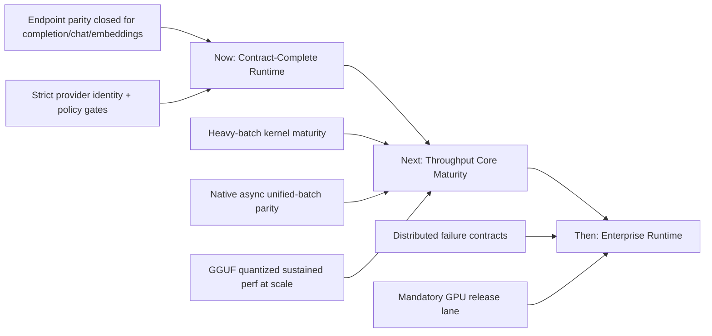

# InferFlux Roadmap

**Snapshot date:** March 8, 2026  
**Current overall grade:** B (contracts substantially improved; throughput still constrained)  
**Target overall grade:** B (2026), B+ (2027)

```mermaid
flowchart LR
    A[Now: Contract-Complete Runtime] --> B[Next: Throughput Core Maturity]
    B --> C[Then: Enterprise Runtime]

    A1[Endpoint parity closed for completion/chat/embeddings] --> A
    A2[Strict provider identity + policy gates] --> A

    B1[Heavy-batch kernel maturity] --> B
    B2[Native async unified-batch parity] --> B
    B3[GGUF quantized sustained perf at scale] --> B

    C1[Distributed failure contracts] --> C
    C2[Mandatory GPU release lane] --> C
```

## 1) Grade Scorecard (Code-Aligned)

| Dimension | Current | Evidence in code today | Blocker to next grade | Primary issues |
|---|---|---|---|---|
| Throughput | B- | Native CUDA gate passes strict checks (provider=native, no fallback, lane submissions >0, overlap >0) with `scripts/run_throughput_gate.py` on Ada profile | Heavy-batch/large-model sustained perf is still below target | [#3](https://github.com/vjsingh1984/inferflux/issues/3), [#4](https://github.com/vjsingh1984/inferflux/issues/4), [#6](https://github.com/vjsingh1984/inferflux/issues/6), [#7](https://github.com/vjsingh1984/inferflux/issues/7) |
| Continuous batching | C+ | Mixed scheduler iterations and decode/prefill overlap execution are active in native CUDA | Native async unified-batch contract is intentionally disabled (`SupportsAsyncUnifiedBatch()==false`), so batching gains rely on synchronous overlap path | [#3](https://github.com/vjsingh1984/inferflux/issues/3), [#8](https://github.com/vjsingh1984/inferflux/issues/8) |
| Capability identity | A- | Provider contract is explicit (`kNative`/`kLlamaCpp`), strict-native policy path is wired, and endpoint parity contracts are now closed for `/v1/completions`, `/v1/chat/completions`, and `/v1/embeddings` | Native endpoint parity currently depends on parity-delegate availability (GGUF-compatible artifact path) rather than native-first implementations for all features | [#6](https://github.com/vjsingh1984/inferflux/issues/6), [#7](https://github.com/vjsingh1984/inferflux/issues/7) |
| Resource efficiency | B | KV precision + dequant cache policy are load-scoped; prefix/KV reuse + session handle layer exist; GGUF overlap no longer hard-disabled (lane-local quantized lane state) | Quantized GGUF path still needs fused-kernel maturity and larger-model validation to convert this to sustained efficiency gains | [#4](https://github.com/vjsingh1984/inferflux/issues/4), [#7](https://github.com/vjsingh1984/inferflux/issues/7), [#9](https://github.com/vjsingh1984/inferflux/issues/9) |
| CI/TDD enforcement | B+ | Contract suites are explicit in CI logs (including CLI arg-contract blocks) | Merge-blocking GPU behavior lane is not yet universally guaranteed | [#5](https://github.com/vjsingh1984/inferflux/issues/5), [#10](https://github.com/vjsingh1984/inferflux/issues/10) |
| Distributed runtime | C- | Split/runtime hooks exist | Failure-path contract matrix is incomplete | [#11](https://github.com/vjsingh1984/inferflux/issues/11) |

## 2) Evidence Ledger (What Was Reconciled)

| Evidence type | Current reading | Grade impact |
|---|---|---|
| Provider identity contract | Runtime provider enum is `kLlamaCpp`/`kNative`; exposure policy is `prefer_native`, `allow_llama_cpp_fallback`, `strict_native_request` | Removes naming ambiguity in canonical docs and API semantics |
| Native readiness gate | `NativeCudaBackend::NativeKernelsReady()` now auto-enables when native kernels are compiled and CUDA device is available (unless scaffold is forced via env) | `backend=cuda` can prefer native by default on ready CUDA nodes |
| Endpoint parity contracts | Native provider now advertises endpoint contracts from explicit native methods and serves logprobs/structured-output/embeddings through parity delegate paths when available | Fallback is policy-driven instead of blanket capability-gap-driven for completion/chat/embeddings flows |
| Scheduler parity safety | Logprobs/structured-output requests bypass phased prefill/decode split and stay on full-generate path | Prevents sequence/sampler state divergence across heterogeneous execution paths |
| Strict-native admin contract | Explicit strict-native request rejections now preserve `backend_policy_violation` semantics on model load | Keeps admin policy behavior deterministic and scriptable |
| API/CLI identity exposure | `/v1/models` and CLI surfaces include requested/exposed backend + provider/fallback fields | Supports deterministic automation and policy checks |
| CUDA fallback chain | Model-load routing now uses `cuda -> cuda_llama_cpp -> rocm -> mlx -> mps -> cpu` (compiled targets only) | Improves resilience while preserving deterministic fallback ordering |
| GGUF overlap safety | GGUF no longer short-circuits overlap initialization; lanes now use lane-local quantized map/adapter ownership | Removes a major overlap safety blocker on quantized GGUF path |
| Throughput gate (Ada RTX 4000, Qwen2.5-3B safetensors, March 8, 2026) | Strict gate passed with `provider=native`, `fallback=false`, decode/prefill lane submissions >0, overlap duration >0, mixed scheduler iterations >0 | Throughput/continuous-batching grades move up one step; remaining blocker is heavy-batch/large-model maturity |

## 3) Priority Order

| Priority | Foundation | Done when |
|---|---|---|
| P0 | Throughput-core maturity on native CUDA | Heavy-batch and larger-model runs sustain uplift without fallback drift |
| P1 | GPU continuous batching maturity | Iteration scheduler remains stable under burst with acceptable tail latency and no metric drift |
| P1 | Native async unified-batch contract re-enable | `SupportsAsyncUnifiedBatch()` can be safely enabled for native without regressing batching/latency contracts |
| P1 | Native-first parity independence | Endpoint parity does not depend on llama.cpp delegate availability for critical features |
| P1 | GGUF quantized native maturity | Quantized native path sustains uplift without dequant-cache contention regressions |
| P2 | Mandatory GPU CI behavior lane | Release cannot pass without GPU behavioral gate |
| P2 | Distributed failure contracts | Fault matrix is covered by integration tests and runbooks |

## 4) Quarter Targets

| Quarter | Exit criteria |
|---|---|
| Q2 2026 | Endpoint parity + identity/policy contracts stable in CI |
| Q3 2026 | Throughput-core items (#3/#4/#6/#7) show sustained heavy-batch gains |
| Q4 2026 | Distributed failure-path contracts land |
| Q1-Q2 2027 | SLA-oriented scale and operations maturity |

## 5) Canonical References

- [TechDebt and Competitive Roadmap](TechDebt_and_Competitive_Roadmap.md)
- [PRD](PRD.md)
- [Architecture](Architecture.md)
- [ARCHIVE_INDEX](ARCHIVE_INDEX.md)
