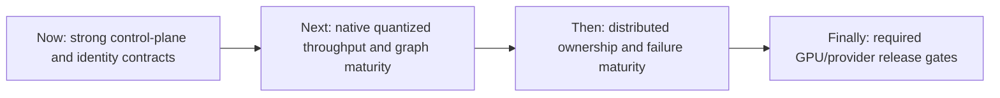

# InferFlux Roadmap

**Snapshot date:** March 13, 2026
**Current overall grade:** B-
**Target overall grade:** B (after native/runtime maturity), B+ (after required GPU and distributed gates)

```mermaid
flowchart LR
    A[Now: strong control-plane and identity contracts] --> B[Next: native quantized throughput and graph maturity]
    B --> C[Then: distributed ownership and failure maturity]
    C --> D[Finally: required GPU/provider release gates]
```

## 1) Grade Scorecard

| Dimension | Current | Evidence in code today | Blocker to next grade |
|---|---|---|---|
| Throughput | C+ | Native provider path is real, native forward metrics exist, and sync overlap is active | Quantized GGUF native hot paths are not yet consistently competitive under heavy-batch edge workloads |
| Continuous batching | C | Sync-first batch execution preserves real batching; prefix-affinity and mixed-step knobs exist | Graph capture/reuse and broader native hot-path residency are still incomplete |
| Capability identity | A- | Provider/fallback identity is explicit across API, CLI, admin, and metrics | Some critical behavior still depends on compatibility/delegate paths |
| Resource efficiency | B- | Memory-first dequant policy, KV planner, load-scoped KV precision, prefix reuse, and session-lease foundations are real | Quantized native execution still leaves too much performance on the table |
| CI/TDD enforcement | B+ | Focused contract suites, docs gate, and explicit CLI/admin tests exist | Required GPU/provider lane is still missing |
| Distributed runtime | C | Split-role scheduling, SHM transport, ticket lifecycle, timeout debt, admin pools, and optional fail-closed admission are landed | Sequence ownership cleanup, decode-worker session reuse, and fault-path CI remain open |

## 2) Evidence Ledger

| Evidence type | Current reading | Grade impact |
|---|---|---|
| Provider identity contract | `requested_backend`, `exposed_backend`, `provider`, `fallback`, `fallback_reason` are explicit and tested | Keeps control-plane and automation grades high |
| Native memory-economy foundation | `dequant_cache_policy=none`, KV planner, and native KV metrics are wired | Makes edge-memory work credible, but not enough to move throughput grades alone |
| Sync-first batching stance | Native keeps `SupportsAsyncUnifiedBatch()==false` and uses sync batched execution for throughput | Correct architectural stance; async is not being mistaken for performance |
| Session handle foundation | Optional TTL-based `session_id` reuse exists in unified mode | Enables future sticky reuse without breaking stateless default behavior |
| Distributed transport contract | Ticket lifecycle, timeout streak/debt, readiness impact, admin pools visibility, and optional fail-closed admission are in code | Raises distributed runtime above scaffold-only status, but not yet to operations-grade maturity |

## 3) Grade-Movement Rule

Grades move only when both are true:

1. A contract or behavior gate exists in CI/integration tests.
2. Representative runtime evidence supports the claim on the affected path.

Single benchmarks, partial scaffolding, or broad aspirations do not move grades.

## 4) Priority Order

| Priority | Foundation | Done when |
|---|---|---|
| P0 | Quantized native throughput core | Common GGUF hot paths stay native, memory-first, and performance-credible |
| P0 | Graph capture and repeatable overlap | Stable decode/prefill envelopes reuse graph buckets with hit/fallback metrics |
| P1 | Distributed ownership maturity | Sequence ownership, cleanup, and transport failure paths are deterministic and tested |
| P1 | Native-first parity independence | Completion/chat/embeddings critical behavior does not silently depend on delegate fallback |
| P1 | Mandatory GPU behavior lane | Release cannot pass without native/provider/runtime behavioral gates |
| P2 | Decode-worker session reuse | Session reuse remains safe in split-role deployments |
| P2 | Lightweight distribution UI | Web-based management console for model serving, backend monitoring, and multi-GPU orchestration |
| P2 | Dual/multi-GPU orchestration | First-class support for heterogeneous GPU setups (e.g., AMD + NVIDIA concurrent serving) |

## 5) Quarter Targets

| Quarter | Exit criteria |
|---|---|
| Q2 2026 | Canonical docs, identity contracts, transport-health semantics, and memory foundations stay aligned with code |
| Q3 2026 | Native quantized GGUF plus graph/overlap work show sustained representative gains |
| Q4 2026 | Distributed runtime moves from ticketed foundation to ownership-safe, fault-tested foundation |
| 2027-H1 | Lightweight distribution UI ships: model management, backend dashboard, multi-GPU controls |
| 2027-H2 | Required GPU/provider CI and broader runtime maturity support higher grades |

## 6) Canonical References

- [VISION](VISION.md)
- [Architecture](Architecture.md)
- [MODERNIZATION_AUDIT](MODERNIZATION_AUDIT.md)
- [TechDebt_and_Competitive_Roadmap](TechDebt_and_Competitive_Roadmap.md)
- [docs/issues/README](issues/README.md)
