# Startup Advisor Guide

Automatic configuration recommendations for optimal InferFlux performance.

## Overview

The Startup Advisor is a unique feature that analyzes your hardware, models, and configuration at startup, then logs actionable recommendations. It requires **no external configuration** and produces **no side effects** - it's read-only and fully suppressible.

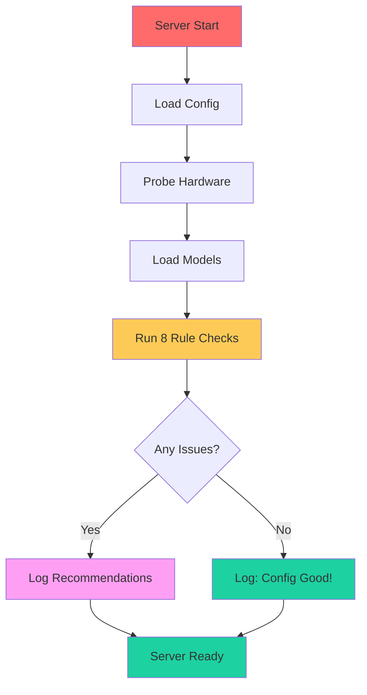

## The 8 Advisor Rules

### Rule 1: Backend Mismatch

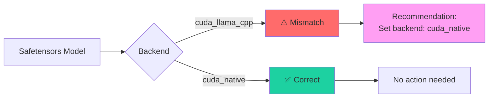

**Trigger:** Safetensors + CUDA + llama.cpp provider

**Recommendation:**
```
[RECOMMEND] backend: Model 'qwen2.5-3b' uses safetensors on CUDA —
set backend to cuda_native
```

**Why it matters:** The llama.cpp backend doesn't support safetensors. The native CUDA backend must be used explicitly.

**Fix:**
```yaml
models:
  - id: qwen2.5-3b
    path: /models/qwen2.5-3b-safetensors/
    backend: cuda_native        # Use cuda_native
    format: auto
```

Then start the server normally:
```bash
./build/inferfluxd --config config/server.yaml
```

### Rule 2: Attention Kernel

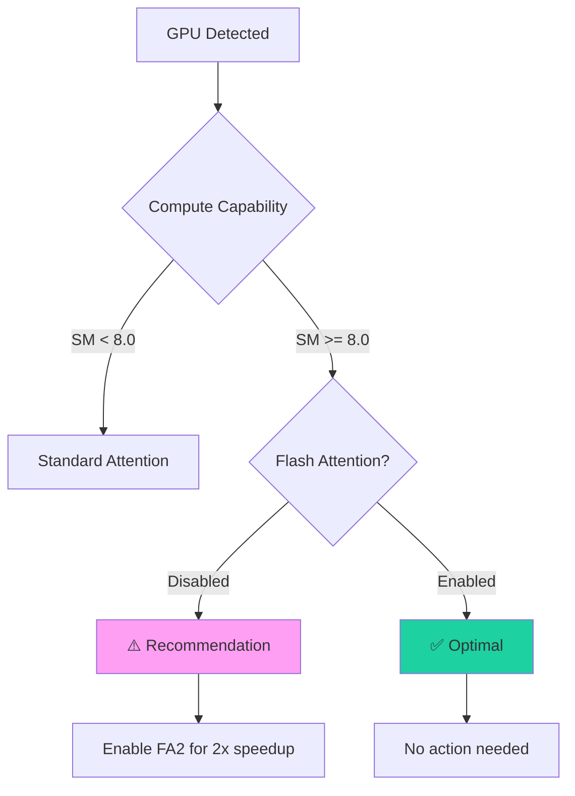

**Trigger:** GPU SM ≥ 8.0, FlashAttention disabled

**Recommendation:**
```
[RECOMMEND] attention: GPU 'RTX 4000 Ada' (SM 8.9) supports FA2 —
set runtime.cuda.flash_attention.enabled: true and runtime.cuda.attention.kernel: fa2
```

**Performance Impact:**

| GPU | SM | FA2 Speedup | VRAM Savings |
|-----|-------|-------------|--------------|
| RTX 4090/Ada | 8.9 | 2.2x | 30-40% |
| RTX 3090/Ampere | 8.6 | 1.8x | 25-35% |
| RTX 2080/Turing | 7.5 | 1.2x | 15-20% |

**Fix:**
```yaml
runtime:
  cuda:
    flash_attention:
      enabled: true             # Enable FA2
      tile_size: 128            # Optimal tile size
```

### Rule 3: Batch Size vs VRAM

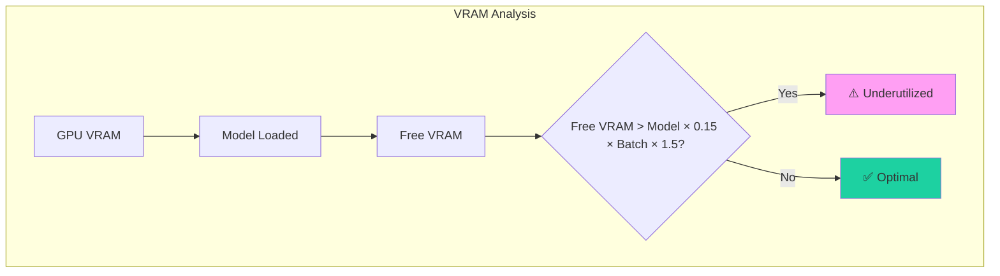

**Trigger:** Large free VRAM with small max_batch_size

**Recommendation:**
```
[RECOMMEND] batch_size: 16966 MB VRAM free —
increase runtime.scheduler.max_batch_size to 56 (current: 8)
```

**Calculation:**
```
suggested_batch = floor(free_vram / (model_size × 0.15))
```

**Batch Size Recommendations:**

| Model Size | VRAM (Free) | Recommended Batch |
|------------|-------------|-------------------|
| 1-3B | > 10 GB | 24-32 |
| 7-8B | > 8 GB | 16-24 |
| 13-14B | > 6 GB | 12-16 |
| 30B+ | > 4 GB | 6-12 |

### Rule 4: Phase Overlap

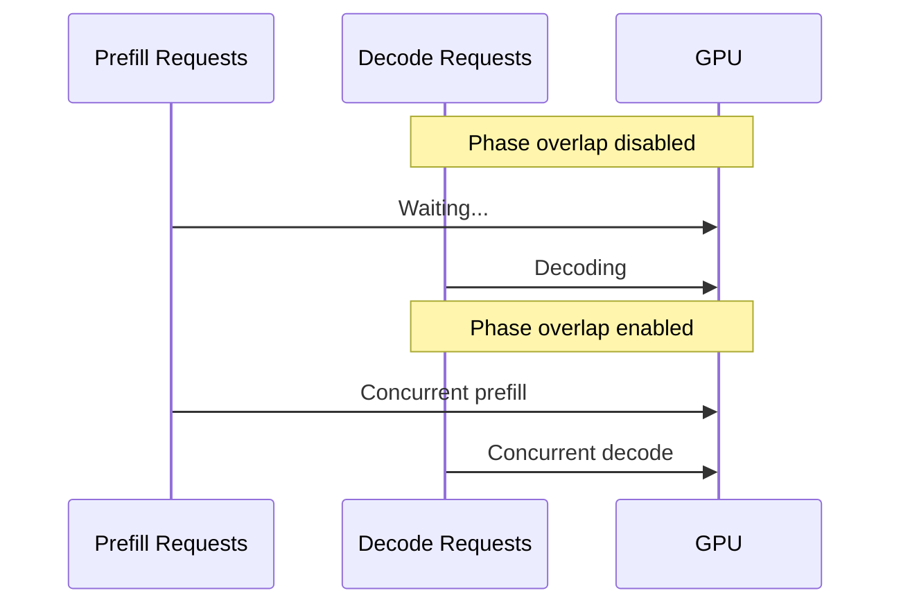

**Trigger:** CUDA enabled, batch_size ≥ 4, phase_overlap disabled

**Recommendation:**
```
[RECOMMEND] phase_overlap: CUDA enabled with batch_size >= 4 —
set runtime.cuda.phase_overlap.enabled: true for mixed-batch decode prioritization
```

**Performance Impact:**

| Workload | No Overlap | Phase Overlap | Improvement |
|----------|------------|---------------|-------------|
| Decode-only | 100 req/s | 100 req/s | - |
| Mixed (50/50) | 65 req/s | 92 req/s | **+42%** |
| Prefill-heavy | 40 req/s | 70 req/s | **+75%** |

### Rule 5: KV Cache Pages

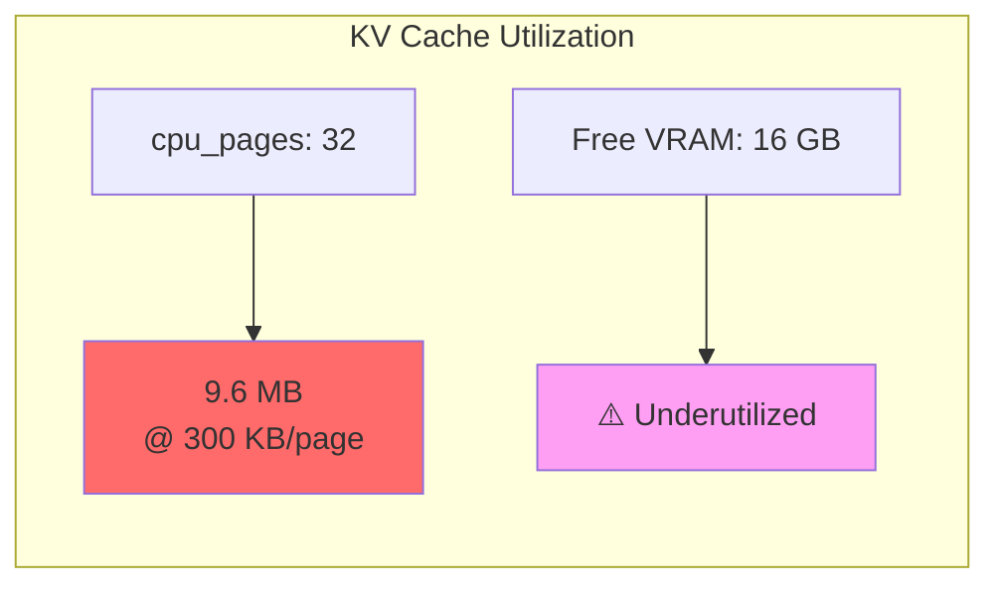

**Trigger:** Large free VRAM with low cpu_pages count

**Recommendation:**
```
[RECOMMEND] kv_cache: 16966 MB VRAM free with only 32 KV pages —
increase runtime.paged_kv.cpu_pages to 265
```

**Page Size by Model:**

| Model | Page Size | Recommended Pages (GPU) | Memory |
|-------|-----------|-------------------------|--------|
| 1-3B | ~300 KB | 256-512 | 75-150 MB |
| 7-8B | ~500 KB | 512-1024 | 250-500 MB |
| 13-14B | ~700 KB | 1536-2048 | 1-1.4 GB |
| 30B+ | ~1 MB | 2048-3072 | 2-3 GB |

### Rule 6: Tensor Parallelism

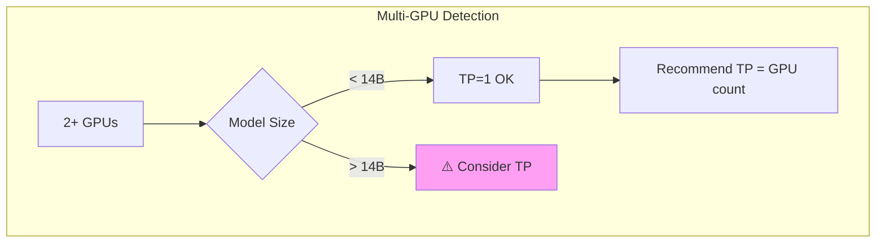

**Trigger:** device_count > 1, TP=1, model barely fits in single GPU

**Recommendation:**
```
[RECOMMEND] tensor_parallel: 2 GPUs detected but TP=1 —
model 'llama-70b' uses 65 GB, set runtime.tensor_parallel: 2
```

**When to Use TP:**

| Model Size | Single GPU (24GB) | TP=2 (2x24GB) | TP=4 (4x24GB) |
|------------|-------------------|----------------|-----------------|
| 7B | ✅ Fits | ✅ Overkill | ❌ Waste |
| 13B | ✅ Fits | ✅ Good | ⚠️ Overkill |
| 30B | ❌ Too big | ✅ Good | ✅ Good |
| 70B | ❌ Too big | ⚠️ Tight | ✅ Good |

### Rule 7: Unknown Format

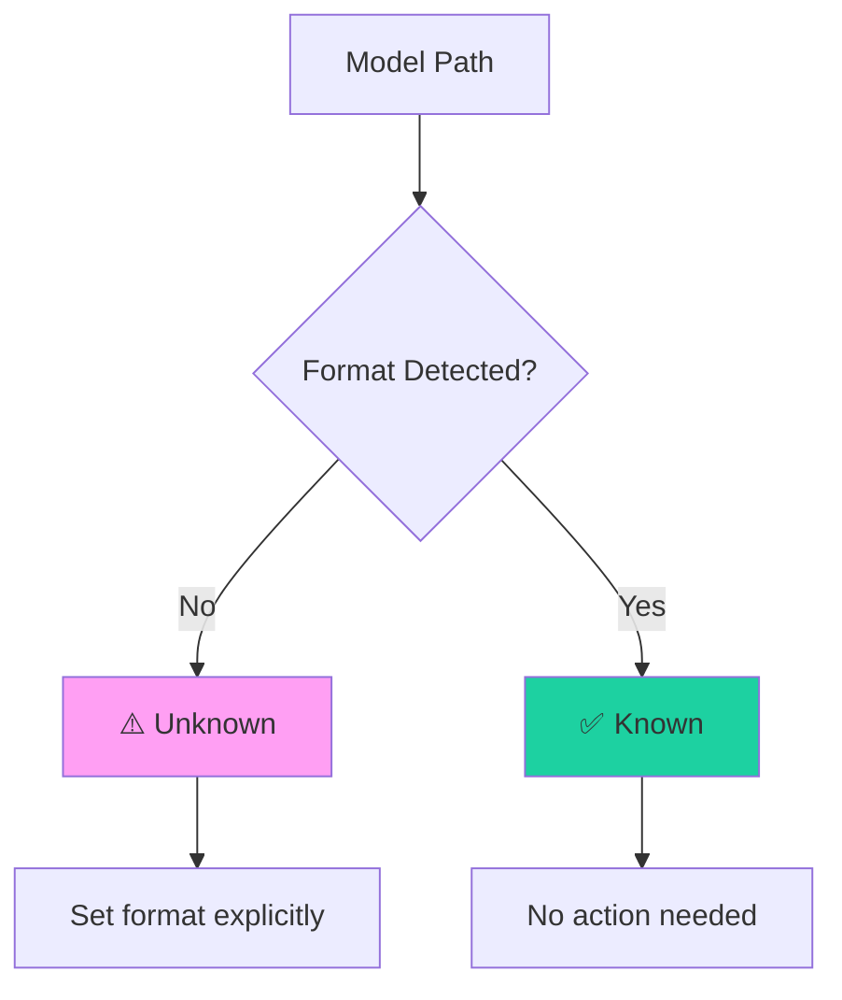

**Trigger:** Any model with `format == "unknown"`

**Recommendation:**
```
[RECOMMEND] format: Model 'custom-model' has unknown format —
set models[*].format explicitly (gguf, safetensors, or hf)
```

**Fix:**
```yaml
models:
  - id: custom-model
    path: /models/custom-model.bin
    format: safetensors        # Set explicitly
```

### Rule 8: GPU Unused

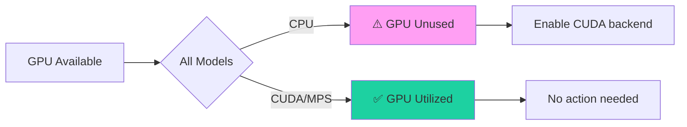

**Trigger:** GPU available, all models use CPU backend

**Recommendation:**
```
[RECOMMEND] gpu_unused: GPU 'RTX 4000 Ada' is available but all models use CPU —
set runtime.cuda.enabled: true
```

## Usage Examples

### Example 1: Suboptimal Config

**Config:**
```yaml
runtime:
  cuda:
    enabled: true
    flash_attention:
      enabled: false           # Suboptimal
  scheduler:
    max_batch_size: 4          # Too small
```

**Advisor Output:**
```
[INFO] startup_advisor: === InferFlux Startup Recommendations ===
[INFO] startup_advisor: [RECOMMEND] attention: GPU 'RTX 4000 Ada' (SM 8.9) supports FA2
  — set runtime.cuda.flash_attention.enabled: true
[INFO] startup_advisor: [RECOMMEND] batch_size: 16966 MB VRAM free
  — increase runtime.scheduler.max_batch_size to 56 (current: 4)
[INFO] startup_advisor: [RECOMMEND] phase_overlap: CUDA enabled with batch_size >= 4
  — set runtime.cuda.phase_overlap.enabled: true
[INFO] startup_advisor: === End Recommendations (3 suggestions) ===
```

### Example 2: Optimal Config

**Config:**
```yaml
runtime:
  cuda:
    enabled: true
    flash_attention:
      enabled: true
      tile_size: 128
    phase_overlap:
      enabled: true
  scheduler:
    max_batch_size: 32
```

**Advisor Output:**
```
[INFO] startup_advisor: === InferFlux Startup Recommendations ===
[INFO] startup_advisor: === No recommendations — config looks good! ===
```

## Suppressing the Advisor

```bash
# Environment variable
INFERFLUX_DISABLE_STARTUP_ADVISOR=true ./build/inferfluxd --config config/server.yaml

# Or in config file (not recommended)
```

## Programmatic Usage

The advisor context is available through `server/startup_advisor.h`:

```cpp
#include "server/startup_advisor.h"

// Build context
inferflux::StartupAdvisorContext ctx;
ctx.gpu = inferflux::ProbeCudaGpu();
// ... populate models and config ...

// Run advisor
int recommendations = inferflux::RunStartupAdvisor(ctx);
std::cout << recommendations << " suggestions\n";
```

## Implementation Details

### Rule Evaluation Flow

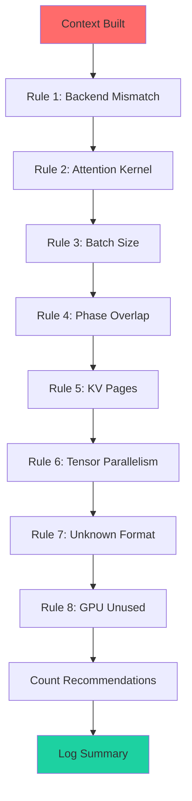

### Hardware Probing

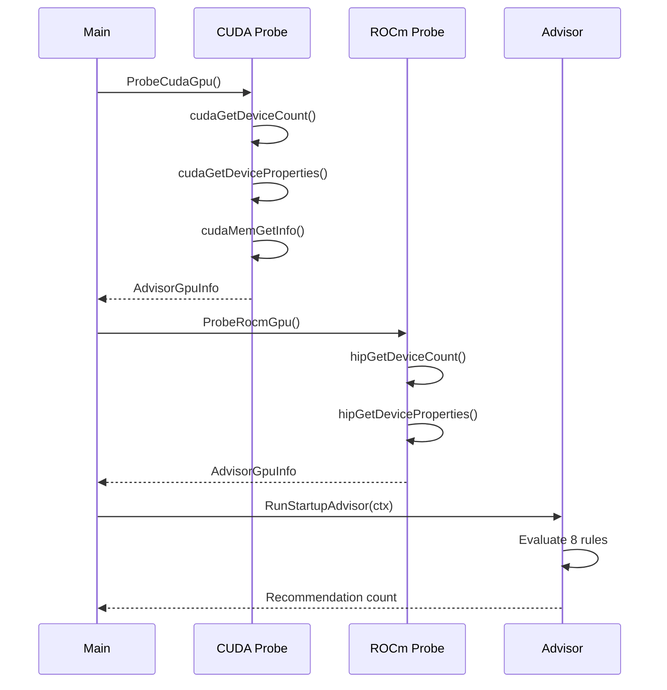

## Testing

```bash
# Run advisor integration tests
ctest --test-dir build -R StartupAdvisor --output-on-failure

# Expected: All tests pass
# 1. Well-tuned config → 0 recommendations
# 2. FA disabled on Ampere → 1+ recommendations
# 3. GPU available, CPU models → 1+ recommendations
# 4. Multi-GPU, TP=1, large model → 1+ recommendations
# 5. No models → 0 recommendations
# 6. Suppression env var → 0 recommendations
```

## Best Practices

1. **Don't ignore recommendations** - Each has measurable performance impact
2. **Re-run after hardware changes** - New GPU = new recommendations
3. **Check logs at startup** - Early intervention prevents production issues
4. **Use with new models** - Different formats have different requirements
5. **Monitor over time** - Recommendations evolve as features are added

---

**Next:** [Configuration Reference](CONFIG_REFERENCE.md) | [Performance Tuning](PERFORMANCE_TUNING.md) | [Architecture](Architecture.md)
