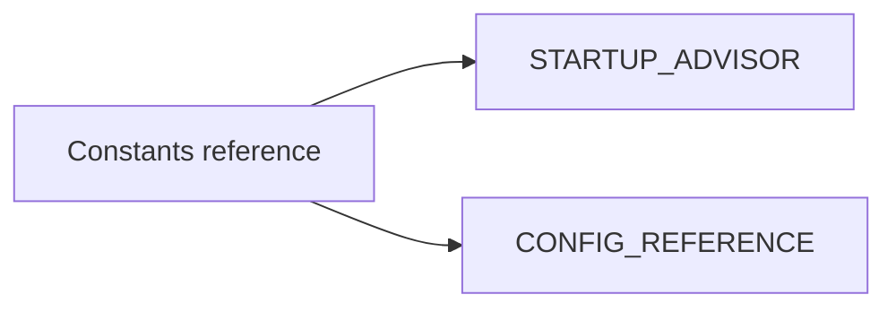

# Startup Advisor Configurable Constants (Consolidated)

**Status:** Consolidated

## Canonical Source Map

| Need | Source of truth |
|---|---|
| Advisor heuristics and guidance | [STARTUP_ADVISOR](STARTUP_ADVISOR.md) |
| Config key documentation | [CONFIG_REFERENCE](CONFIG_REFERENCE.md) |

## Archived Full Constants Snapshot

- [STARTUP_ADVISOR_CONFIGURABLE_CONSTANTS_2026_03_05](archive/evidence/STARTUP_ADVISOR_CONFIGURABLE_CONSTANTS_2026_03_05.md)
