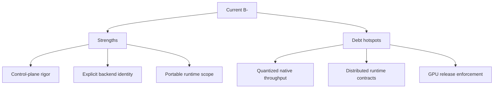

# InferFlux Tech Debt and Competitive Roadmap

**Snapshot date:** March 9, 2026  
**Current overall grade:** B-  
**Purpose:** Rank the debt that most directly blocks best-in-class runtime credibility.

## 1) Dimension Grades

| Dimension | Grade | Strong today | Weak today |
|---|---|---|---|
| Vision/product coherence | B+ | Clear server-first product shape and dual-backend strategy | Throughput narrative still outpaces proven native results |
| Capabilities | B+ | Strong API/admin/CLI contracts and endpoint identity | Some native feature parity remains delegate-coupled |
| Scalability/economy | C+ | Fairness, phased execution, prefix reuse, and optional split roles exist | Distributed ownership/failure semantics are still shallow |
| Resource efficiency | B- | KV planner, load-scoped precision, dequant policy, and reuse foundations are in code | Quantized native hot paths are not yet first-class enough to fully realize the memory model |
| Design/implementation | B | Clean provider split and policy surface | Native async API remains intentionally disabled; some runtime complexity is transitional |
| TDD/CI maturity | B+ | Contract suites are explicit and visible | Mandatory GPU lane is still missing |
| OSS docs/operator clarity | A- | Canonical docs are compact and code-aligned | Some deep-dive docs are still design-target oriented |

## 2) Revalidated Evidence

| Evidence | Result | Implication |
|---|---|---|
| Backend provider contract | Explicit provider/fallback semantics in runtime + API/CLI surfaces | Strong automation and policy posture |
| Native memory-economy foundation | `dequant_cache_policy=none` default, KV planner, and native KV metrics are wired | Good edge-device direction, but not yet sufficient proof of throughput leadership |
| Sync-first batching stance | Native keeps `SupportsAsyncUnifiedBatch()==false` and relies on sync batch execution for throughput | Confirms batching, not async dispatch, is the current performance model |
| Session handle foundation | TTL-based optional session leases exist in unified scheduler mode | Correct contract direction without breaking stateless default behavior |
| Distributed readiness foundation | Decode readiness depends on loaded model + full worker health | Better operational semantics, but transport and ownership remain immature |

## 3) Debt Register

| Priority | Debt item | Why it matters | Retirement gate | Tracking |
|---|---|---|---|---|
| P0 | Quantized GGUF first-class native runtime | Main blocker for native edge-device competitiveness | Hot paths stay native and memory-first without compatibility drift | [P1-2](issues/P1-2-quantized-native-forward-productionization.md) |
| P0 | Graph/overlap productionization | Needed for repeatable sustained throughput, not just functional overlap | Stable graph buckets + graph-hit metrics + non-regression coverage | [P1-1](issues/P1-1-native-flashattention-production-path.md) |
| P1 | Native-first parity independence | Delegate coupling hides real native feature gaps | Completion/chat/embeddings critical paths are native-owned where practical | [P0-1](issues/P0-1-native-cuda-identity-contract.md), [P0-2](issues/P0-2-strict-native-request-policy.md) |
| P1 | GPU KV/page allocator maturity | Memory economy must hold under concurrency, not only at load time | Stable reuse metrics and predictable planner behavior under load | [P0-4](issues/P0-4-gpu-kv-page-allocator-prefix-reuse.md) |
| P1 | Mandatory GPU behavior lane | Native regressions should block merges, not be discovered later | Required CI block for native-provider gates | [P0-5](issues/P0-5-mandatory-gpu-behavioral-ci-gate.md) |
| P1 | Distributed failure and ownership contracts | Current split-role/disaggregated work is not yet operations-grade | Ticketed transport + ownership cleanup + failure matrix | [P1-6](issues/P1-6-distributed-failure-path-contract-tests.md) |

## 4) Outdated Patterns To Retire

| Pattern | Better practice |
|---|---|
| Treating async support as proof of throughput | Measure batch quality and native hot-path residency instead |
| Using compatibility fallback as invisible feature completion | Expose fallback and native ownership explicitly |
| Static VRAM reservations | Plan KV sizing against budget and publish the decision |
| Claiming distributed readiness from scaffolding alone | Require transport lifecycle, ownership semantics, and fault-path tests |

See [MODERNIZATION_AUDIT](MODERNIZATION_AUDIT.md) for the full migration table.

## 5) Two CUDA Backend Value Split

| Axis | `native_cuda` provider | `cuda_llama_cpp` provider |
|---|---|---|
| Why it exists | Native performance/control path | Stable compatibility and fallback path |
| What it does well now | Policy-visible identity, native loaders, memory-economy foundation, sync overlap path | Mature GGUF compatibility and lower operational risk |
| What still lags | Quantized heavy-batch throughput and some native-first feature ownership | InferFlux-specific kernel/runtime headroom |
| Why both stay | They solve different operational risks today | They let the control plane stay stable while native matures |

## 6) Competitive Direction

| Area | Keep | Close next |
|---|---|---|
| Control plane | API/admin/CLI rigor, routing policy, observability | Keep current lead |
| Native runtime | Loader detection, memory policy, provider identity | Close quantized throughput and graph maturity gap |
| Distributed runtime | Honest low grade and bounded claims | Add transport lifecycle and ownership semantics before broadening claims |

## 7) Canonical References

- [Roadmap](Roadmap.md)
- [Architecture](Architecture.md)
- [COMPETITIVE_POSITIONING](COMPETITIVE_POSITIONING.md)
- [MODERNIZATION_AUDIT](MODERNIZATION_AUDIT.md)
