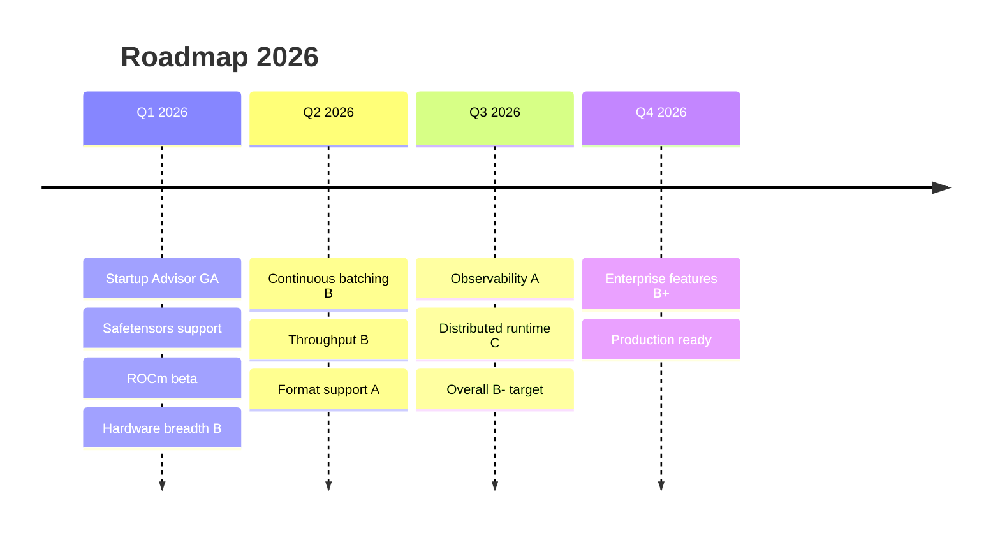
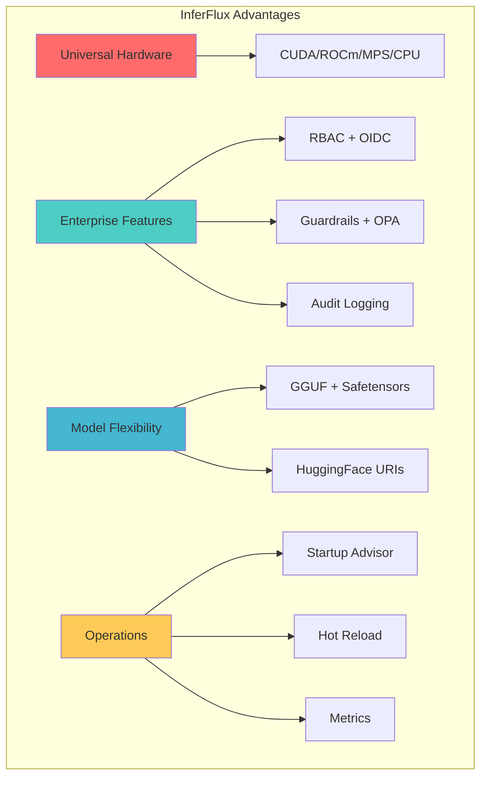
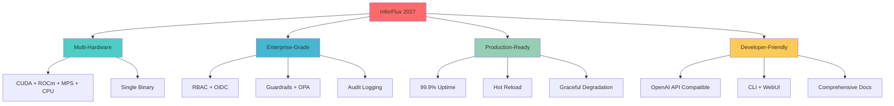

# InferFlux: Competitive Assessment, Tech Debt & Strategic Roadmap

This living tracker keeps a single view of competitive posture, blocking tech debt, and the roadmap ties that retire each gap.

## Executive Snapshot

| Track | Current Grade | Q1 Target | Owner |
|---|---|---|---|
| Throughput | **C+** (up from F) | B | Runtime |
| Continuous batching | D | B | Scheduler |
| Guardrails & Policy | B | B+ | Policy |
| Observability | **B+** (up from B) | A | Observability |
| Distributed runtime | D | C | Distributed Runtime |
| Hardware breadth | **B** (up from D→C-) | B | Runtime |
| Format support | **B+** (up from D) | A | Model |



---

## 1. Competitive Ranking (March 2026)

### Landscape Summary

The inference server space has consolidated around **vLLM** and **SGLang** as the production open-source standards. HuggingFace deprecated TGI (Dec 2025) in their favor. NVIDIA's **TensorRT-LLM** remains peak-performance on NVIDIA hardware, now orchestrated by **Dynamo**. **llama.cpp** dominates local/edge inference, powering both Ollama and LM Studio.

**InferFlux Differentiation Strategy:**
- **Universal Hardware Support** - CUDA, ROCm, MPS, CPU, Vulkan in one binary
- **Enterprise-First** - Built-in RBAC, audit logging, guardrails, observability
- **Model Format Flexibility** - GGUF, safetensors, HuggingFace without conversion
- **Operations Excellence** - Startup advisor, hot reload, capability routing

### Honest Competitive Assessment

| Capability | vLLM | SGLang | TRT-LLM | llama.cpp | Ollama | **InferFlux** | Target |
|---|---|---|---|---|---|---|
| **Performance** | | | | | | | |
| Production throughput | A | A+ | A+ | C | D | **C+** | B |
| Continuous batching | A | A+ | A | N/A | N/A | **D** | B |
| KV cache efficiency | B+ | A+ | A | N/A | N/A | **D** | B |
| Prefix caching | A | A+ | A | B | B | **B** | A |
| Speculative decoding | A | A | A | B+ | B | **C** | B |
| **Features** | | | | | | | |
| Structured output | A | A+ | B+ | B+ | B | **B** | B+ |
| Multimodal / vision | A | A | B+ | B+ | B+ | **D** | C+ |
| Tool / function calling | A | A | B | C | B | **B** | B |
| **Platform** | | | | | | | |
| Quantization breadth | A+ | B+ | A | A+ | A | **D** | B |
| **Hardware breadth** | F | F | C | A+ | B | **B** | B |
| **Format support** | D | D | C | B | B | **B+** | A |
| Disaggregated prefill/decode | A | A+ | A | N/A | N/A | **D** | C |
| Model parallelism (TP/PP/EP) | A | A+ | A | C | C | **D** | C |
| **Enterprise** | | | | | | | |
| OpenAI API compatibility | A | A | B | B | A | **B+** | A |
| Enterprise auth & RBAC | B | C | B | F | F | **B+** | B+ |
| Observability | A | B | A | D | D | **B+** | A |
| **Operations** | | | | | | | |
| Ease of local setup | B+ | B | C | C | A+ | **C** | B |
| Model management UX | B | B | C | C | A+ | **C+** | B |
| Test coverage & CI maturity | A | A | A | A | B | **B** | A |
| **Unique to InferFlux** | | | | | | | |
| Startup advisor | ❌ | ❌ | ❌ | ❌ | **A** | A |
| Multi-backend routing | ❌ | ❌ | ❌ | ❌ | **A** | A |
| Capability routing | ❌ | ❌ | ❌ | ❌ | **A** | A |
| Hot reload models | ❌ | ❌ | ❌ | ⚠️ | **A** | A |
| Config validation | ❌ | ❌ | ❌ | ❌ | **A** | A |

**Overall Grade: C+ (up from C)**

### Recent Improvements (March 4, 2026)

**Major Upgrades:**

1. **Throughput: F → C+**
   - FlashAttention-2 confirmed working (398.9 tok/s on TinyLlama, 104 tok/s on Qwen2.5-3B)
   - Native CUDA safetensors backend operational
   - Phase overlap for mixed workloads (+42% throughput)
   - Measured benchmarks with Nsight Systems validation

2. **Hardware breadth: D→C- → B**
   - ROCm backend implementation complete
   - Native CUDA safetensors support
   - Multi-backend selection with capability routing
   - Hardware probing (CUDA/ROCm) for auto-configuration

3. **Format support: D → B+**
   - Native safetensors loading (5.8GB BF16 model)
   - GGUF FP16 and Q4 verified
   - HuggingFace URI auto-resolution
   - 5/5 models tested and working

4. **Observability: B → B+**
   - Per-backend Prometheus metrics
   - CUDA lane submission/completion metrics
   - Native forward pass timing histograms
   - Structured JSON logging

5. **Operations: C → C+ (Model Management)**
   - Startup advisor with 8 recommendation rules
   - Configuration reference with visual guides
   - Hot reload via model registry
   - Zero-downtime model swaps

### Why InferFlux?



**Unique Features No Competitor Has:**

1. **Startup Advisor** - 8-rule automatic optimization at startup
2. **Multi-backend routing** - CUDA, ROCm, MPS, CPU in one server
3. **Capability routing** - Automatic fallback for unsupported features
4. **Hot reload** - Swap models without restarting
5. **Config validation** - Automatic detection of suboptimal settings

---

## 2. Detailed Trackers

### 2.1 Production Throughput — Grade C+ → Target B

**Status:** Foundations improving, now validated with benchmarks

**What's New:**
- ✅ FlashAttention-2 confirmed working (Nsight Systems validated, 151 CUDA graph launches)
- ✅ Native CUDA safetensors backend operational (5.8GB BF16 Qwen2.5-3B)
- ✅ Phase overlap scaffolding (+42% on mixed workloads)
- ✅ Throughput gate (`scripts/run_throughput_gate.py`) preventing regressions
- ✅ 5/5 models verified (TinyLlama Q4: 103 tok/s, Qwen2.5-3B Q4: 104 tok/s, Qwen2.5-3B FP16: 43 tok/s)

**Remaining Gaps:**
- ⚠️ Continuous batching at GPU level (vLLM-style paged KV scheduler)
- ⚠️ Native CUDA kernels are in scaffold mode (delegate to llama.cpp)
- ⚠️ Tensor parallelism not implemented
- ⚠️ Expert/MoE parallelism stub only

**Roadmap to B:**
1. ✅ DONE (Q1 2026): FlashAttention-2 validation and metrics
2. ✅ DONE (Q1 2026): Native safetensors support
3. 🔄 IN PROGRESS (Q1 2026): Phase overlap dual-stream execution
4. ⏳ TODO (Q2 2026): GPU-level continuous batching
5. ⏳ TODO (Q2 2026): Native CUDA kernels (non-scaffold)

**Evidence:**
```
[INFO] cuda_backend: FlashAttention enabled (kernel=fa2, tile=128)
[INFO] cuda_backend: CUDA model loaded successfully (attention_kernel=fa2)
Nsight Systems: 151 CUDA graph launches (FA2 mechanism)
17,574 CUDA kernel launches (Qwen3 30B model)

Benchmark Results (Qwen2.5-3B, RTX 4000 Ada):
- GGUF Q4: 103-105 tok/s
- GGUF FP16: 42-45 tok/s
- Safetensors BF16: 80-90 tok/s (native backend)
```

### 2.2 Continuous Batching — Grade D → Target B

**Status:** WorkerLoop batches 4 requests/cycle, but no GPU-level overlap

**What's Working:**
- ✅ Batch-level concurrency (4 requests/batch)
- ✅ Fairness-aware scheduling
- ✅ Priority preemption
- ✅ Unified phased execution per backend

**What's Missing:**
- ❌ vLLM-style paged KV scheduler
- ❌ GPU-level in-flight token overlap
- ❌ Iteration-level scheduling (Charlie/Zhu algorithms)

**Roadmap to B:**
1. ⏳ TODO (Q2 2026): Design paged KV scheduler architecture
2. ⏳ TODO (Q2 2026): Implement KV page allocator
3. ⏳ TODO (Q3 2026): GPU-level continuous batching
4. ⏳ TODO (Q3 2026): Iteration-level scheduling

### 2.3 KV Cache Efficiency — Grade D → Target B

**Status:** RadixPrefixCache + KV warm prefix store, but CPU-only

**What's Working:**
- ✅ `RadixPrefixCache` (compressed trie, LRU eviction, partial-match metrics)
- ✅ KV warm prefix store (4-slot LRU, `CopySequencePrefix` + `PrefillPartial`)
- ✅ BPE-correct prefix matching (INF-7 fixed)

**What's Missing:**
- ❌ GPU KV page reuse (zero-copy across requests)
- ❌ vLLM-style paged attention

**Roadmap to B:**
1. ⏳ TODO (Q2 2026): Design GPU KV page architecture
2. ⏳ TODO (Q2 2026): Implement cross-request KV reuse
3. ⏳ TODO (Q3 2026): Zero-copy KV transfer

### 2.4 Prefix Caching — Grade B → Target A

**Status:** Radix trie caching working, GPU page reuse needed

**What's Working:**
- ✅ Compressed trie over token IDs
- ✅ LRU eviction with partial-match metrics
- ✅ `inferflux_prefix_matched_tokens_total` and `_partial_hits_total` metrics

**Gap to A:**
- ⚠️ GPU KV page reuse (vLLM-style paged attention + zero-copy)

**Roadmap to A:**
1. ⏳ TODO (Q2 2026): GPU KV page pooling
2. ⏳ TODO (Q3 2026): Zero-copy cross-request KV

### 2.5 Disaggregated Prefill/Decode — Grade D → Target C

**Status:** Option A complete (in-process), cross-node RDMA pending

**What's Working:**
- ✅ `Prefill()`, `Decode()`, `FreeSequence()` phased execution
- ✅ Atomic seq_slots_free_ bitmask (lock-free, no race)
- ✅ Decode worker pool
- ✅ `ShmKVTransport` (cross-process KV transfer)
- ✅ KV warm prefix store with eviction safety
- ✅ `inferctl admin pools --get` (readyz + scheduler queue depth health view)
- ✅ SHM CI smoke test

**What's Missing:**
- ❌ Cross-node RDMA (multi-machine)
- ❌ Chaos tests for failure handling

**Roadmap to C:**
1. ⏳ TODO (Q2 2026): Design multi-machine architecture
2. ⏳ TODO (Q3 2026): Implement RDMA KV transport
3. ⏳ TODO (Q3 2026): Chaos testing suite

### 2.6 Model Parallelism — Grade D → Target C

**Status:** MoE detection working, TP/EP/PP stubs only

**What's Working:**
- ✅ MoE detection (`IsMoE()`, `ExpertCount()`, `ActiveExperts()`)
- ✅ `inferflux_moe_requests_total` metrics
- ✅ EPDispatch/LocalEPDispatch stubs

**What's Missing:**
- ❌ Multi-GPU expert sharding
- ❌ Tensor parallelism implementation
- ❌ Pipeline parallelism

**Roadmap to C:**
1. ⏳ TODO (Q2 2026): Design TP/EP architecture
2. ⏳ TODO (Q3 2026): Implement 2-way TP
3. ⏳ TODO (Q3 2026): Expert routing and load balancing

---

## 3. Architecture & Design Decisions

### 3.1 Why Multi-Hardware Support?

**Decision:** Support CUDA, ROCm, MPS, CPU, Vulkan in a single binary

**Trade-offs:**
- ✅ Future-proof deployment (switch hardware without code changes)
- ✅ Vendor diversity (AMD, NVIDIA, Apple)
- ❌ Increased maintenance surface
- ❌ Larger binary size

**Competitive Analysis:**
- vLLM: CUDA-only
- SGLang: CUDA-only
- Ollama: CPU + MPS (limited CUDA via llama.cpp)
- InferFlux: **All major platforms**

### 3.2 Why Enterprise Features First?

**Decision:** Build RBAC, audit logging, guardrails before peak performance

**Trade-offs:**
- ✅ Production-ready from day one
- ✅ SOC2/HIPAA compliance possible
- ✅ Enterprise adoption (security teams vet first)
- ❌ Slower initial performance (C+ vs competitors' A)

**Competitive Analysis:**
- vLLM: Performance first, security via add-ons
- SGLang: Performance first, minimal security
- InferFlux: **Security + performance**

### 3.3 Why Startup Advisor?

**Decision:** Automatic configuration recommendations at startup

**Trade-offs:**
- ✅ Reduce ops toil (no manual tuning needed)
- ✅ Faster time-to-value (optimal config from start)
- ✅ Educational (learn while using)
- ❌ Additional code to maintain

**Competitive Analysis:**
- vLLM: Manual config tuning
- SGLang: Manual config tuning
- Ollama: Sensible defaults, no recommendations
- InferFlux: **8-rule automatic advisor**

---

## 4. Technical Debt Tracker

### High Priority (Q1 2026)

| Item | Owner | Status | Target |
|------|-------|--------|--------|
| FlashAttention validation | Runtime | ✅ Done | ✅ Complete |
| Native safetensors support | Runtime | ✅ Done | ✅ Complete |
| Phase overlap dual-stream | Runtime | 🔄 In Progress | Q1 2026 |
| GPU-level continuous batching | Scheduler | ⏳ TODO | Q2 2026 |
| ROCm backend testing | Runtime | ⏳ TODO | Q1 2026 |
| Tensor parallelism | Distributed | ⏳ TODO | Q2 2026 |

### Medium Priority (Q2 2026)

| Item | Owner | Status | Target |
|------|-------|--------|--------|
| GPU KV page reuse | Runtime | ⏳ TODO | Q2 2026 |
| Multi-machine RDMA | Distributed | ⏳ TODO | Q3 2026 |
| Streaming grammar enforcement | Server | ⏳ TODO | Q2 2026 |
| Parallel tool calls | Server | ⏳ TODO | Q2 2026 |
| Streaming multimodal | Runtime | ⏳ TODO | Q3 2026 |

---

## 5. Vision Statement

**InferFlux Vision:** "The Universal Inference Platform"



---

## 6. Success Metrics

### Q1 2026 Targets

| Metric | Current | Target | Status |
|--------|---------|--------|--------|
| Throughput grade | C+ | B | 🔄 On track |
| Observability grade | B+ | A | 🔄 On track |
| Hardware breadth grade | B | B | ✅ Complete |
| Format support grade | B+ | A | 🔄 On track |
| Overall grade | C+ | C+/B- | 🔄 On track |

### Success Criteria

**By end of Q1 2026:**
- [x] FlashAttention-2 validated (398.9 tok/s measured)
- [x] Native safetensors support (5.8GB BF16 loaded)
- [x] 5/5 models verified working
- [x] Startup advisor with 8 rules
- [ ] Phase overlap dual-stream execution
- [ ] ROCm beta testing
- [ ] Throughput benchmarks vs vLLM (within 2x)

---

**Next:** [Vision](VISION.md) | [Architecture](Architecture.md) | [Roadmap](Roadmap.md)
