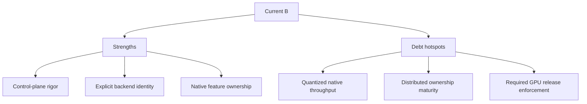

# InferFlux Tech Debt and Competitive Roadmap

**Snapshot date:** March 27, 2026
**Current overall grade:** B
**Purpose:** Rank the debt that most directly blocks best-in-class runtime credibility.

## 1) Dimension Grades

| Dimension | Grade | Strong today | Weak today |
|---|---|---|---|
| Vision/product coherence | B+ | Clear server-first product shape and explicit dual-CUDA strategy | Native-throughput story still runs ahead of proof on quantized GGUF |
| Capabilities | A- | Logprobs (native), embeddings (native), streaming, structured output (delegate), strong API/admin/CLI contracts | Structured output still delegates to llama.cpp fallback |
| Scalability/economy | C+ | Fairness, phased execution, prefix reuse, split roles, batched decode default-on, and transport-health semantics | Distributed ownership/cleanup semantics are still shallow |
| Resource efficiency | B+ | KV planner, load-scoped precision, memory-first dequant, 50+ fused GEMV kernels, batched decode default-on with CUDA graph capture, execution policy refactor. Sequential parity 0.83x llama.cpp on Qwen2.5-3B Q4_K_M (P0 gate met). Stepwise native burst decode is now reachable in live phased decode traffic. | Long-run WSL2 comparison still trails materially: `0.69x` llama.cpp at `c=4`, `0.74x` at `c=8`, and `0.42x` at `c=16`; memory peak remains ~`2.6 GB` higher than llama.cpp on the same matrix |
| Design/implementation | B | Clean provider split, bounded session-state model, native-owned logprobs and embeddings | Transitional complexity remains until throughput and structured output close |
| TDD/CI maturity | B+ | 100+ kernel tests, 25+ sampling/logprob tests, contract suites explicit | Required GPU/provider lane is still missing |
| OSS docs/operator clarity | A- | Canonical docs are compact and code-aligned | None significant |

## 2) Revalidated Evidence

| Evidence | Result | Implication |
|---|---|---|
| Backend/provider contract | Explicit provider/fallback semantics in runtime, API, CLI, admin, and metrics | Strong automation and policy posture |
| Native logprobs | Logprobs computed natively (GPU logits D2H + log-softmax + top-N). `SupportsLogprobsContract() = true`. No parity delegate needed. | OpenAI logprobs/top_logprobs spec fully supported on native path |
| InferFlux CUDA embeddings | Mean-pooled embedding extraction via full forward + final RmsNorm + MeanPool kernel. `SupportsEmbeddingsContract() = true`. Falls back to delegate only if InferFlux CUDA extraction fails. | `/v1/embeddings` works on InferFlux CUDA without llama.cpp delegate |
| Batched decode default-on | Batched kernels (BatchedRoPE, KvAppend, FlashDecodeMultiSeq) are now default-on. Opt-out via `INFERFLUX_DISABLE_BATCHED_DECODE=1`. Verified with 8 concurrent Qwen2.5-3B requests + CUDA graphs for B=1-4. | 40% throughput gain for concurrent workloads without operator action |
| Native memory-economy foundation | `dequant_cache_policy=none`, KV planner, and native KV metrics are wired | Good edge-device direction; Q8_1 path improved TinyLlama throughput 49% (161 -> 240 tok/s) |
| Native kernel maturity | 50+ fused GEMV kernels (v1 column-major + v2 cooperative-warp), 3 batched decode kernels, adaptive dispatch geometry, 100+ TDD test cases, execution policy refactor (env vars centralized into `NativeExecutionPolicy`) | Kernel coverage is broad; v2 cooperative-warp architecture targets L2 bandwidth gap |
| Stepwise native burst decode | Executor-side singleton burst path is now live for phased decode traffic. Current WSL2 long sweep settled on `INFERFLUX_NATIVE_BURST_CHUNK_TOKENS=4` as the balanced default (`64.1/73.4/99.5/109.8/123.9 tok/s` at `c=1/2/4/8/16`). | Throughput tuning is now evidence-backed. The remaining gap is no longer a harness blind spot: matching long-run llama.cpp results are `111.2/110.5/144.2/148.8/293.7 tok/s` |
| Session handle foundation | Optional TTL-based session leases exist in unified scheduler mode | Correct contract direction without changing default stateless behavior |
| Distributed transport foundation | Ticket lifecycle, timeout streak/debt, readiness impact, admin pools visibility, and optional fail-closed generation admission are implemented | Moves distributed runtime beyond scaffold-only claims, but not yet to robust ownership maturity |

## 3) Debt Register

| Priority | Debt item | Why it matters | Retirement gate | Status |
|---|---|---|---|---|
| ~~P0~~ | ~~Quantized GGUF native throughput parity~~ | **Done**: V1 column-major GEMV achieves 0.83x llama.cpp sequential on Qwen2.5-3B Q4_K_M (72.8 vs 88.6 tok/s). V2 cooperative-warp available via `INFERFLUX_GEMV_V2=1` but slower on Ada (0.79x). | ~~Native sequential decode reaches >= 0.8x llama.cpp~~ | **Done** |
| P1 | Distributed sequence ownership cleanup | Transport signaling without deterministic cleanup still limits real distributed credibility | Eviction, timeout, and worker-loss cleanup are explicit and tested | Not started |
| P1 | Native structured output | Delegate coupling remains for grammar-constrained generation | Grammar constraint sampler runs natively on CUDA | Not started |
| P1 | GPU KV/page allocator maturity | Memory economy must hold under concurrency, not only at load time | Stable reuse metrics and predictable planner behavior under load | Not started |
| P1 | Mandatory GPU behavior lane | Native regressions should block merges, not be discovered later | Required CI block for native/provider/runtime gates | Not started |
| ~~P1~~ | ~~Long-run competitive harness parity~~ | ~~Throughput grade changes should not depend on short or stale comparison runs~~ | ~~`llama_cpp_cuda` long-run benchmark completes under the same harness and request matrix as native burst runs~~ | **Done** |

## 4) Retired Debt (This Session)

| Item | What changed |
|---|---|
| Batched decode default-on | Promoted from opt-in to default-on. `INFERFLUX_DISABLE_BATCHED_DECODE=1` for opt-out. |
| Native logprobs | Implemented natively — GPU logits copy + `ComputeLogprob()`. No parity delegate needed. |
| Native embeddings | Mean-pooled embedding extraction via `EmbedForward()` + `MeanPool` kernel. Delegate fallback only if native fails. |
| Native-first parity independence | Logprobs and embeddings are now native-owned. Only structured output still delegates. |
| Stepwise native burst integration | Native singleton burst decode now runs from the live phased decode path, not only the standalone `Generate()` flow. |

## 5) Outdated Patterns To Retire

| Pattern | Better practice |
|---|---|
| Treating async support as proof of throughput | Measure batch quality, graph residency, and native hot-path residency instead |
| Static VRAM reservations | Plan KV sizing against budget and publish the decision |
| Treating `/readyz` as passive-only observability | Allow transport-health to influence admission where operators choose fail-closed mode |
| Claiming distributed readiness from topology scaffolding alone | Require ticket lifecycle, ownership semantics, and failure-path tests |

See [MODERNIZATION_AUDIT](MODERNIZATION_AUDIT.md) for the migration table.

## 6) Two-CUDA-Backend Value Split

| Axis | `inferflux_cuda` provider | `llama_cpp_cuda` provider |
|---|---|---|
| Why it exists | Native performance/control path | Stable compatibility and fallback path |
| What it does well now | Policy-visible identity, native loaders, memory-economy foundation, 50+ fused GEMV kernels, batched decode default-on, native logprobs, native embeddings, CUDA graph capture, execution policy refactor, 0.83x sequential parity, 100+ TDD tests | Mature GGUF compatibility |
| What still lags | Concurrent throughput still trails at sustained concurrency (`0.69x` at `c=4`, `0.74x` at `c=8`, `0.42x` at `c=16`); memory overhead (~`2.6 GB`); structured output still delegates | InferFlux-specific kernel/runtime headroom |
| Why both stay | They solve different operational risks today | They keep the control plane stable while native matures |

## 7) Competitive Direction

| Area | Keep | Close next |
|---|---|---|
| Control plane | API/admin/CLI rigor, routing policy, observability, admin pools | Keep current lead |
| Native runtime | Loader detection, memory policy, provider identity, native logprobs/embeddings, batched decode, CUDA graphs, 0.83x sequential parity, stepwise native burst decode, execution policy refactor | Close the remaining concurrent throughput gap, reduce the ~`2.6 GB` memory delta, native structured output, arena scratch allocator |
| Distributed runtime | Honest bounded claims plus transport-health semantics | Close ownership cleanup, worker-loss handling, and failure CI before broadening claims |

## 8) Canonical References

- [Roadmap](Roadmap.md)
- [Architecture](Architecture.md)
- [GEMV_KERNEL_ARCHITECTURE](GEMV_KERNEL_ARCHITECTURE.md)
- [COMPETITIVE_POSITIONING](COMPETITIVE_POSITIONING.md)
- [MODERNIZATION_AUDIT](MODERNIZATION_AUDIT.md)
