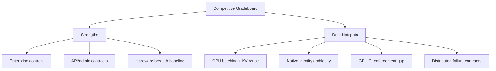

# InferFlux Tech Debt and Competitive Roadmap

**Snapshot date:** March 5, 2026  
**Current overall grade:** C+ (revalidated March 5, 2026 after commit-history refresh + regression reruns; aligned with [Roadmap](Roadmap.md))  
**Purpose:** Single-page debt heatmap tied to issue-backed retirement gates.

## 1) Grade Heatmap

| Dimension | Grade | What is strong | What is weak |
|---|---|---|---|
| Vision and product coherence | B | Clear OSS identity, OpenAI-compatible API, enterprise posture | Throughput narrative is still ahead of full native CUDA delivery |
| Capabilities | B | Strong explicit-ID and admin/CLI argument contracts with embeddings/model identity gates | Native provider still scaffold/fallback in main CUDA path |
| Scalability and economy | C+ | Fairness + phased execution + prefix cache foundation plus HTTP worker-pool mitigation (4→16) | No full GPU iteration scheduler or KV page allocator |
| Resource efficiency | B- | Pre-flight memory checks, graceful degradation, and slot/advisor test coverage now protect FP16 memory pressure paths | Memory-pressure metrics export and autoscaling SLO wiring are still partial |
| Design and implementation quality | B | Strong capability/policy abstractions and backend identity wiring | Transitional dual-path complexity remains in CUDA backend stack |
| TDD and CI maturity | B+ | Focused contract suites mirrored in CI + coverage with drift-count assertions | Merge-blocking GPU behavioral coverage still depends on self-hosted availability |
| OSS docs and operator clarity | B+ | Canonical docs were consolidated and contract-checked | Link freshness is merge-gated only for canonical docs, not all reference docs |

## 1.1) Evidence Snapshot (Revalidated)

| Evidence | Result | Implication |
|---|---|---|
| `ctest -R "NativeForwardTests|NativeBatchTests|GGUFTests|QuantizationTests|ModelIdentityTests|EmbeddingsRoutingTests|IntegrationEmbeddingsRoutingContract|IntegrationModelIdentityContract|IntegrationCLIAdminArgContract|IntegrationNativeMetrics"` | 10/10 passed | Capability identity + native-runtime regression confidence increased |
| `./build/inferflux_tests "[startup_advisor]"` and `./build/inferflux_tests "[policy]"` | 2/2 passed | Confirms advisor/policy hardening landed with regression coverage |
| `server/main.cpp` worker default (`a18ca46`) | `http_workers` increased 4→16 | Mitigates request-layer queue saturation for non-streaming concurrency |
| `run_throughput_gate.py` (CUDA, `gpu_profile=ada_rtx_4000`, strict lane/overlap/mixed requirements) | Failed (`137.33` completion tok/s; lane + overlap + mixed-iteration deltas remained `0`; fallback=`true`; provider=`universal`) | Native CUDA lane/overlap path is still not active in default `backend=cuda` runs |
| `run_throughput_gate.py` (CUDA, relaxed lane requirements) | Passed (`265.675` completion tok/s, `1.0` success rate, fallback=`true`, provider=`universal`) | Throughput baseline is stable, but still universal fallback instead of native path |
| Focused static analysis (`bugprone-empty-catch`, narrowing, widening) on runtime/http/policy hot paths | Clean on targeted files | Lowers latent crash/undefined-behavior risk in core paths |
| `python3 scripts/check_docs_contract.py` | Passed | Confirms canonical docs coherence after consolidation |

## 1.2) Recent Commit-History Findings

| Commit | What landed | Debt impact |
|---|---|---|
| `a8cee5b` | Native CUDA runtime error-handling hardening across event/stream/allocation paths | Reduces reliability debt in throughput-critical execution surfaces |
| `a18ca46` | Default HTTP worker pool increased to 16 | Reduces request-layer concurrency bottlenecks for non-streaming workloads |
| `307bc12` / `24412c2` | Policy/HTTP parse and conversion safety hardening | Reduces control-plane correctness and operational-risk debt |
| `f795f31` / `2eaa66b` | Startup-advisor + runtime conversion/math safety hardening | Improves resource-planning safety and implementation quality |
| `5d284f6` / `b22d4d5` | Concurrent + quick streaming benchmark script hardening | Improves investigation repeatability and throughput observability |

## 2) Debt Register (Actionable)

| Priority | Debt Item | Impact | Owner | Retirement Gate | Issue |
|---|---|---|---|---|---|
| P0 | Native CUDA identity not uniformly explicit | Operator confusion, policy risk, benchmark ambiguity | Runtime + CLI | Provider identity explicit in API/CLI/metrics and strict-fail path tested | [#1](https://github.com/vjsingh1984/inferflux/issues/1), [#2](https://github.com/vjsingh1984/inferflux/issues/2) |
| P1 | GPU continuous batching maturity gap | Throughput/cost lag vs vLLM/SGLang | Scheduler + Runtime | Iteration scheduler with benchmark and regression contracts | [#3](https://github.com/vjsingh1984/inferflux/issues/3) |
| P1 | GPU KV page allocator and prefix reuse gap | Recompute overhead, lower token economy | Runtime | Page allocator + correctness suite + reuse metrics | [#4](https://github.com/vjsingh1984/inferflux/issues/4) |
| P1 | Native attention/quantized kernel maturity gaps | Performance ceiling, fallback dependency | Runtime CUDA | Fused/production kernels with non-regression tests | [#6](https://github.com/vjsingh1984/inferflux/issues/6), [#7](https://github.com/vjsingh1984/inferflux/issues/7) |
| P1 | Scheduler lock contention | Queue latency under load | Scheduler | Lock partitioning and contention regression tests | [#8](https://github.com/vjsingh1984/inferflux/issues/8) |
| P1 | Economy metrics insufficient for autoscaling | Cost control and SLO blind spots | Observability | Efficiency metrics documented and consumed by policies | [#9](https://github.com/vjsingh1984/inferflux/issues/9) |
| P2 | GPU CI behavioral lane not fully mandatory | Regressions can slip by environment variance | QA + Runtime | Merge-blocking GPU behavior lane in CI | [#5](https://github.com/vjsingh1984/inferflux/issues/5), [#10](https://github.com/vjsingh1984/inferflux/issues/10) |
| P2 | Distributed failure-path contract coverage incomplete | Enterprise resilience risk | Distributed Runtime | Fault matrix tests for transport/prefill/decode failures | [#11](https://github.com/vjsingh1984/inferflux/issues/11) |
| P2 | Model weight unloading not implemented | Memory pressure prevents model swapping, long-running servers accumulate GPU memory | Runtime + Backend | Implement model unload/swap with proper weight deallocation and KV cache cleanup | Future issue |

## 3) Competitive Position (Concise)

| Area | InferFlux current | Direction |
|---|---|---|
| Enterprise controls | Strong relative position | Keep lead via strict contracts + observability |
| Hardware and format breadth | Strong baseline | Maintain while hardening throughput core |
| Raw GPU throughput | Behind leaders | Close gap through #3/#4/#6/#7 |
| CI enforceability | Moderate | Raise with mandatory GPU behavior gates |
| Distributed resilience | Early | Mature via #11 and associated runbooks |

## 4) Execution Order (Minimal Critical Path)

1. Resolve identity and strict policy semantics first (`#1`, `#2`).
2. Land throughput foundation (`#3`, `#4`) before advanced optimizations.
3. Lock in mandatory GPU CI and coverage symmetry (`#5`, `#10`).
4. Complete kernel maturity and scheduler contention items (`#6`, `#7`, `#8`).
5. Finish economy metrics and distributed failure contracts (`#9`, `#11`).
6. Implement model unload/swap for dynamic multi-model serving (P2 item).

## 5) Evidence Anchors (Code-Backed)

- Backend identity/policy selection: `runtime/backends/backend_factory.cpp`
- Native CUDA executor/delegation path: `runtime/backends/cuda/native_cuda_executor.cpp`
- Native kernel maturity surface: `runtime/backends/cuda/kernels/flash_attention.cpp`, `runtime/backends/cuda/native/quantized_forward.cpp`
- Scheduler contention surface: `scheduler/scheduler.cpp`, `scheduler/scheduler.h`
- CI enforcement surface: `.github/workflows/ci.yml`

## 6) Canonical References

- [Roadmap](Roadmap.md)
- [Architecture](Architecture.md)
- [API_SURFACE](API_SURFACE.md)
- [ARCHIVE_INDEX](ARCHIVE_INDEX.md)
