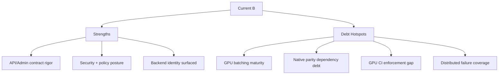

# InferFlux Tech Debt and Competitive Roadmap

**Snapshot date:** March 8, 2026  
**Current overall grade:** B (contract maturity improved; throughput remains the main limiter)  
**Purpose:** Debt heatmap tied to issue-backed retirement gates.

## 1) Dimension Grades

| Dimension | Grade | Strong today | Weak today |
|---|---|---|---|
| Vision/product coherence | B+ | OSS control-plane direction is backed by native behavior-gate evidence and strict provider identity | Heavy-batch narrative still trails enterprise target |
| Capabilities | B+ | Strong model/admin/CLI contracts, machine-visible backend identity metadata, and endpoint parity contracts for completion/chat/embeddings | Native parity is currently delegate-coupled for some model-format combinations |
| Scalability/economy | B- | Fairness + phased execution + prefix-cache + active mixed scheduler iterations | GPU iteration policy/tail-latency tuning still immature |
| Resource efficiency | B | KV/dequant lifecycle controls are load-scoped; GGUF overlap no longer hard-disabled | Quantized GGUF path still needs fused maturity and larger-model validation |
| Design/implementation | B+ | Clear provider split (`llama_cpp` compatibility vs `native` performance core), deterministic fallback policy, and explicit endpoint capability contracts | Native async unified-batch contract remains disabled; parity path still has delegate complexity |
| TDD/CI maturity | B+ | Focused contract gates explicitly visible in CI and coverage jobs | Mandatory GPU behavior lane still environment-dependent |
| OSS docs/operator clarity | B+ | Canonical docs consolidated and contract-checked | Some non-canonical references still carry legacy wording |

## 2) Revalidated Evidence (Code + Latest Gates)

| Evidence | Result | Implication |
|---|---|---|
| Backend provider contract (`runtime/backends/backend_factory.*`) | Explicit provider enum + exposure policy (`allow_llama_cpp_fallback`, `strict_native_request`) | Identity semantics are now source-aligned |
| Router/API exposure surfaces (`scheduler/single_model_router.cpp`, `server/http/http_server.cpp`) | Backend provider/fallback fields are machine-visible | Automation-facing identity checks are robust |
| Endpoint parity routing contract (`scheduler/single_model_router.cpp`, `runtime/backends/cuda/native_cuda_backend.cpp`) | Native capability map is explicit per endpoint and no longer blanket-gated for completion/chat/embeddings | Fallback decisions are policy-driven rather than capability-gap-driven when parity path is available |
| Scheduler parity safety (`scheduler/scheduler.cpp`) | Logprobs/structured-output requests stay on full-generate path instead of phased prefill/decode split | Avoids cross-path sequence/sampler state divergence |
| Native readiness gate (`runtime/backends/cuda/native_cuda_backend.cpp`) | Native readiness auto-detects compiled kernels + CUDA device availability (with env override to force scaffold) | Default CUDA requests can opt into native path without manual executor hints |
| CUDA fallback chain (`scheduler/single_model_router.cpp`) | Ordered chain: `cuda -> cuda_llama_cpp -> rocm -> mlx -> mps -> cpu` (unsupported targets skipped) | Improves survivability and keeps fallback behavior predictable |
| Native concurrency contract (`runtime/backends/cuda/native_kernel_executor.cpp`) | Decode/prefill overlap path is active in synchronous execution; async unified-batch contract is intentionally disabled | Throughput gains exist, but contract-level async parity remains open |
| GGUF overlap safety (`runtime/backends/cuda/native_kernel_executor.cpp`) | GGUF overlap initialization now uses lane-local quantized map/adapter ownership | Removes prior hard disablement and dequant-scratch sharing risk in overlap mode |
| Throughput gate evidence (Ada RTX 4000, Qwen2.5-3B safetensors, March 8, 2026) | Strict gate passes with native provider, no fallback, active decode/prefill lanes, active overlap, and mixed scheduler iterations | Confirms native CUDA path is now materially active in real gate workloads |
| Strict-native admin contract (`scheduler/single_model_router.cpp`, `server/http/http_server.cpp`) | Strict native load rejection now surfaces `422 backend_policy_violation` consistently | Preserves fail-fast policy semantics for automation and operations |
| Contract suites + docs contract | Focused identity/arg-contract/docs checks are present | CI confidence improved on control-plane correctness |

## 3) Debt Register (Actionable)

| Priority | Debt item | Impact | Retirement gate | Issue |
|---|---|---|---|---|
| P0 | Native heavy-batch/quantized throughput maturity | Enterprise throughput/cost lag | Sustained uplift on larger models and bursty batches with strict native policy intact | [#3](https://github.com/vjsingh1984/inferflux/issues/3), [#6](https://github.com/vjsingh1984/inferflux/issues/6), [#7](https://github.com/vjsingh1984/inferflux/issues/7) |
| P1 | GPU continuous batching maturity | Throughput/cost lag | Iteration scheduler + non-regression gates | [#3](https://github.com/vjsingh1984/inferflux/issues/3) |
| P1 | GPU KV page allocator/reuse maturity | Recompute overhead and weaker token economy | Correctness + reuse metrics + stable throughput uplift | [#4](https://github.com/vjsingh1984/inferflux/issues/4) |
| P1 | Native attention/quantized kernel maturity | Performance ceiling on large/quantized workloads | Fused native kernels + validated GGUF quantized overlap path with benchmark/regression coverage | [#6](https://github.com/vjsingh1984/inferflux/issues/6), [#7](https://github.com/vjsingh1984/inferflux/issues/7) |
| P1 | Native-first endpoint parity independence | Delegate coupling can hide parity fragility on some model-format layouts | Core parity features operate without llama.cpp delegate dependence | [#6](https://github.com/vjsingh1984/inferflux/issues/6), [#7](https://github.com/vjsingh1984/inferflux/issues/7) |
| P1 | Native async unified-batch contract parity | Scheduler/backends cannot yet rely on uniform async behavior from native path | Re-enable native async contract with latency and correctness non-regression gates | [#3](https://github.com/vjsingh1984/inferflux/issues/3), [#8](https://github.com/vjsingh1984/inferflux/issues/8) |
| P1 | Scheduler lock contention | Queue latency under load | Lock partitioning + contention regressions | [#8](https://github.com/vjsingh1984/inferflux/issues/8) |
| P1 | Economy metrics for autoscaling | Cost/SLO blind spots | Metrics integrated into policy and runbooks | [#9](https://github.com/vjsingh1984/inferflux/issues/9) |
| P2 | Mandatory GPU CI behavioral lane | Regressions can slip by infra variance | Merge-blocking GPU behavior lane | [#5](https://github.com/vjsingh1984/inferflux/issues/5), [#10](https://github.com/vjsingh1984/inferflux/issues/10) |
| P2 | Distributed failure-path contracts | Enterprise resilience risk | Fault-injection matrix in integration CI | [#11](https://github.com/vjsingh1984/inferflux/issues/11) |

## 4) Two CUDA Backend Value Split

| Axis | `native_cuda` provider | `cuda_llama_cpp` provider |
|---|---|---|
| Why it exists | Throughput/control headroom with first-party kernel/runtime ownership | Compatibility baseline with mature llama.cpp feature surface |
| Strength now | Native identity/policy contracts, endpoint parity contracts for completion/chat/embeddings, active mixed overlap path | Broad feature coverage and lower operational risk as stable compatibility baseline |
| Current gap | Quantized heavy-batch maturity, async contract parity, and remaining delegate coupling for parity surfaces | Lower ceiling for InferFlux-specific kernel innovation |
| Operational role | Preferred when ready and policy allows | Deterministic fallback and compatibility safety net |

## 5) Competitive Direction (Short)

| Area | Current | Direction |
|---|---|---|
| Enterprise controls | Strong | Preserve lead via strict contracts + observability |
| Hardware/format breadth | Strong baseline | Maintain while throughput core matures |
| Raw GPU throughput | Behind leaders | Close via #3/#4/#6/#7 |
| CI enforceability | Moderate | Raise with mandatory GPU lane |
| Distributed resilience | Early | Mature via #11 + runbooks |

## 6) Canonical References

- [Roadmap](Roadmap.md)
- [PRD](PRD.md)
- [Architecture](Architecture.md)
- [ARCHIVE_INDEX](ARCHIVE_INDEX.md)
