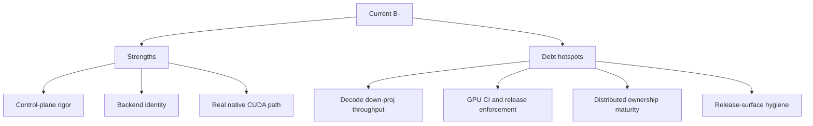

# InferFlux Tech Debt and Competitive Roadmap

**Snapshot date:** March 31, 2026
**Current overall grade:** B-

## 1) Dimension Grades

| Dimension | Grade | Strong today | Weak today |
|---|---|---|---|
| Vision and product coherence | B+ | Clear server-first product with explicit dual-CUDA strategy | Native CUDA story still needs stronger sustained-concurrency proof |
| Capabilities | A- | Streaming, embeddings, admin APIs, logprobs, metrics, fallback identity | Structured-output dependence on compatibility paths is still not fully retired |
| Scalability and economy | B- | Scheduler with granular lock ordering and fairness, radix prefix cache, multi-tier KV (GPU→host→disk), disaggregated KV channel with SHM transport, memory-first GGUF direction | Native CUDA still loses ground at c≥8 concurrency; distributed ownership semantics need hardening |
| Resource efficiency | B- | GGUF stays quantized, KV planner is real, native metrics expose operator choices | Decode down-proj still burns too much time in live `c=8` style traffic |
| Design and implementation | B+ | Runtime/provider split is coherent and testable; CUDA graph capture, FlashAttention-2 with GQA, GPU-adaptive dispatch, and 50+ fused kernels are production-grade | Transitional complexity still high around dispatch policy and compatibility overlap |
| TDD and CI maturity | B | Good focused tests and source-aligned docs gate | Required GPU/provider lane is still missing |
| OSS release readiness | B- | Canonical docs, release workflow, and repo-root OSS files can now be made explicit | Artifact clutter, local benchmark sprawl, and release hygiene still require ongoing discipline |

## 2) Current Competitive Reading

| Area | Current reading |
|---|---|
| `llama_cpp_cuda` vs Ollama | Strong published repo advantage; keep this as the stable public benchmark claim |
| `inferflux_cuda` vs `llama_cpp_cuda` | Native exceeds llama.cpp on single-sequence (~1.1x); c=4 at 148.3 tok/s, c=8 at 174.6 tok/s (March 31 baseline). Lane overlap race fixes (0ccbad3) improved concurrent stability but residual c=8 instability remains (~75% pass rate) |
| Native hot path reality | MMQ accumulate kernels landed for M=9-64 (0ccbad3); CUDA graphs re-enabled on primary forward path; remaining gap is concurrent stability at c>=8 |
| Distributed runtime | KV channel and SHM transport are production-tested; ownership cleanup and worker-loss handling still need hardening |

## 3) Debt Register

| Priority | Debt item | Why it matters | Retirement gate | Status |
|---|---|---|---|---|
| P0 | Decode down-proj row-pair and row-quad throughput | MMQ accumulate kernels for M=9-64 landed in 0ccbad3, covering the primary decode down-proj bottleneck | Native decode down-proj kernels improve sustained concurrent serving without regressing `c=4` | COMPLETED (0ccbad3) |
| P0 | Lane overlap race conditions | GetLaneResources + ReleaseBatchScopedDequantizedCache now protected by lane_overlap_mutex_ (0ccbad3); concurrent stability improved but residual c=8 instability remains (~75% pass rate) | Race-free lane overlap under sustained concurrency | Partially resolved (0ccbad3) |
| P0 | CUDA graph stability | CUDA graphs were blanket-disabled due to heap corruption risk; now selectively re-enabled on primary forward path with cudaDeviceSynchronize before capture (0ccbad3) | CUDA graphs enabled without heap corruption | COMPLETED (0ccbad3) |
| P0 | Residual c=8 concurrent instability | Clean runs pass 32/32 but overall pass rate is ~75% at c=8; root cause unknown | c=8 throughput gate passes reliably (>95%) | Open |
| P0 | Required GPU/provider CI lane | Native CUDA regressions are still too easy to discover late | Release-blocking GPU/provider runtime lane exists and is enforced | Not started |
| P1 | Native structured output independence | Compatibility fallback still owns some important generation behavior | Grammar-constrained generation runs natively on the CUDA path | Not started |
| P1 | Distributed sequence ownership cleanup | Transport health exists, but cleanup and worker-loss semantics are still not operations-grade | Ownership transfer, cleanup, and failure handling are deterministic and tested | Not started |
| P1 | Release-surface hygiene | OSS release credibility drops when local profiling artifacts and stale claims leak into the tree | Local benchmark/profiling noise stays ignored and release docs remain code-aligned | In progress |
| P2 | Benchmark harness unification | Windows-native and older Linux/WSL benchmark narratives had diverged | One maintained, source-aligned benchmark story is used for release-facing docs | In progress |

## 4) Tech Debt Grade Notes

| Grade | Why it is not lower | Why it is not higher |
|---|---|---|
| B- overall | Real server, 827 unit tests + 137 integration tests, production-grade native CUDA path (FA2, graph capture, 50+ fused kernels), explicit backend identity, granular scheduler with fairness | Native CUDA still lacks a clean sustained-concurrency win at c≥8, GPU CI is still optional, and speculative decoding is only partially integrated |

## 5) Recommended Next Execution Order

| Order | Work item | Reason |
|---|---|---|
| 1 | Diagnose and fix residual c=8 instability | MMQ accumulate and lane overlap fixes landed but ~75% pass rate at c=8 remains; this is the top remaining runtime risk |
| 2 | Add a required GPU/provider behavior lane | Prevent performance and routing regressions from landing unnoticed |
| 3 | Reduce compatibility dependence for structured output | Shrink the last major capability gap between native and compatibility paths |
| 4 | Harden release hygiene | Keep release docs and artifact policy aligned with real repo state |

## 6) OSS Release Readiness Review

| Area | Grade | Reading |
|---|---|---|
| Licensing and root metadata | A- | Apache 2.0 LICENSE, CONTRIBUTING, SECURITY, CODE_OF_CONDUCT all in place and clean |
| Canonical docs | B+ | Good structure, CUDA claims now updated to current measurements, doc index provides clear navigation |
| Release process | B | Workflow and process docs exist, CI has docs contract gate and SBOM generation, but release quality still depends too much on manual GPU validation |
| Repository hygiene | B- | Profiler/benchmark artifacts properly gitignored, personal references removed, stale claims updated |

## 7) Canonical References

- [README](../README.md)
- [benchmarks](benchmarks.md)
- [Roadmap](Roadmap.md)
- [COMPETITIVE_POSITIONING](COMPETITIVE_POSITIONING.md)
