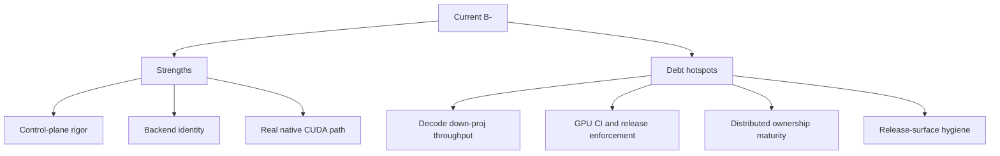

# InferFlux Tech Debt and Competitive Roadmap

**Snapshot date:** March 29, 2026  
**Current overall grade:** B-

## 1) Dimension Grades

| Dimension | Grade | Strong today | Weak today |
|---|---|---|---|
| Vision and product coherence | B+ | Clear server-first product with explicit dual-CUDA strategy | Native CUDA story still needs stronger sustained-concurrency proof |
| Capabilities | A- | Streaming, embeddings, admin APIs, logprobs, metrics, fallback identity | Structured-output dependence on compatibility paths is still not fully retired |
| Scalability and economy | C+ | Scheduler, batching, KV planning, operator metrics, memory-first GGUF direction | Native CUDA still loses ground at higher concurrency; distributed ownership semantics remain shallow |
| Resource efficiency | B- | GGUF stays quantized, KV planner is real, native metrics expose operator choices | Decode down-proj still burns too much time in live `c=8` style traffic |
| Design and implementation | B | Runtime/provider split is coherent and testable; native CUDA kernels are real, not scaffold-only | Transitional complexity is still high around dispatch policy, benchmark harnesses, and compatibility overlap |
| TDD and CI maturity | B | Good focused tests and source-aligned docs gate | Required GPU/provider lane is still missing |
| OSS release readiness | B- | Canonical docs, release workflow, and repo-root OSS files can now be made explicit | Artifact clutter, local benchmark sprawl, and release hygiene still require ongoing discipline |

## 2) Current Competitive Reading

| Area | Current reading |
|---|---|
| `llama_cpp_cuda` vs Ollama | Strong published repo advantage; keep this as the stable public benchmark claim |
| `inferflux_cuda` vs `llama_cpp_cuda` | Native is competitive around `c=4` in the current Windows harness, but still behind at `c=8` |
| Native hot path reality | FFN grouped MMQ3 is live; the remaining gap is centered on decode down-proj row-pair/row-quad cost |
| Distributed runtime | Honest foundation exists, but not enough for strong ownership-safe claims |

## 3) Debt Register

| Priority | Debt item | Why it matters | Retirement gate | Status |
|---|---|---|---|---|
| P0 | Decode down-proj row-pair and row-quad throughput | Current live `c=8` operator metrics point here as the remaining native bottleneck | Native decode down-proj kernels improve sustained concurrent serving without regressing `c=4` | In progress |
| P0 | Required GPU/provider CI lane | Native CUDA regressions are still too easy to discover late | Release-blocking GPU/provider runtime lane exists and is enforced | Not started |
| P1 | Native structured output independence | Compatibility fallback still owns some important generation behavior | Grammar-constrained generation runs natively on the CUDA path | Not started |
| P1 | Distributed sequence ownership cleanup | Transport health exists, but cleanup and worker-loss semantics are still not operations-grade | Ownership transfer, cleanup, and failure handling are deterministic and tested | Not started |
| P1 | Release-surface hygiene | OSS release credibility drops when local profiling artifacts and stale claims leak into the tree | Local benchmark/profiling noise stays ignored and release docs remain code-aligned | In progress |
| P2 | Benchmark harness unification | Windows-native and older Linux/WSL benchmark narratives had diverged | One maintained, source-aligned benchmark story is used for release-facing docs | In progress |

## 4) Tech Debt Grade Notes

| Grade | Why it is not lower | Why it is not higher |
|---|---|---|
| B- overall | The codebase has a real server, real tests, real native kernels, and explicit backend identity | Native CUDA still lacks a clean sustained-concurrency win over the compatibility backend, and GPU CI is still optional |

## 5) Recommended Next Execution Order

| Order | Work item | Reason |
|---|---|---|
| 1 | Optimize decode down-proj row-pair and row-quad kernels | This is the hottest remaining live path in current metrics |
| 2 | Add a required GPU/provider behavior lane | Prevent performance and routing regressions from landing unnoticed |
| 3 | Reduce compatibility dependence for structured output | Shrink the last major capability gap between native and compatibility paths |
| 4 | Harden release hygiene | Keep release docs and artifact policy aligned with real repo state |

## 6) OSS Release Readiness Review

| Area | Grade | Reading |
|---|---|---|
| Licensing and root metadata | B | Root OSS metadata can be explicit and conventional |
| Canonical docs | B | Good structure, but several CUDA claims needed updating to current measurements |
| Release process | B | Workflow and process docs exist, but release quality still depends too much on manual GPU validation |
| Repository hygiene | C+ | Local benchmark/profiling artifact churn is still easy to accumulate |

## 7) Canonical References

- [README](../README.md)
- [benchmarks](benchmarks.md)
- [Roadmap](Roadmap.md)
- [COMPETITIVE_POSITIONING](COMPETITIVE_POSITIONING.md)
