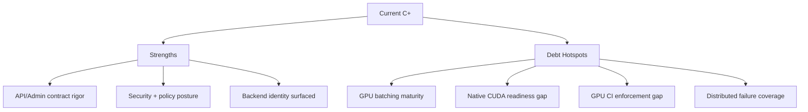

# InferFlux Tech Debt and Competitive Roadmap

**Snapshot date:** March 5, 2026  
**Current overall grade:** C+  
**Purpose:** Debt heatmap tied to issue-backed retirement gates.

## 1) Dimension Grades

| Dimension | Grade | Strong today | Weak today |
|---|---|---|---|
| Vision/product coherence | B | Clear OSS control-plane direction and OpenAI-compatible contract | Throughput narrative still ahead of full native CUDA activation |
| Capabilities | B | Strong explicit model/admin/CLI contracts and embeddings/model identity gates | Native CUDA path is still readiness-gated for default CUDA routing |
| Scalability/economy | C+ | Fairness + phased execution + prefix-cache foundation | No production-grade GPU iteration scheduler/KV allocator maturity |
| Resource efficiency | B- | Startup advisor and memory-safety hardening landed | Economy metrics to drive autoscaling decisions remain partial |
| Design/implementation | B | Cleaner backend provider contract (`llama_cpp` vs `native`) | Transitional dual-path CUDA complexity still present |
| TDD/CI maturity | B+ | Focused contract gates explicitly visible in CI and coverage jobs | Mandatory GPU behavior lane still environment-dependent |
| OSS docs/operator clarity | B+ | Canonical docs consolidated and contract-checked | Some non-canonical references still carry legacy wording |

## 2) Revalidated Evidence (Code + Latest Gates)

| Evidence | Result | Implication |
|---|---|---|
| Backend provider contract (`runtime/backends/backend_factory.*`) | Explicit provider enum + exposure policy (`allow_llama_cpp_fallback`, `strict_native_request`) | Identity semantics are now source-aligned |
| Router/API exposure surfaces (`scheduler/single_model_router.cpp`, `server/http/http_server.cpp`) | Backend provider/fallback fields are machine-visible | Automation-facing identity checks are robust |
| Native readiness gate (`runtime/backends/cuda/native_cuda_backend.cpp`) | Native readiness auto-detects compiled kernels + CUDA device availability (with env override to force scaffold) | Default CUDA requests can opt into native path without manual executor hints |
| CUDA fallback chain (`scheduler/single_model_router.cpp`) | Ordered chain: `cuda -> cuda_llama_cpp -> rocm -> mlx -> mps -> cpu` (unsupported targets skipped) | Improves survivability and keeps fallback behavior predictable |
| Throughput prefill/batching evidence (Qwen14B snapshot, March 6, 2026) | `cuda_native` passes baseline/prefill/batch-medium but fails strict native-forward gate under batch-heavy pressure; `cuda_llama_cpp` passes all profiled workloads | Throughput grade remains constrained until native heavy-batch stability and lane/overlap activation are demonstrated |
| Contract suites + docs contract | Focused identity/arg-contract/docs checks are present | CI confidence improved on control-plane correctness |

## 3) Debt Register (Actionable)

| Priority | Debt item | Impact | Retirement gate | Issue |
|---|---|---|---|---|
| P0 | Native CUDA identity and strict-fail behavior | Policy ambiguity and routing risk | Explicit native failures + identity consistency across API/CLI/metrics | [#1](https://github.com/vjsingh1984/inferflux/issues/1), [#2](https://github.com/vjsingh1984/inferflux/issues/2) |
| P1 | GPU continuous batching maturity | Throughput/cost lag | Iteration scheduler + non-regression gates | [#3](https://github.com/vjsingh1984/inferflux/issues/3) |
| P1 | GPU KV page allocator/reuse maturity | Recompute overhead and weaker token economy | Correctness + reuse metrics + stable throughput uplift | [#4](https://github.com/vjsingh1984/inferflux/issues/4) |
| P1 | Native attention/quantized kernel maturity | Performance ceiling | Fused native kernels with benchmark + regression coverage | [#6](https://github.com/vjsingh1984/inferflux/issues/6), [#7](https://github.com/vjsingh1984/inferflux/issues/7) |
| P1 | Scheduler lock contention | Queue latency under load | Lock partitioning + contention regressions | [#8](https://github.com/vjsingh1984/inferflux/issues/8) |
| P1 | Economy metrics for autoscaling | Cost/SLO blind spots | Metrics integrated into policy and runbooks | [#9](https://github.com/vjsingh1984/inferflux/issues/9) |
| P2 | Mandatory GPU CI behavioral lane | Regressions can slip by infra variance | Merge-blocking GPU behavior lane | [#5](https://github.com/vjsingh1984/inferflux/issues/5), [#10](https://github.com/vjsingh1984/inferflux/issues/10) |
| P2 | Distributed failure-path contracts | Enterprise resilience risk | Fault-injection matrix in integration CI | [#11](https://github.com/vjsingh1984/inferflux/issues/11) |

## 4) Competitive Direction (Short)

| Area | Current | Direction |
|---|---|---|
| Enterprise controls | Strong | Preserve lead via strict contracts + observability |
| Hardware/format breadth | Strong baseline | Maintain while throughput core matures |
| Raw GPU throughput | Behind leaders | Close via #3/#4/#6/#7 |
| CI enforceability | Moderate | Raise with mandatory GPU lane |
| Distributed resilience | Early | Mature via #11 + runbooks |

## 5) Canonical References

- [Roadmap](Roadmap.md)
- [PRD](PRD.md)
- [Architecture](Architecture.md)
- [ARCHIVE_INDEX](ARCHIVE_INDEX.md)
