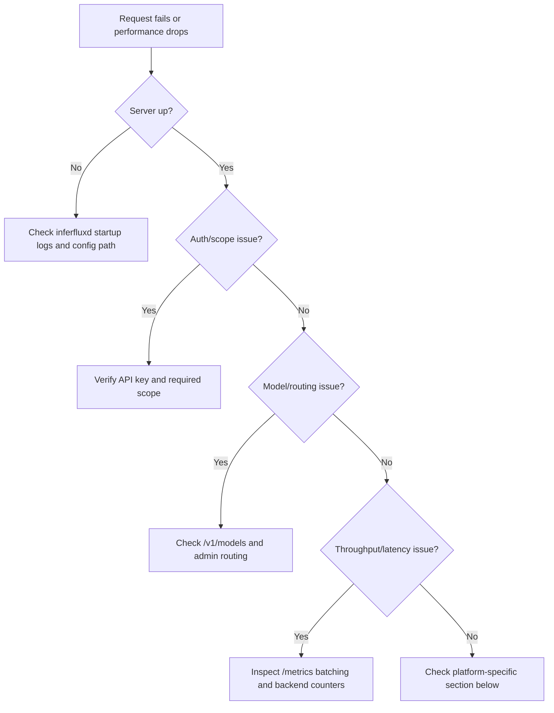

# Troubleshooting (Canonical OSS)

**Status:** Canonical

## 1) Triage Flow



## 2) Symptom Matrix

| Symptom | First command | Likely cause | Fast fix |
|---|---|---|---|
| Server not reachable | `curl -s http://127.0.0.1:8080/livez` | process not started or wrong port | start `inferfluxd`, verify `server.http_port` |
| Not ready | `curl -s http://127.0.0.1:8080/readyz` | model/backend not ready | fix model path/backend config; re-check logs |
| `401` / `403` | run same request with known key | missing/invalid key or insufficient scope | pass bearer key with required scope |
| `404 model_not_found` | `./build/inferctl models --api-key <KEY>` | wrong model id/default model missing | use valid model id or set default model |
| `422 backend_policy_violation` | inspect routing + backend exposure | strict native request policy blocked fallback | disable strict native policy or request compatible backend |
| high latency / low throughput | `curl -s .../metrics | head -120` | under-sized batches or backend mismatch | tune scheduler/KV/cuda settings in config |
| WebUI blank/empty | verify binary + model list | UI not built or no model loaded | build with `-DENABLE_WEBUI=ON` and load model |

## 3) Startup and Config Issues

| Problem | Check | Fix |
|---|---|---|
| Config file not found | path passed to `--config` | use absolute path or correct profile |
| Model path invalid | `models[].path` exists | fix path; verify file permissions |
| Backend unavailable | build flags vs selected backend | rebuild with matching `-DENABLE_*` flags |
| CPU fallback unexpected | server logs for backend selection | update `runtime.backend_priority` and model backend |

## 4) Auth and Scope Issues

| Endpoint family | Required scope |
|---|---|
| `/v1/completions`, `/v1/chat/completions` | `generate` |
| `/v1/models`, `/v1/models/{id}`, `/v1/embeddings` | `read` |
| `/v1/admin/*` | `admin` |

Common checks:

```bash
./build/inferctl models --api-key <KEY>
./build/inferctl admin models --list --api-key <ADMIN_KEY>
```

## 5) Model, Routing, and Backend Issues

```bash
./build/inferctl models --json --api-key <KEY>
./build/inferctl admin routing --get --api-key <ADMIN_KEY>
./build/inferctl admin pools --get --api-key <ADMIN_KEY>
```

Look for:
- incompatible capability requests (e.g., embeddings/streaming against unsupported backend)
- fallback behavior in `backend_exposure.*` fields
- backend readiness state in pools/routing outputs

## 6) Performance and Capacity Issues

| Signal | Where | Action |
|---|---|---|
| small effective batches | `/metrics` batch size counters | raise `runtime.scheduler.max_batch_size` and accumulation window |
| token-budget skips high | `/metrics` skip counters | adjust `max_batch_tokens` and decode slicing |
| low reuse/hit rate | cache metrics | increase KV pages and validate prefix reuse path |
| CUDA underutilization | backend metrics + logs | enable/tune FA2 and phase overlap when supported |

## 7) Platform-Specific Notes

| Platform | Issue | Fix |
|---|---|---|
| macOS | Metal command queue failures | set `GGML_METAL_DISABLE=1` for CPU fallback |
| NVIDIA CUDA | explicit `cuda_native` rejected | adjust strict mode or use `cuda_universal` until native ready |
| Docker | config/model persistence | mount config/models volumes and verify permissions |

Docker quick commands:

```bash
docker build -t inferflux:latest -f docker/Dockerfile .
docker run --rm -p 8080:8080 inferflux:latest --ui
docker compose -f docker/docker-compose.yaml up
```

## 8) Escalation Data to Collect

1. `inferfluxd` startup log section (model + backend selection).
2. `/readyz` and `/metrics` snapshots.
3. failing request payload (without secrets) and response status/body.
4. active config file and relevant `INFERFLUX_*` overrides.

## 9) Related Docs

- [Quickstart](Quickstart.md)
- [User Guide](UserGuide.md)
- [API Surface](API_SURFACE.md)
- [CONFIG_REFERENCE](CONFIG_REFERENCE.md)
- [Admin Guide](AdminGuide.md)
