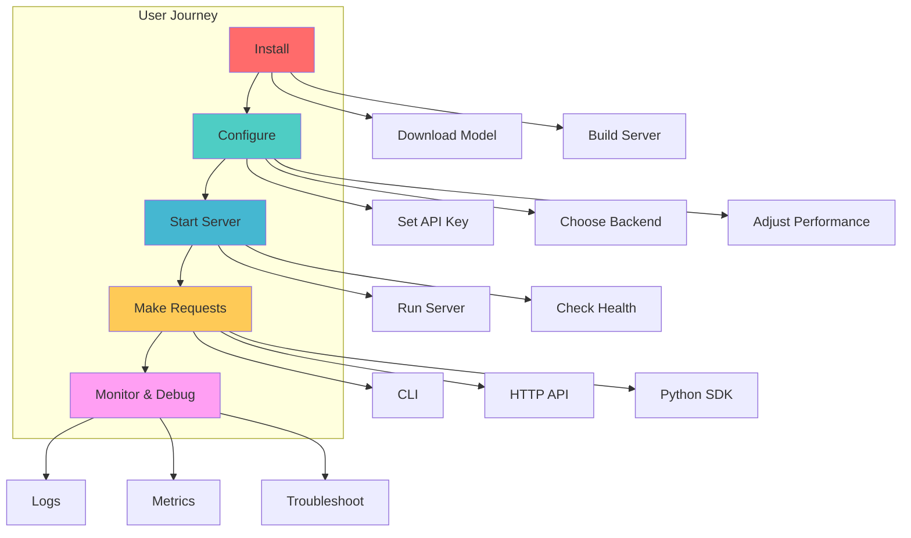
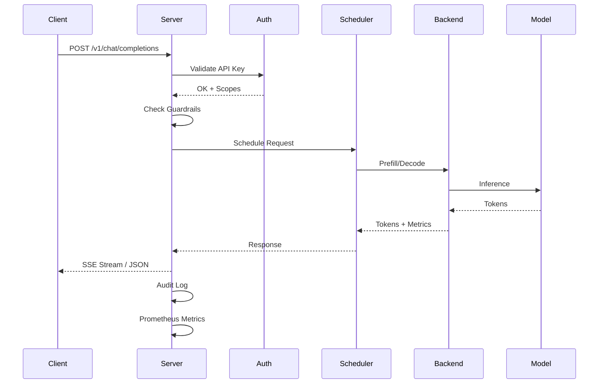
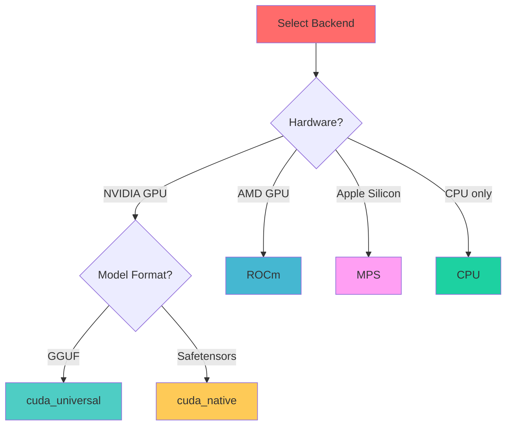
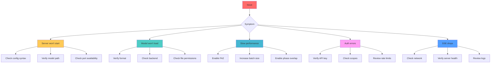

# User Guide

Complete guide for using InferFlux server and CLI client.

## Overview



## Quick Start

### Prerequisites

| Requirement | Minimum | Recommended |
|-------------|---------|-------------|
| **OS** | Linux, macOS, WSL2 | Native Linux |
| **CPU** | 4 cores | 8+ cores |
| **RAM** | 8 GB | 16+ GB |
| **GPU** | None (CPU mode) | NVIDIA RTX 3060+ |
| **VRAM** | N/A | 12+ GB |
| **Storage** | 10 GB | 50+ GB SSD |

### Quick-start Checklist

## Quick-start checklist

| Step | Command |
| --- | --- |
| 1. Set API key | `export INFERCTL_API_KEY=dev-key-123` |
| 2. Point to model | `export INFERFLUX_MODEL_PATH=$HOME/models/llama3.gguf` |
| 3. Launch server | `./scripts/run_dev.sh --config config/server.yaml` |
| 4. Make a request | `./build/inferctl completion --prompt "Hello" --stream --model llama3` |

### Installation

```bash
# Clone repository
git clone https://github.com/your-org/inferflux.git
cd inferflux

# Initialize submodules
git submodule update --init --recursive

# Build
./scripts/build.sh

# Verify build
ls -lh build/inferfluxd build/inferctl
```

### Download Model

```bash
# Create models directory
mkdir -p models

# Download TinyLlama (fast for testing)
wget https://huggingface.co/TheBloke/TinyLlama-1.1B-Chat-v1.0-GGUF/resolve/main/tinyllama-1.1b-chat-v1.0.Q4_K_M.gguf \
  -O models/tinyllama-1.1b.gguf

# Or download Qwen2.5-3B (better quality)
wget https://huggingface.co/Qwen/Qwen2.5-3B-Instruct-GGUF/resolve/main/qwen2.5-3b-instruct-q4_k_m.gguf \
  -O models/qwen2.5-3b.gguf
```

### Start Server

```bash
# Set API key
export INFERCTL_API_KEY=dev-key-123

# Set model path
export INFERFLUX_MODEL_PATH=$(pwd)/models/tinyllama-1.1b.gguf

# Start server
./build/inferfluxd --config config/server.yaml

# In another terminal, check health
curl http://localhost:8080/healthz
```

### Make First Request

```bash
# Using inferctl CLI
./build/inferctl chat --prompt "Explain quantum entanglement" --model tinyllama

# Using curl
curl -X POST http://localhost:8080/v1/chat/completions \
  -H "Content-Type: application/json" \
  -H "Authorization: Bearer dev-key-123" \
  -d '{
    "model": "tinyllama",
    "messages": [{"role": "user", "content": "Hello!"}]
  }'
```

## Request Flow Diagram



**ASCII Flow:**
```
Client CLI ──HTTP JSON/SSE──▶ HTTP Server ──▶ Scheduler ──▶ Backend (CPU/MPS/CUDA)
     ▲                            │                 │              │
     │                            │                 ├─ Prefix Cache│
     └── stream events ◀──────────┘                 └─ Metrics/Logs │
```

## Configuration Cheatsheet

### Environment Variables

| Variable | Purpose | Example |
|----------|---------|---------|
| `INFERFLUX_MODEL_PATH` | Default model path | `/models/llama3.gguf` |
| `INFERCTL_API_KEY` | API key for requests | `dev-key-123` |
| `INFERFLUX_MODELS` | Multi-model config | `id=m1,path=/p1.gguf;id=m2,path=/p2.gguf` |
| `INFERFLUX_NATIVE_CUDA_EXECUTOR` | CUDA executor mode | `native_kernel` |
| `INFERFLUX_BACKEND_PRIORITY` | Backend order | `cuda,cpu` |
| `INFERFLUX_DISABLE_STARTUP_ADVISOR` | Disable advisor | `true` |
| `INFERFLUX_MODEL_FORMAT` | Override format detection | `gguf` |

### Configuration Options

| Feature | YAML / Env | Description |
| --- | --- | --- |
| **Streaming** | `request.stream=true` | SSE token streaming |
| **Model Registry** | `registry.path=config/registry.yaml` | Hot reload models without restart |
| **Model Format** | `models[].format`, `model.format`, `INFERFLUX_MODEL_FORMAT`, `INFERFLUX_MODELS` (`format=...`) | Detect or force model loader format (`auto`, `gguf`, `safetensors`, `hf`); `hf://org/repo` maps to `${INFERFLUX_HOME:-$HOME/.inferflux}/models/org/repo` |
| **Throughput** | `runtime.scheduler.max_batch_size`, `runtime.scheduler.max_batch_tokens`, `INFERFLUX_SCHED_MAX_BATCH_SIZE`, `INFERFLUX_SCHED_MAX_BATCH_TOKENS` | Control scheduler batch packing |
| **CUDA Attention** | `runtime.cuda.attention.kernel`, `INFERFLUX_CUDA_ATTENTION_KERNEL` | Select `auto`, `fa3`, `fa2`, or `standard` with safe fallback |
| **Phase Overlap** | `runtime.cuda.phase_overlap.enabled`, `runtime.cuda.phase_overlap.min_prefill_tokens`, `runtime.cuda.phase_overlap.prefill_replica`, `INFERFLUX_CUDA_PHASE_OVERLAP`, `INFERFLUX_CUDA_PHASE_OVERLAP_MIN_PREFILL_TOKENS`, `INFERFLUX_CUDA_PHASE_OVERLAP_PREFILL_REPLICA` | Decode-first arbitration plus optional dual-context prefill overlap for mixed prefill/decode unified batches |
| **Guardrails** | `guardrails.blocklist`, `guardrails.opa_endpoint` | Basic + contextual filtering |
| **Rate Limit** | `auth.rate_limit_per_minute` | Per-key throttling |

### Choosing Backend



**Backend Decision Guide:**

| Situation | Backend | Config |
|-----------|---------|--------|
| GGUF model + NVIDIA GPU | `cuda_universal` | `backend: cuda` |
| Safetensors + NVIDIA GPU | `cuda_native` | `backend: cuda_native` |
| GGUF model + AMD GPU | `rocm` | `backend: rocm` |
| Any model + Apple Silicon | `mps` | `backend: mps` |
| Any model + CPU only | `cpu` | `backend: cpu` |

### Performance Tuning

**Startup Advisor:**

```bash
# Start server to see recommendations
./build/inferfluxd --config config/server.yaml

# Example output:
[INFO] startup_advisor: === InferFlux Startup Recommendations ===
[INFO] startup_advisor: [RECOMMEND] batch_size: 16966 MB VRAM free
  — increase runtime.scheduler.max_batch_size to 56 (current: 8)
[INFO] startup_advisor: [RECOMMEND] phase_overlap: CUDA enabled
  — set runtime.cuda.phase_overlap.enabled: true
[INFO] startup_advisor: === End Recommendations (2 suggestions) ===
```

**Key Settings:**

```yaml
runtime:
  scheduler:
    max_batch_size: 32        # Increase for higher throughput
    max_batch_tokens: 8192    # Max tokens per batch

  cuda:
    flash_attention:
      enabled: true           # 2.2x speedup on SM 8.0+
    phase_overlap:
      enabled: true           # 42% improvement on mixed workloads

  paged_kv:
    cpu_pages: 256            # Increase for larger context
```

For model provenance debugging, `/v1/models` and `/v1/admin/models` include
`path`, `source_path`, and `effective_load_path`.

## CLI Recipes

### Chat Mode

| Goal | Command |
| --- | --- |
| Interactive chat | `inferctl chat --interactive --model llama3` |
| Single prompt | `inferctl chat --prompt "Explain quantum computing" --model tinyllama` |
| Streaming | `inferctl chat --prompt "Tell me a story" --stream --model tinyllama` |
| With temperature | `inferctl chat --prompt "Creative writing" --temperature 0.8 --model tinyllama` |

### Completion Mode

| Goal | Command |
| --- | --- |
| Text completion | `inferctl completion --prompt "Once upon a time" --model tinyllama` |
| Streaming completion | `inferctl completion --prompt "The future of AI is" --stream --model tinyllama` |
| With max tokens | `inferctl completion --prompt "Explain" --max_tokens 512 --model tinyllama` |

### Model Management

| Goal | Command |
| --- | --- |
| List public models | `inferctl models` (table default; add `--json` for raw `/v1/models` output) |
| Describe one model | `inferctl models --id llama3 --json` (calls `/v1/models/{id}`) |
| Admin list models | `inferctl admin models --list` (table includes source/effective loader paths; add `--json` for script-friendly raw output) |
| Load model & mark default | `inferctl admin models --load path.gguf --id llama3 --default` |
| Unload model | `inferctl admin models --unload old-model` |
| Set default model | `inferctl admin models --set-default tinyllama` |

### Server Management

| Goal | Command |
| --- | --- |
| Start server | `inferctl server start --config config/server.yaml` |
| Stop server | `inferctl server stop` |
| Check status | `inferctl server status` |

### Admin Commands

| Goal | Command |
| --- | --- |
| Update guardrails | `inferctl admin guardrails --set pii,classified` |
| Inspect cache stats | `inferctl admin cache --stats` |
| View API keys | `inferctl admin api-keys --list` |
| View rate limit | `inferctl admin rate-limit --get` |
| Set rate limit | `inferctl admin rate-limit --set 120` |
| Inspect pool health | `inferctl admin pools --get` |
| Inspect routing policy | `inferctl admin routing --get` |

For automation, `inferctl models --json` and
`inferctl admin models --list --json` return non-zero on auth or other non-2xx HTTP responses.
OpenAI-style requests treat `model: "default"` as an alias for default-model routing;
other unknown explicit model IDs return `model_not_found`.
`GET /v1/models/{id}` returns the same `model_not_found` contract for unknown IDs, and
admin model lifecycle APIs require explicit IDs for `unload`/`set-default` (`400 id is required`, `404 model_not_found`).
`inferctl admin models --load/--unload/--set-default` now also returns non-zero
on non-2xx responses so shell automation can rely on exit codes.
`inferctl` enforces required values for model identity flags (`--id`, `--load`,
`--unload`, `--set-default`) and fails fast on malformed invocations.
`inferctl admin models` enforces exactly one operation flag
(`--list`, `--load`, `--unload`, `--set-default`) to prevent ambiguous scripts.
`inferctl admin cache`, `inferctl admin api-keys`, `inferctl admin guardrails`,
`inferctl admin rate-limit`, `inferctl admin pools`, and
`inferctl admin routing` follow the same fail-fast contract for required
values, operation exclusivity, and non-2xx exit codes.

## HTTP API Reference

### Chat Completions

```bash
curl -X POST http://localhost:8080/v1/chat/completions \
  -H "Content-Type: application/json" \
  -H "Authorization: Bearer dev-key-123" \
  -d '{
    "model": "tinyllama",
    "messages": [
      {"role": "system", "content": "You are a helpful assistant."},
      {"role": "user", "content": "Hello!"}
    ],
    "temperature": 0.7,
    "max_tokens": 256,
    "stream": false
  }'
```

**Streaming:**

```bash
curl -X POST http://localhost:8080/v1/chat/completions \
  -H "Content-Type: application/json" \
  -H "Authorization: Bearer dev-key-123" \
  -d '{
    "model": "tinyllama",
    "messages": [{"role": "user", "content": "Tell me a joke"}],
    "stream": true
  }'
```

### Completions

```bash
curl -X POST http://localhost:8080/v1/completions \
  -H "Content-Type: application/json" \
  -H "Authorization: Bearer dev-key-123" \
  -d '{
    "model": "tinyllama",
    "prompt": "Once upon a time",
    "max_tokens": 128,
    "temperature": 0.8
  }'
```

### Models

```bash
# List models
curl -H "Authorization: Bearer dev-key-123" \
  http://localhost:8080/v1/models

# Get model details
curl -H "Authorization: Bearer dev-key-123" \
  http://localhost:8080/v1/models/tinyllama
```

### Embeddings

```bash
curl -X POST http://localhost:8080/v1/embeddings \
  -H "Content-Type: application/json" \
  -H "Authorization: Bearer dev-key-123" \
  -d '{
    "model": "tinyllama",
    "input": "Hello, world!"
  }'
```

## Python Integration

### OpenAI Client

```python
from openai import OpenAI

client = OpenAI(
    base_url="http://localhost:8080/v1",
    api_key="dev-key-123"
)

# Chat completion
response = client.chat.completions.create(
    model="tinyllama",
    messages=[
        {"role": "system", "content": "You are a helpful assistant."},
        {"role": "user", "content": "Hello!"}
    ],
    temperature=0.7,
    max_tokens=256
)

print(response.choices[0].message.content)

# Streaming
for chunk in client.chat.completions.create(
    model="tinyllama",
    messages=[{"role": "user", "content": "Tell me a story"}],
    stream=True
):
    if chunk.choices[0].delta.content:
        print(chunk.choices[0].delta.content, end="")
```

### Requests Client

```python
import requests
import json

url = "http://localhost:8080/v1/chat/completions"
headers = {
    "Content-Type": "application/json",
    "Authorization": "Bearer dev-key-123"
}

data = {
    "model": "tinyllama",
    "messages": [{"role": "user", "content": "Hello!"}],
    "temperature": 0.7,
    "max_tokens": 256
}

response = requests.post(url, headers=headers, json=data)
result = response.json()

print(result["choices"][0]["message"]["content"])
```

## Monitoring & Debugging

### View Logs

```bash
# Server logs
tail -f logs/server.log

# Filter errors
grep ERROR logs/server.log

# Follow with color
tail -f logs/server.log | grep --color=always "ERROR\|WARN"
```

### Check Metrics

```bash
# All metrics
curl http://localhost:8080/metrics

# Queue depth
curl http://localhost:8080/metrics | grep queue_depth

# Throughput
curl http://localhost:8080/metrics | grep tokens_per_second

# Cache hit rate
curl http://localhost:8080/metrics | grep kv_cache_hits
```

### Health Checks

```bash
# Liveness (always 200 if alive)
curl http://localhost:8080/livez

# Readiness (200 if ready to serve)
curl http://localhost:8080/healthz

# Detailed health
curl http://localhost:8080/readyz
```

## Troubleshooting

### Common Issues



| Symptom | Likely cause | Fix |
| --- | --- | --- |
| `no_backend` response | model not loaded | set `INFERFLUX_MODEL_PATH` or use registry entry |
| `model_not_found` response | explicit `model` id is unknown | verify ID via `inferctl models --json` or `/v1/models` |
| SSE stops mid-stream | client dropped | restart CLI or check `inferflux_stream_tokens_total` |
| Guardrail block | term matched or OPA deny | review blocklist / OPA response |
| Rate limit | exceeded per-key quota | increase `auth.rate_limit_per_minute` |
| **High latency** | Small batch size | Increase `runtime.scheduler.max_batch_size` |
| **Low throughput** | FA2 disabled | Enable `runtime.cuda.flash_attention.enabled` |
| **VRAM OOM** | Batch too large | Decrease batch size or increase KV pages |
| **Model load fail** | Wrong backend | Match backend to model format |

### Error Messages

| Error | Cause | Solution |
|-------|-------|----------|
| `model_not_found` | Model ID doesn't exist | Check `/v1/models` for valid IDs |
| `no_backend` | No backend available | Enable CUDA or use CPU backend |
| `unauthorized` | Invalid API key | Check `INFERCTL_API_KEY` matches config |
| `forbidden` | Insufficient permissions | Verify API key has required scopes |
| `rate_limit_exceeded` | Too many requests | Increase rate limit or slow down |
| `guardrail_block` | Content blocked | Review guardrails configuration |
| `internal_error` | Server error | Check logs for details |

### Performance Tips

1. **Use GPU** - 10-20x faster than CPU
2. **Enable FlashAttention** - 2.2x speedup on modern GPUs
3. **Enable Phase Overlap** - 42% improvement on mixed workloads
4. **Increase Batch Size** - Higher throughput for concurrent requests
5. **Use Q4 Quantization** - 2.4x faster with minimal quality loss
6. **Enable Prefix Cache** - 85%+ hit rate on conversations

## Best Practices

### DO's ✅

1. **Use startup advisor** - Get automatic config recommendations
2. **Set appropriate batch sizes** - Balance throughput and latency
3. **Enable metrics** - Monitor performance in production
4. **Use structured logs** - Easier parsing and debugging
5. **Secure API keys** - Use strong keys and limit scopes
6. **Enable guardrails** - Protect against harmful content
7. **Monitor VRAM** - Avoid OOM errors

### DON'Ts ❌

1. **Don't use default keys** - Change `dev-key-123` in production
2. **Don't ignore warnings** - Startup advisor warnings matter
3. **Don't skip health checks** - Always verify `/readyz` before use
4. **Don't overload GPU** - Respect VRAM limits
5. **Don't disable logging** - Keep logs for debugging
6. **Don't use wrong format** - Match backend to model format
7. **Don't forget to cleanup** - Unload unused models

Need deeper assistance? Visit the [Admin Guide](AdminGuide.md) for deployment and observability tips or file an issue. 👍

## Next Steps

- **[Configuration Reference](CONFIG_REFERENCE.md)** - All configuration options
- **[Performance Tuning](PERFORMANCE_TUNING.md)** - Optimization guide
- **[Startup Advisor](STARTUP_ADVISOR.md)** - Auto-tuning guide
- **[Admin Guide](AdminGuide.md)** - Deployment and operations
- **[Developer Guide](DeveloperGuide.md)** - Contribution guide

---

**Quick Links:**
- **[Main README](../README.md)** - Project overview
- **[Documentation Hub](INDEX.md)** - All documentation
- **[GitHub Repository](https://github.com/your-org/inferflux)** - Source code
