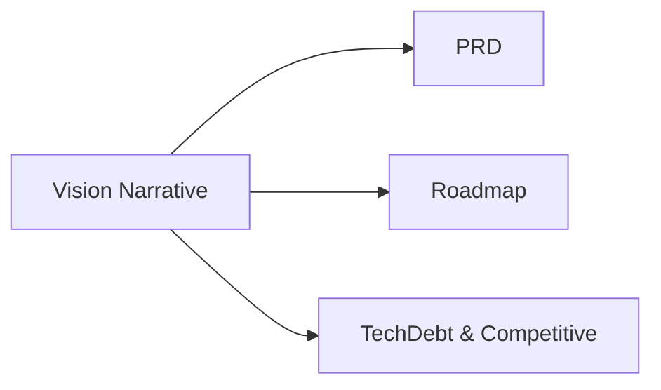

# Vision (Consolidated)

**Status:** Consolidated into canonical planning docs

## Canonical Source Map

| Need | Source of truth |
|---|---|
| Product vision and scope | [PRD](PRD.md) |
| Phase plan and milestones | [Roadmap](Roadmap.md) |
| Competitive/debt execution lens | [TechDebt_and_Competitive_Roadmap](TechDebt_and_Competitive_Roadmap.md) |

## Archived Full Narrative

- [VISION_2026_03_05](archive/evidence/VISION_2026_03_05.md)
