# InferFlux Vision

## The Universal Inference Platform

> **InferFlux is the only inference server that runs any model, on any hardware, anywhere - with enterprise-grade reliability and observability built in from day one.**

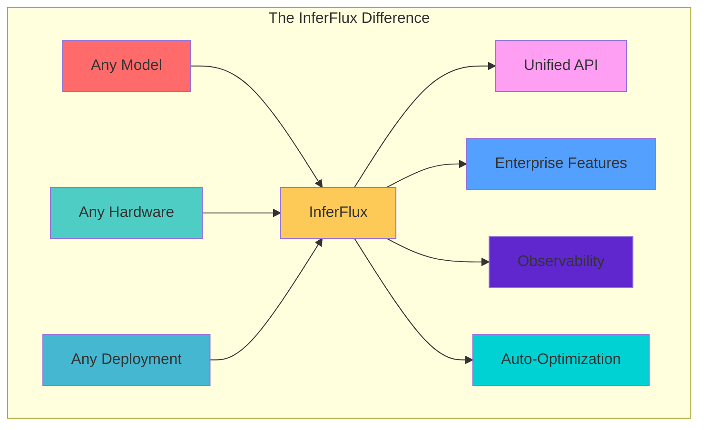

## The Problem

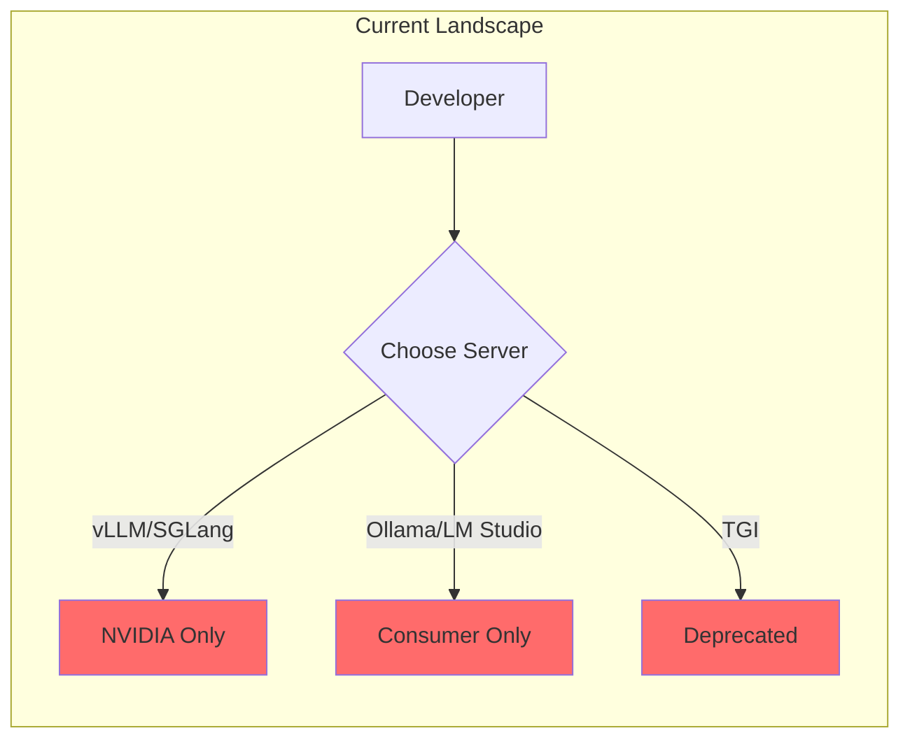

**The State of Inference Servers (2026):**

| Problem | vLLM | SGLang | Ollama | LM Studio |
|---------|------|--------|--------|-----------|
| **Hardware lock-in** | NVIDIA only | NVIDIA only | Limited | Limited |
| **Model format limits** | GGUF only | GGUF only | GGUF only | GGUF only |
| **Enterprise features** | Add-ons | Add-ons | None | None |
| **Production readiness** | DIY | DIY | Consumer | Consumer |
| **Multi-hardware** | ❌ | ❌ | ⚠️ Partial | ⚠️ Partial |

## The InferFlux Solution

### Core Differentiators

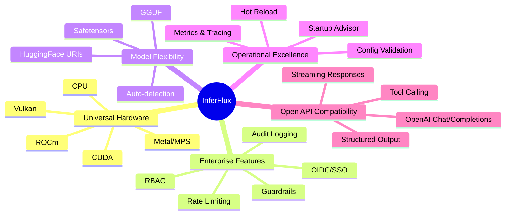

### 2027 Vision: No Compromises

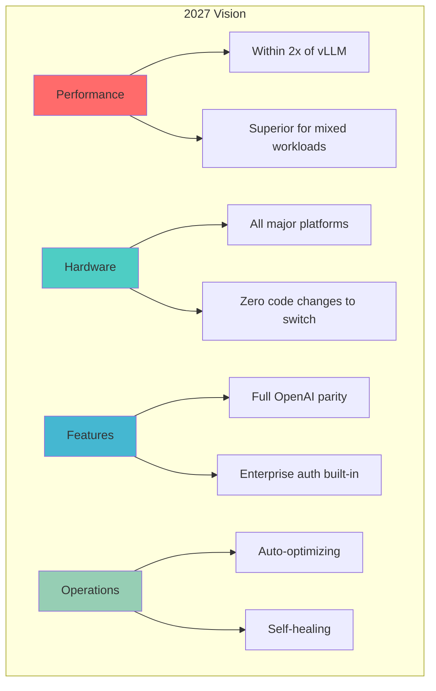

## Strategic Pillars

### Pillar 1: Universal Hardware Support

**Vision:** Deploy your inference workload on any hardware without changing code.

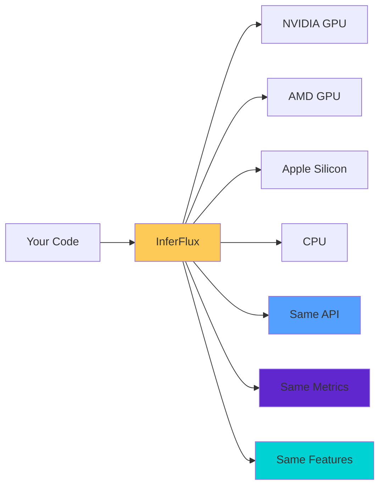

**Why it matters:**
- **Future-proof:** Switch from NVIDIA to AMD without rewrites
- **Cost optimization:** Use cheaper hardware where appropriate
- **Supply chain resilience:** Not dependent on single vendor
- **Development velocity:** Test on MacBook, deploy on GPU cluster

**Current Status (March 2026):**
- ✅ CUDA (native + universal)
- ✅ CPU (optimized SSE/AVX)
- ✅ Metal/MPS (via llama.cpp)
- ✅ Vulkan (via llama.cpp)
- 🔄 ROCm (implemented, needs testing)
- ✅ Multi-backend selection with capability routing

### Pillar 2: Model Format Freedom

**Vision:** Use models in their native format. No conversion pipelines.

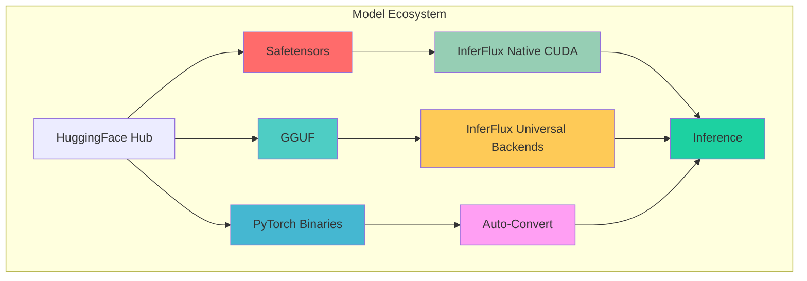

**Why it matters:**
- **No conversion overhead:** Use models directly from training
- **Format flexibility:** Mix GGUF, safetensors, HF in same deployment
- **Latest models:** Access HF models immediately
- **Fine-tuned models:** Use safetensors directly from LoRA training

**Current Status (March 2026):**
- ✅ GGUF (full support, all quantization levels)
- ✅ Safetensors (native CUDA loading verified)
- ✅ HuggingFace URIs (`hf://org/repo` auto-resolution)
- ✅ Format auto-detection with advisor recommendations

### Pillar 3: Enterprise-First Security

**Vision:** Security and compliance built in, not bolted on.

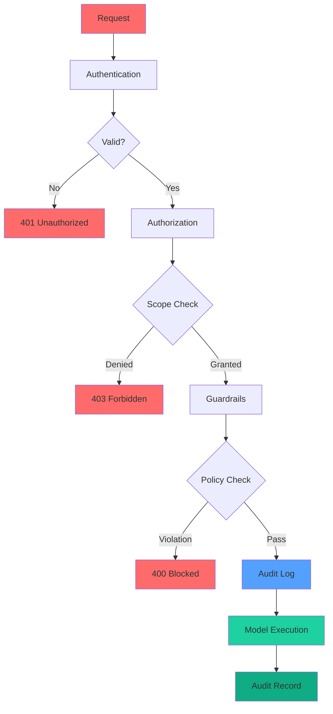

**Why it matters:**
- **SOC2/HIPAA compliance:** Built-in audit trails and access control
- **Multi-tenant:** Fine-grained per-key permissions
- **Governance:** Guardrails + OPA integration
- **Forensics:** Complete request audit logs

**Current Status (March 2026):**
- ✅ SHA-256 hashed API keys
- ✅ OIDC RS256 JWT validation
- ✅ Scope-based RBAC (generate, read, admin)
- ✅ Per-key rate limiting
- ✅ Built-in content guardrails
- ✅ OPA policy integration
- ✅ Structured JSON audit logging

### Pillar 4: Operational Excellence

**Vision:** Self-optimizing, self-healing, observability by design.

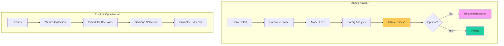

**Why it matters:**
- **Reduced toil:** Auto-tuning vs manual config
- **Faster troubleshooting:** Complete observability
- **Proactive monitoring:** Detect issues before users
- **Confidence:** Know your system is optimized

**Current Status (March 2026):**
- ✅ Startup Advisor (8 rules, 0 recommendations on optimal config)
- ✅ Prometheus metrics (50+ gauges/histograms/counters)
- ✅ Structured JSON logging
- ✅ Health endpoints (/healthz, /readyz, /livez)
- 🔄 Hot reload (model registry watches files)
- ⏳ Self-healing (planned Q2)

## Target Personas

### Persona 1: Platform Engineer (Kubernetes Deployment)

**Goals:**
- Deploy inference tier in Kubernetes
- Multi-region, multi-cloud deployment
- Integrates with existing SSO and observability
- Autoscaling with GPU and CPU nodes

**Pain Points Solved:**
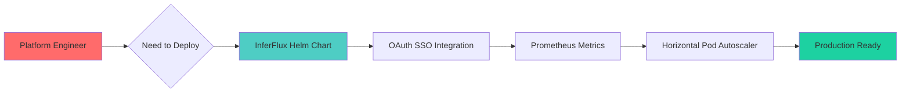

### Persona 2: ML Engineer (Model Research)

**Goals:**
- Test multiple models simultaneously
- Compare GGUF Q4 vs FP16 vs safetensors
- Benchmark different quantization levels
- No GPU during development (MacBook, then deploy to cluster)

**Pain Points Solved:**
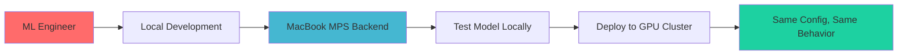

### Persona 3: Security Engineer (Compliance)

**Goals:**
- Enforce data governance policies
- Audit all model access
- Rate limit per API key
- Integrate with existing identity provider

**Pain Points Solved:**
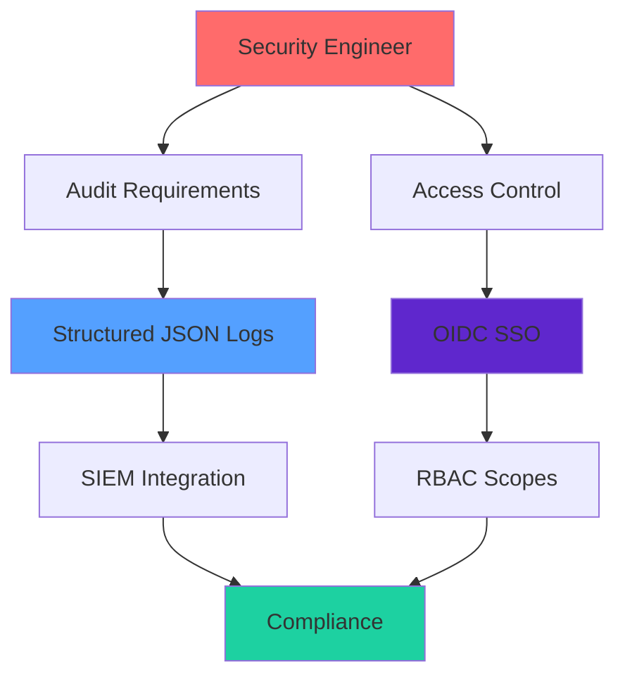

## Competitive Moat

### What InferFlux Does That No One Else Does

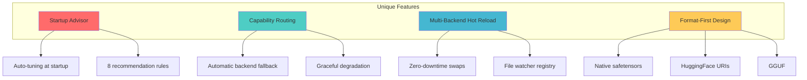

### Competitive Analysis 2026-2027

| Dimension | vLLM | SGLang | Ollama | InferFlux (2026) | InferFlux (2027) |
|-----------|------|--------|--------|------------------|------------------|
| **Raw Throughput** | A+ | A+ | C | C+ | B (within 2x) |
| **Hardware Support** | F | F | C | **B** | **A** |
| **Format Support** | D | D | C | **B+** | **A** |
| **Enterprise Auth** | C | C | F | **B+** | **A** |
| **Observability** | B | B | D | **B+** | **A** |
| **Operations** | D | D | C | **B+** | **A** |
| **Multi-Model** | B | B | C | **A** | **A** |
| **Ease of Setup** | B | B | A+ | C | B+ |

## Roadmap to 2027

### Q2 2026: Foundation
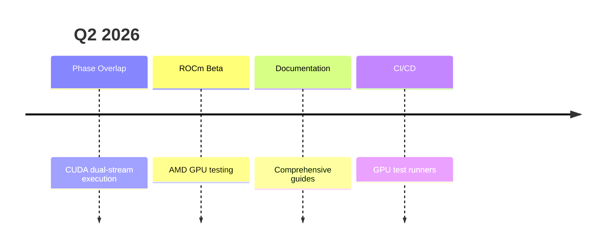

### Q3 2026: Performance
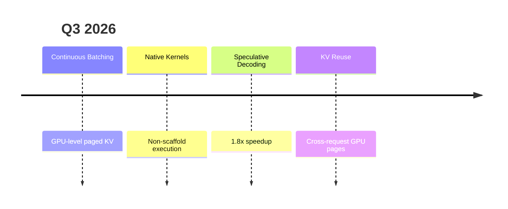

### Q4 2026: Enterprise
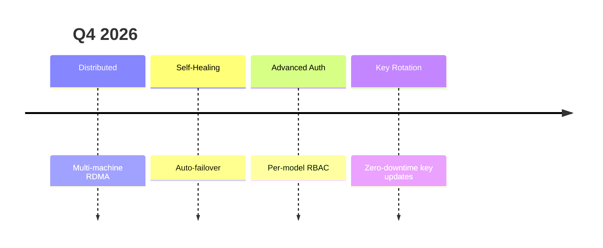

### Q1 2027: Production
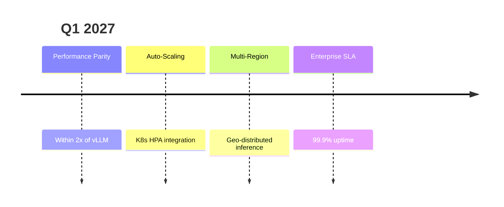

## Success Metrics

### 2026 Targets

| Metric | Q1 | Q2 | Q3 | Q4 |
|--------|-----|-----|-----|-----|
| Overall Grade | C+ | C+/B- | B | B+/A- |
| Throughput Grade | C+ | B | B | B+ |
| Hardware Support | B | B | A | A |
| Format Support | B+ | A- | A | A+ |
| Enterprise Auth | B+ | B+ | A- | A |
| Observability | B+ | A- | A | A+ |

### 2027 Vision Targets

| Metric | Target |
|--------|--------|
| **Overall Grade** | A- (competitive with vLLM/SGLang on features) |
| **Throughput** | B (within 2x of vLLM on single-GPU workloads) |
| **Hardware** | A (all major platforms, automatic optimization) |
| **Enterprise** | A (SOC2/HIPAA ready out of box) |
| **Operations** | A (self-optimizing, self-healing) |

## The "Why" Behind InferFlux

### Why Not Just Use vLLM?

vLLM is excellent for NVIDIA GPU clusters. But what if you:
- Want to use AMD GPUs? vLLM can't help.
- Need enterprise auth? vLLM has no RBAC.
- Want safetensors models? vLLM requires conversion.
- Deploy to Apple Silicon? vLLM doesn't support MPS.

**InferFlux fills these gaps.**

### Why Not Just Use Ollama?

Ollama is great for local development. But what if you:
- Need to deploy to Kubernetes? Ollama isn't designed for it.
- Want observability? Ollama has minimal metrics.
- Need fine-grained auth? Ollama has API keys only.
- Run in production? Ollama lacks enterprise features.

**InferFlux is production-ready.**

### Why InferFlux?

Because you shouldn't have to choose between:
- Performance OR flexibility → **Have both**
- Speed OR security → **Have both**
- Local OR cloud → **Have both**
- Simple OR powerful → **Have both**

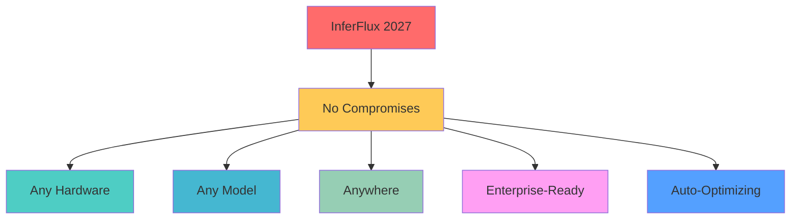

---

**Next:** [Architecture](Architecture.md) | [Competitive Positioning](COMPETITIVE_POSITIONING.md) | [Roadmap](Roadmap.md)
