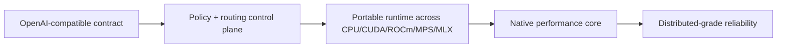

# InferFlux Vision

**Snapshot date:** March 9, 2026

## 1) Vision Contract

| Pillar | What it means in practice |
|---|---|
| API compatibility | Core user/admin surfaces stay OpenAI-style and scriptable |
| Operator control plane | Auth, policy, routing, metrics, and admin APIs are part of the product, not bolt-ons |
| Dual CUDA strategy | `native_cuda` is the performance/control path; `cuda_llama_cpp` is the compatibility/fallback path |
| Memory economy | Shared model weights, separate KV lifecycle, prefix reuse, and explicit memory policy knobs |
| Stateless by default | Baseline API remains stateless; optional `session_id` leases sit above the core contract |
| Scale path | Single-node reliability first, then deterministic distributed runtime contracts |

## 2) Current Reality

| State | Code-aligned reading |
|---|---|
| Strong today | API/admin/CLI contracts, machine-visible backend identity, strict routing policy, prefix/KV reuse, and broad operator controls |
| Foundation present | Native loader detection, memory-first quantized GGUF policy, KV auto-tune planning/metrics, optional session handles, split prefill/decode node roles |
| Still open | Native async parity, sustained quantized GGUF throughput, native-first feature independence, ticketed distributed KV handoff, mandatory GPU release lane |

## 3) Modernization Stance

| Retire | Replace with |
|---|---|
| Blanket fallback behavior | Capability + policy-driven routing with explicit fallback metadata |
| "Async means faster" | Sync batched execution core with async admission only where it preserves batch quality |
| Persistent dequant caches by default | Load-scoped memory policy with `none` as the native quantized default |
| Fixed KV reservation | Budget-aware KV sizing and exported planning metrics |
| Benchmark-only claims | Contract gates plus representative perf evidence |

## 4) Canonical Source Map

| Need | Source of truth |
|---|---|
| Product contract | [PRD](PRD.md) |
| Runtime architecture | [Architecture](Architecture.md) |
| Current grades and milestones | [Roadmap](Roadmap.md) |
| Debt and competitive lens | [TechDebt_and_Competitive_Roadmap](TechDebt_and_Competitive_Roadmap.md) |
| Modernization migration guide | [MODERNIZATION_AUDIT](MODERNIZATION_AUDIT.md) |

Archived long-form narratives remain under [ARCHIVE_INDEX](ARCHIVE_INDEX.md).
