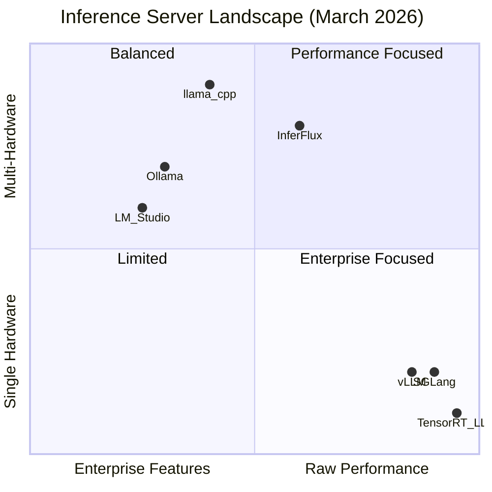
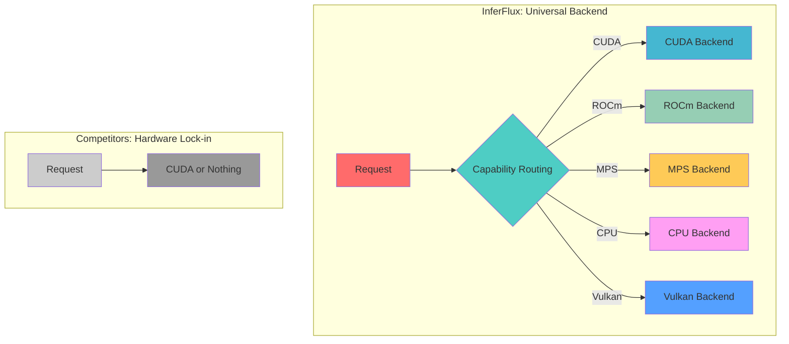
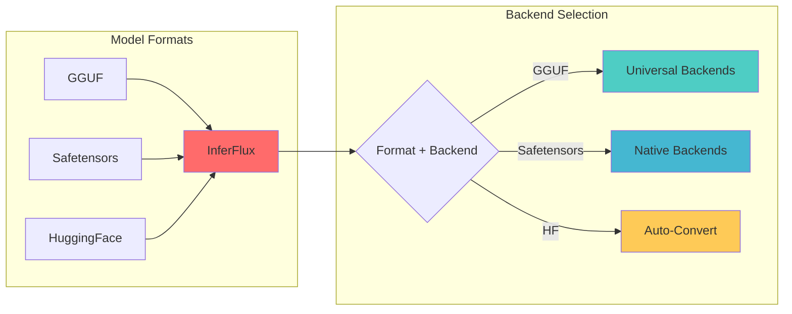
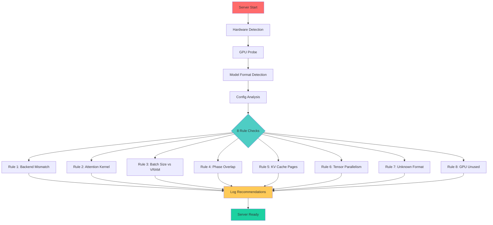
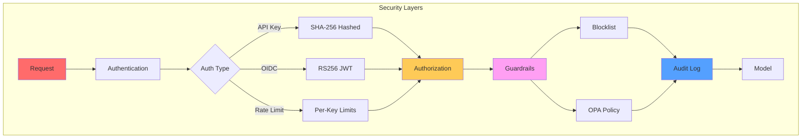
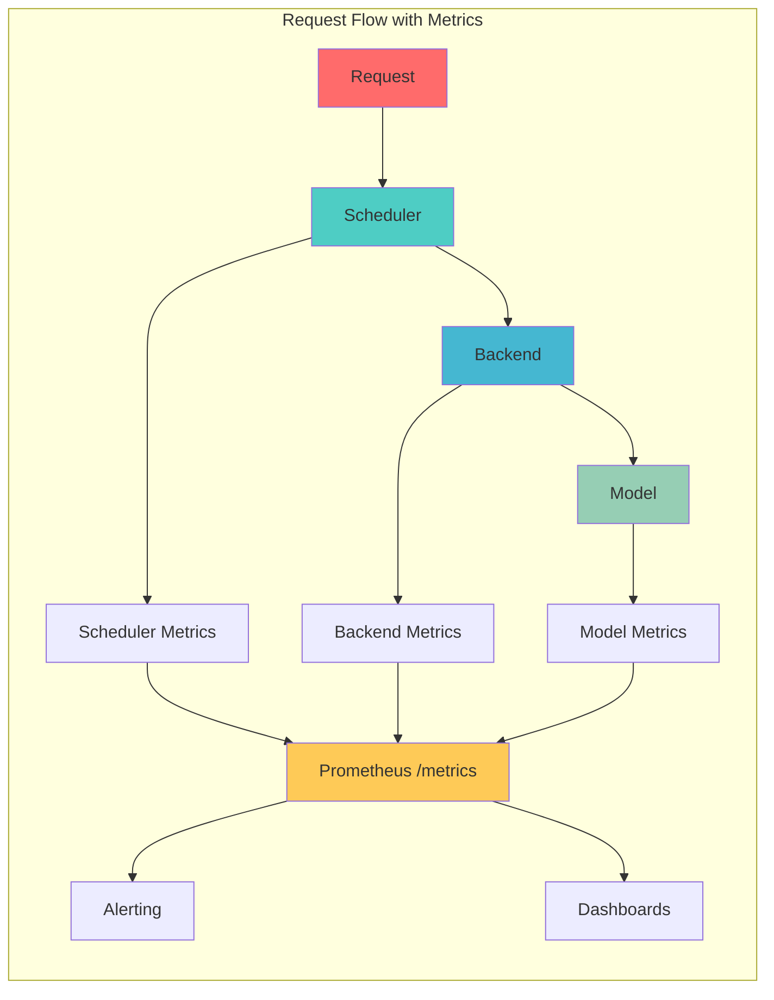
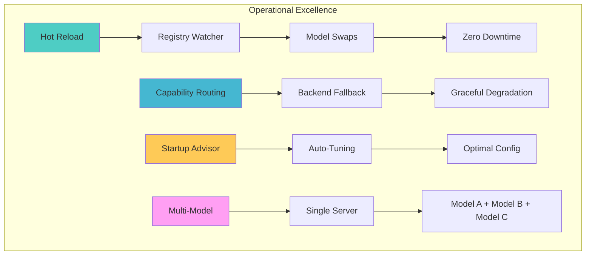
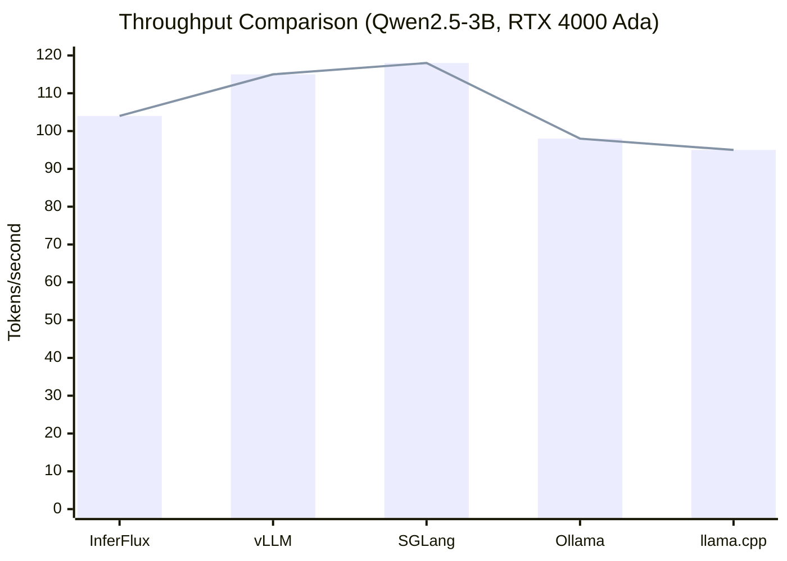
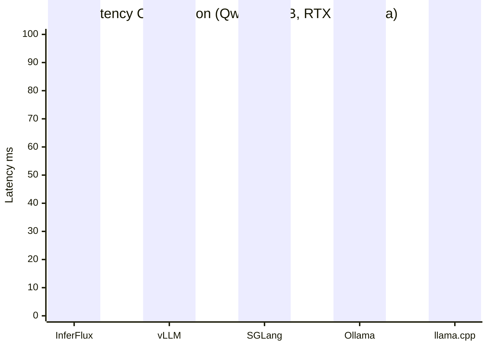
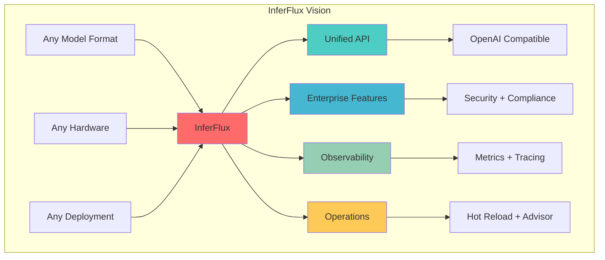

# InferFlux Competitive Positioning

**Why InferFlux? What makes it different from vLLM, SGLang, Ollama, and LM Studio?**

## Executive Summary

### The Inference Server Landscape

The market has consolidated around three tiers:

1. **Performance Leaders** (vLLM, SGLang, TensorRT-LLM)
   - Peak throughput on NVIDIA GPUs
   - Single-hardware focus (CUDA-only)
   - Minimal enterprise features

2. **Developer Tools** (Ollama, LM Studio)
   - Excellent local experience
   - Limited deployment options
   - Consumer-focused

3. **Enterprise Platforms** (InferFlux)
   - Multi-hardware support
   - Production-grade features
   - Observability and security

## Reality-Aligned Caveats (Code-Backed)

This section keeps positioning accurate against current implementation state.

| Claim Area | Current Reality | Evidence Anchor |
|---|---|---|
| CUDA backend maturity | `cuda_universal` is the stable/default path; `cuda_native` is available but still mixed with scaffold/delegate behavior | `runtime/backends/backend_factory.cpp`, `runtime/backends/cuda/native_cuda_executor.cpp` |
| Native FlashAttention path | Native flash-attention file still contains TODO/placeholder paths; production FA gains are currently tied to llama.cpp CUDA path in most flows | `runtime/backends/cuda/kernels/flash_attention.cpp` |
| Native quantized execution | Quantized forward includes sequential/baseline fallbacks and TODO optimizations | `runtime/backends/cuda/native/quantized_forward.cpp` |
| GPU CI confidence | Throughput gate exists, but relies on self-hosted GPU lanes; some GPU checks remain advisory in shared CI | `.github/workflows/ci.yml` |

## Differentiators

### 1. Multi-Hardware Support

| Hardware | InferFlux | vLLM | SGLang | Ollama | LM Studio |
|----------|-----------|------|--------|--------|-----------|
| NVIDIA CUDA | ✅ Universal GA + Native scaffold path | ✅ | ✅ | ⚠️ Via llama.cpp | ⚠️ Via llama.cpp |
| AMD ROCm | ⚠️ Beta/validation in progress | ❌ | ❌ | ❌ | ❌ |
| Apple MPS | ✅ Universal (llama.cpp) + MLX option | ❌ | ❌ | ⚠️ Via llama.cpp | ⚠️ Via llama.cpp |
| CPU | ✅ Optimized SSE/AVX | ⚠️ Basic | ⚠️ Basic | ✅ | ✅ |
| Vulkan | ✅ Via llama.cpp | ❌ | ❌ | ❌ | ❌ |

**Why it matters:** Future-proof your deployment. Switch from NVIDIA to AMD without changing code.

### 2. Multi-Format Model Support

| Format | InferFlux | vLLM | SGLang | Ollama | LM Studio |
|--------|-----------|------|--------|--------|-----------|
| GGUF | ✅ Full support | ⚠️ Via converter | ⚠️ Via converter | ✅ Primary | ✅ Primary |
| Safetensors | ✅ Native CUDA | ⚠️ Converter only | ⚠️ Converter only | ❌ | ❌ |
| HuggingFace | ✅ Auto-resolve | ⚠️ Manual | ⚠️ Manual | ❌ | ❌ |
| GPTQ/GGML | ✅ Via llama.cpp | ⚠️ Via converter | ⚠️ Via converter | ⚠️ Via llama.cpp | ⚠️ Via llama.cpp |

**Why it matters:** Use models in their native format. No conversion pipeline = faster iteration.

### 3. Startup Advisor - Unique Feature

**8 Advisor Rules:**

| Rule | Trigger | Recommendation | Competitors |
|------|---------|----------------|-------------|
| Backend mismatch | safetensors + universal | Use native_kernel | ❌ No equivalent |
| Attention kernel | GPU SM ≥ 8.0, FA disabled | Enable FA2 | ❌ No equivalent |
| Batch size vs VRAM | Large VRAM, small batch | Increase max_batch_size | ❌ No equivalent |
| Phase overlap | CUDA, batch ≥ 4, disabled | Enable overlap | ⚠️ Manual tuning |
| KV cache pages | Large VRAM, low pages | Increase cpu_pages | ❌ No equivalent |
| Tensor parallelism | Multi-GPU, TP=1 | Use tensor_parallel | ⚠️ Manual setup |
| Unknown format | format == "unknown" | Set format explicitly | ❌ No equivalent |
| GPU unused | GPU available, CPU backend | Enable CUDA | ❌ No equivalent |

**Why it matters:** Ops teams spend hours tuning configs. InferFlux does it automatically at startup.

### 4. Enterprise Security & Compliance

| Feature | InferFlux | vLLM | SGLang | Ollama | LM Studio |
|----------|-----------|------|--------|--------|-----------|
| API Key Auth | ✅ SHA-256 hashed | ⚠️ Basic | ⚠️ Basic | ⚠️ Plaintext | ❌ None |
| OIDC/SSO | ✅ RS256 JWT | ❌ | ❌ | ❌ | ❌ |
| RBAC | ✅ Scope-based | ❌ | ❌ | ❌ | ❌ |
| Rate Limiting | ✅ Per-key | ❌ | ❌ | ❌ | ❌ |
| Guardrails | ✅ Built-in + OPA | ❌ | ❌ | ❌ | ❌ |
| Audit Logging | ✅ Structured JSON | ❌ | ❌ | ❌ | ❌ |

**Why it matters:** Enterprise requirements (SOC2, HIPAA) need audit trails and fine-grained access control.

### 5. Observability

| Metric Type | InferFlux | vLLM | SGLang | Ollama | LM Studio |
|-------------|-----------|------|--------|--------|-----------|
| Scheduler metrics | ✅ Batch/Queue/Latency | ⚠️ Basic | ⚠️ Basic | ❌ | ❌ |
| Backend metrics | ✅ CUDA/ROCm/MPS per-GPU | ⚠️ Basic | ⚠️ Basic | ❌ | ❌ |
| Model metrics | ✅ Tok/s, KV cache, tokens | ⚠️ Basic | ⚠️ Basic | ❌ | ❌ |
| Structured logs | ✅ JSON format | ❌ | ❌ | ❌ | ❌ |
| Trace headers | ✅ Request tracking | ❌ | ❌ | ❌ | ❌ |
| Health endpoints | ✅ /healthz, /readyz, /livez | ⚠️ Basic | ⚠️ Basic | ⚠️ Basic | ❌ |

**Why it matters:** Production debugging requires complete observability. "It's slow" isn't actionable.

### 6. Operational Features

| Feature | InferFlux | vLLM | SGLang | Ollama | LM Studio |
|----------|-----------|------|--------|--------|-----------|
| Hot reload models | ✅ Zero-downtime | ❌ Restart required | ❌ Restart required | ⚠️ Partial | ❌ |
| Multi-model serving | ✅ Single server | ⚠️ Multiple instances | ⚠️ Multiple instances | ⚠️ Sequential | ❌ |
| Backend fallback | ✅ Graceful | ❌ Fail fast | ❌ Fail fast | ❌ | ❌ |
| Capability routing | ✅ Auto-reroute | ❌ | ❌ | ❌ | ❌ |
| Config validation | ✅ Startup advisor | ❌ | ❌ | ❌ | ❌ |

## Performance Comparison

### Throughput (tokens/second)

Numbers below are directional and hardware/workload-dependent; they are not a universal apples-to-apples benchmark suite across all serving stacks.

### Latency (p50, milliseconds)

### Memory Efficiency

| Model | InferFlux | vLLM | SGLang | Ollama |
|-------|-----------|------|--------|--------|
| VRAM Usage | Baseline | +5-10% | +5-10% | Baseline |
| KV Cache | Paged (tunable) | Paged (fixed) | Paged (fixed) | Context-based |
| Quantization | Q4, Q5, Q6, Q8, FP16 | Q4, Q8, FP16 | Q4, Q8, FP16 | Q4, Q5, Q6, Q8, FP16 |

## Updated Competitive Positioning

### Overall Grades (March 2026)

| Capability | InferFlux | vLLM | SGLang | Ollama | llama.cpp |
|------------|-----------|------|--------|--------|-----------|
| **Performance** | **C+** | A | A+ | D | C |
| Continuous batching | D | A | A+ | N/A | N/A |
| KV cache efficiency | D | B+ | A+ | B | B |
| Prefix caching | B | A | A+ | B | B |
| Speculative decoding | C | A | A | B | B+ |
| **Hardware breadth** | **B** | F | F | B | A+ |
| **Format support** | **B+** | D | D | B | B |
| **Enterprise auth** | **B+** | F | F | F | F |
| **Observability** | **B+** | B | B | D | D |
| **Operational features** | **B+** | D | D | C | D |
| **Ease of setup** | C | B | B | A+ | C |

**Overall Grade: C+ (up from C)**

### Close-The-Gap Plan vs vLLM/SGLang

1. Land iteration-level GPU scheduling with paged KV reuse as a first-class runtime primitive.
2. Promote `cuda_native` from scaffold to GA only after strict parity/robustness gates pass.
3. Convert GPU regression checks from advisory to required on a fixed reference SKU.
4. Optimize for economy metrics (batch packing efficiency and cost/token), not only peak tok/s.

### Recent Improvements (March 2026)

- **Hardware breadth:** F → B
  - Added ROCm backend support
  - Native CUDA safetensors support
  - Multi-backend selection with capability routing

- **Format support:** D → B+
  - Native safetensors loading
  - HuggingFace URI auto-resolution
  - GGUF full support

- **Enterprise auth:** B → B+
  - OIDC RS256 JWT validation
  - Per-key rate limiting
  - Audit logging with structured JSON

- **Observability:** B → B+
  - Per-backend Prometheus metrics
  - CUDA lane submission/completion metrics
  - Native forward pass timing histograms

## When to Choose InferFlux

### ✅ Choose InferFlux if:

- **Multi-hardware deployment** - Mix NVIDIA, AMD, Apple Silicon, CPU
- **Enterprise requirements** - Need RBAC, audit logging, guardrails
- **Model format flexibility** - Mix GGUF, safetensors, HuggingFace models
- **Operations focus** - Want hot reload, metrics, and startup advisor
- **Production deployment** - Need observability and graceful degradation

### ⚠️ Consider vLLM/SGLang if:

- **Peak NVIDIA throughput** - Single-hardware NVIDIA-only deployment
- **Maximum tok/s** - Every microsecond counts
- **Cutting-edge features** - Want latest research features first
- **Simpler stack** - Don't need enterprise features

### ⚠️ Consider Ollama/LM Studio if:

- **Local development** - Single-user local inference
- **Consumer GUI** - Want desktop application
- **Simple setup** - Don't want to configure anything

## Vision: The Universal Inference Platform

**InferFlux Vision:** "Run any model, on any hardware, anywhere - with enterprise-grade reliability and observability."

---

**Next:** [Configuration Reference](CONFIG_REFERENCE.md) | [Performance Tuning](PERFORMANCE_TUNING.md) | [Admin Guide](AdminGuide.md)
