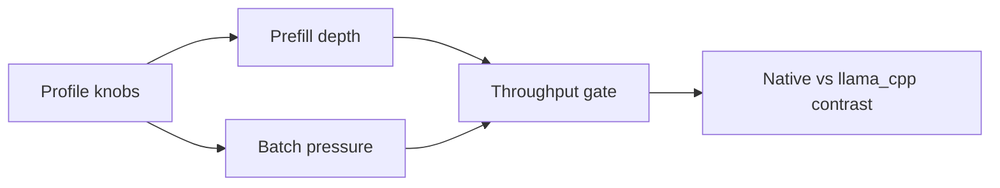

# Qwen14B Prefill and Batching Matrix (RTX 4000 Ada)

**Date:** March 6, 2026  
**Type:** Reference-Evidence  
**Scope:** `qwen2.5-coder-14b-instruct-q4_k_m.gguf` on `cuda_native` vs `cuda_llama_cpp`

## 1) Run Setup

| Parameter | Value |
|---|---|
| GPU | NVIDIA RTX 4000 Ada |
| Model | Qwen2.5-Coder-14B Q4_K_M GGUF |
| Endpoint | `/v1/completions` |
| Max tokens | `32` |
| Scheduler | `max_batch_size=16`, `max_batch_tokens=16384`, `min_batch_size=4`, `batch_accumulation_ms=5` |
| Gate checks | Provider identity required (`native` or `llama_cpp`); native runs also require no fallback + native forward counters |

## 2) Side-by-Side Matrix

| Profile | Workload | Native (`cuda_native`) | Llama CUDA (`cuda_llama_cpp`) | Contrast |
|---|---|---|---|---|
| `baseline_small_prefill` | `concurrency=1`, `requests=2`, repeats `8/64`, target prefill `320` | PASS, `3.991 tok/s`, `0.125 req/s`, p50 `7386.11 ms`, batch max `1` | PASS, `5.340 tok/s`, `0.281 req/s`, p50 `22.15 ms`, batch max `1` | llama higher throughput in this snapshot |
| `prefill_heavy_single` | `concurrency=1`, `requests=2`, repeats `256/256`, target prefill `8192` | PASS, `8.235 tok/s`, `0.257 req/s`, p50 `3460.99 ms`, batch max `1` | PASS, `22.976 tok/s`, `3.829 req/s`, p50 `258.58 ms`, batch max `1` | heavier prefill still favored llama path here |
| `batch_medium` | `concurrency=4`, `requests=8`, repeats `16/128`, target prefill `4096` | PASS, `6.290 tok/s`, `0.197 req/s`, p50 `19325.06 ms`, batch max `4` | PASS, `48.553 tok/s`, `2.555 req/s`, p50 `1439.85 ms`, batch max `4` | both reached batch size `4`; llama significantly faster |
| `batch_heavy` | `concurrency=8`, `requests=16`, repeats `64/256`, target prefill `8192` | **FAIL**: strict native gate tripped (`native_forward_* delta = 0`) | PASS, `23.150 tok/s`, `3.858 req/s`, p50 `2061.32 ms`, batch max `4` | native heavy profile needs investigation before tuning conclusions |

## 3) Notes

- Native cold-start incurred long first-use GGUF dequantization on this 14B Q4 model.
- Native heavy-batch case reported provider `native` but no native forward counter deltas, so that row is treated as invalid for throughput comparison.
- This matrix is an operational snapshot; use it with canonical tuning flow in [MONITORING](../../MONITORING.md).
