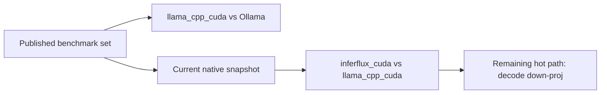

# InferFlux Benchmarks and Performance Analysis

**Status:** Current  
**Snapshot date:** March 29, 2026  
**Primary hardware:** NVIDIA RTX 4000 Ada (20 GB)

## 1) Contract Table

| Question | Current answer |
|---|---|
| Which CUDA backend is the best concurrent GGUF choice today? | `llama_cpp_cuda` |
| Which benchmark claim is fully published and stable? | `llama_cpp_cuda` vs Ollama |
| What is the current native CUDA status? | `inferflux_cuda` is competitive around `c=4` in the current Windows harness, but still behind at `c=8` |
| What is the next optimization target? | Decode down-proj row-pair and row-quad kernels |

## 2) Published Competitive Result

These numbers remain the repo's validated public benchmark claim for concurrent GGUF serving:

| Metric | InferFlux `llama_cpp_cuda` | Ollama | Advantage |
|---|---|---|---|
| 16 concurrent agents | 277 tok/s | 76 tok/s | 3.7x |
| 8 concurrent agents | 206 tok/s | 80 tok/s | 2.6x |
| 4 concurrent agents | 176 tok/s | 80 tok/s | 2.2x |
| Single agent | 107 tok/s | 52 tok/s | 2.0x |
| GPU memory usage | 9.7 GB | 13.3 GB | 27% less |

Reading:
- `llama_cpp_cuda` is still the best balanced CUDA backend in this repo for concurrent GGUF traffic.
- This result should not be confused with the current state of `inferflux_cuda`.

## 3) Current Native CUDA Snapshot

Representative Windows-native harness run on March 29, 2026 using:
- model: `Qwen2.5-3B-Instruct Q4_K_M`
- requests: `16`
- max tokens: `32`
- scheduler: `batch_accumulation_ms=2`
- endpoint: `/v1/chat/completions`

| Metric | `inferflux_cuda` | `llama_cpp_cuda` | Ratio |
|---|---|---|---|
| c=4 throughput | 182.9 tok/s | 182.9 tok/s | 1.00x |
| c=8 throughput | 210.0 tok/s | 268.1 tok/s | 0.78x |

Interpretation:
- `inferflux_cuda` is no longer a purely theoretical path; it is running live optimized kernels and is competitive in some decode envelopes.
- `llama_cpp_cuda` still has the better sustained concurrency profile.
- The latest live operator metrics show FFN grouped MMQ3 is already active, so more FFN fusion alone will not close the remaining gap.

### March 31 Snapshot (MMQ Accumulate and Lane Overlap Fixes)

Commit `0ccbad3` added MMQ accumulate kernels for M=9-64 residual fusion, fixed a lane overlap heap corruption race via `lane_overlap_mutex_` in `ExecuteLaneBatchForAsync` and `ReleaseBatchScopedDequantizedCache`, and re-enabled CUDA graphs on the primary forward instance during lane overlap. Commit `7561fc7` made `decode_relay_active_` and `decode_relay_batch_size_` atomic.

Representative Windows-native harness run on March 31, 2026 using:
- model: `Qwen2.5-3B-Instruct Q4_K_M`
- requests: `32`
- max tokens: `64`
- endpoint: `/v1/chat/completions`

| Metric | `inferflux_cuda` |
|---|---|
| c=1 throughput | 65.6 tok/s (32/32 completions) |
| c=4 throughput | 148.3 tok/s (32/32 completions) |
| c=8 throughput | 174.6 tok/s (32/32 in best runs, ~75% stability) |

Interpretation:
- c=8 now completes all 32 requests in best runs, up from frequent failures before the lane overlap mutex fix.
- A residual intermittent crash at c=8 (~25% failure rate) is tracked but not yet fully resolved.
- These numbers are not directly comparable to the March 29 snapshot (different request count and max token length). Re-validation against `llama_cpp_cuda` under the same parameters is pending.

## 4) Live Operator Reading

Recent decode metrics from the same native probe showed:

| Area | Live reading |
|---|---|
| FFN gate/up | `q8_1_group_mmq3` was active for `M=3_4` and `M=5_8` decode buckets |
| Down-proj | decode was dominated by `q8_1_gemv_row_pair` and `q8_1_gemv_row_quad` |
| MMQ use | no broad down-proj MMQ promotion was kept as default after serving rechecks |
| Q6_K accumulate path | vectorized accumulate MMVQ is now implemented, but broad serving gains are still workload-sensitive |

This is the important engineering conclusion from the current codebase:
- the remaining native throughput problem is centered on decode down-proj cost
- the next credible wins are kernel-path wins, not more selector-only relabeling

## 5) Methodology Notes

| Item | Current practice |
|---|---|
| Public multi-backend claim | Keep `llama_cpp_cuda` vs Ollama as the published repo-level benchmark |
| Native CUDA progress tracking | Use the Windows-native harness with `benchmark_request_driver.py` and explicit chat payloads |
| Benchmark hygiene | Compare backends under the same request matrix; keep local artifacts out of the release surface |
| Interpretation rule | Do not promote selector changes as wins unless serving throughput improves in repeated probes |

## 6) Recommended Backend Choice

| Use case | Recommended backend |
|---|---|
| Concurrent GGUF serving | `llama_cpp_cuda` |
| Native CUDA kernel development | `inferflux_cuda` |
| Safetensors-native CUDA path | `inferflux_cuda` |
| Compatibility-first production fallback | `llama_cpp_cuda` |

## 7) What Changed in This Review

| Old reading | Updated reading |
|---|---|
| `inferflux_cuda` broadly does not scale at all | it is now competitive in some Windows-native envelopes, but still behind at sustained concurrency |
| FFN fusion is the main remaining native gap | FFN grouped MMQ3 is already active; decode down-proj is the hotter remaining path |
| Benchmark harness was interchangeable across endpoints | chat/completions payload shape had to be fixed before native numbers became trustworthy |

## 8) References

- [README](../README.md)
- [TechDebt_and_Competitive_Roadmap](TechDebt_and_Competitive_Roadmap.md)
- [Roadmap](Roadmap.md)
- [benchmark_multi_backend_steps](benchmark_multi_backend_steps.md)
