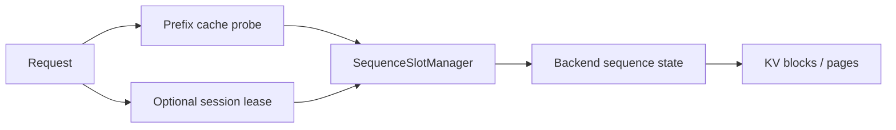

# KV Cache and Slot Lifecycle

**Snapshot date:** March 9, 2026  
**Status:** partial implementation, still blocked on ownership cleanup

## 1) Layer Split

| Layer | Current role | Important limit |
|---|---|---|
| Prefix cache | Token-aligned prefix reuse and block-table accounting | Reuse correctness matters more than aggressive admission heuristics |
| `SequenceSlotManager` | Allocates, tracks, and evicts sequence slots at the scheduler layer | Does not by itself own backend cleanup semantics |
| Backend sequence state | Backend-private per-sequence KV and decode state | Not all backends expose the same copy/free primitives |
| Paged/shared KV | Shared block lifecycle for reuse and accounting | Needs tighter distributed ownership semantics |
| Session lease layer | Optional `session_id -> retained sequence state` mapping | Unified scheduler mode only today |

## 2) Current Code Reality

| Area | Implemented now | Still missing |
|---|---|---|
| Slot lifecycle | `AcquireSlot`, `ReleaseSlot`, `MarkProcessing`, token count updates, idle-timeout eviction candidates | Full backend-owned cleanup on all eviction paths |
| Scheduler integration | Scheduler routes allocation/free through `SequenceSlotManager` | Idle eviction remains conservative until ownership cleanup is fully wired |
| Session reuse | TTL session lease layer stores `{model_id, sequence_id, prompt_tokens, block_table}` | Decode-worker mode support |
| Memory pressure hooks | Slot manager exposes memory-pressure checks and graceful degradation helpers | Strong policy integration and broader test coverage |
| Prefix reuse | Ref-counted block reuse and prefix hit metrics exist | Prefix-aware admission is still foundational, not fully cost-driven |

## 3) What This Design Retires

| Old assumption | Current reading |
|---|---|
| “KV cache” is one thing | In practice there are scheduler slots, backend-private sequence state, and shared prefix/KV blocks |
| Timeout eviction alone is enough | Timeout is only a guardrail until sequence ownership cleanup is deterministic |
| llama.cpp/private backend KV can be tiered transparently | Backend-private KV remains backend-specific; InferFlux can coordinate lifecycle but not magically standardize internal memory layouts |
| Session reuse should be default | API remains stateless by default; leases are optional |

## 4) Practical Memory Model

| Memory plane | Lifecycle |
|---|---|
| Model weights | Shared per model instance |
| Backend-private sequence KV | Allocated/freed by backend sequence ownership |
| Shared prefix/KV blocks | Ref-counted and reusable across requests |
| Session lease state | Small metadata object retaining the sequence/block mapping |

## 5) Next Gates

1. Close backend sequence ownership cleanup in eviction paths.
2. Add ticketed distributed KV handoff before claiming cluster-grade reuse semantics.
3. Promote richer eviction policy only after ownership correctness is closed.

## 6) Related Docs

- [SEQUENCE_SLOT_MANAGER_PLAN](SEQUENCE_SLOT_MANAGER_PLAN.md)
- [SESSION_HANDLE_LAYER_PHASE1](SESSION_HANDLE_LAYER_PHASE1.md)
- [../Architecture](../Architecture.md)
