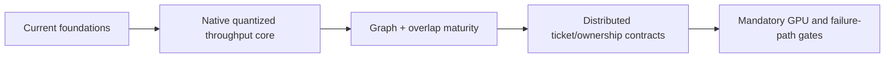

# Native CUDA and Distributed Runtime Uplift Plan

**Snapshot date:** March 9, 2026  
**Status:** active foundation, partial implementation  
**Owner group:** runtime + scheduler + distributed-runtime + QA

## 1) Objective

Raise production-grade throughput and move distributed runtime from scaffold to contract-backed foundation.

## 2) Design Stance

| Principle | Current stance |
|---|---|
| Throughput model | Sync batched execution is the performance path |
| Async model | Async is for admission/collection only if it preserves batch quality |
| Quantized GGUF | Treat as first-class native runtime path, not pre-dequantized compatibility mode |
| Memory economy | Keep weights shared/immutable, KV separate, and dequant policy explicit |
| Session state | Stateless by default; optional TTL session leases remain an upper-layer contract |
| Distributed evolution | Add lifecycle/ownership semantics before claiming scale maturity |

## 3) Current Code Reality

| Pillar | Implemented now | Still missing |
|---|---|---|
| Prefix-aware scheduler foundation | Scheduler policy enum, prefix-affinity scoring, mixed-step knobs, policy metrics | Cost-aware admission is not yet the default scheduling model |
| Native memory foundation | `dequant_cache_policy=none`, `QuantizedWeightMap` policy-aware handling, KV planner, native KV metrics | Hot paths still need wider fused coverage so memory-first mode is also the fast path |
| Native overlap | Sync-path mixed prefill/decode overlap is active | Graph capture and repeatable bucket reuse are still open |
| Native async interface | Async submit/collect scaffolding exists | `SupportsAsyncUnifiedBatch()==false`; native throughput should not depend on per-step async dispatch |
| Session reuse | TTL-based session handle layer in unified scheduler mode | Decode-worker mode ownership-safe session reuse |
| Distributed foundation | Split roles, decode-worker readiness, SHM transport, ticket lifecycle, timeout debt, admin pools visibility, and optional fail-closed admission | Sequence ownership cleanup and broader multi-process fault proof |

## 4) Foundations Already Landed

| Area | Landed work |
|---|---|
| Scheduler | Prefix-affinity scoring, mixed-step tunables, and policy metrics |
| Native GGUF memory path | Memory-first dequant policy and `lm_head` scratch/caching fixes |
| KV lifecycle | Native KV planner, budget-based sequence tuning, and exported planning metrics |
| Session layer | Optional `session_id` lease contract with TTL in unified mode |
| Decode readiness | Decode-only nodes report ready only when weights are loaded, workers are alive, and distributed transport health is below configured debt/streak thresholds |
| Distributed transport health | Ticket lifecycle counters, timeout debt, admin pools contract, and optional fail-closed generation admission |

## 5) Open Phases

### Phase 1: Native throughput core

| Priority | Item | Done when |
|---|---|---|
| P0 | Coverage-complete fused quantized execution for hot GGUF paths | Common decode/prefill envelopes stay native and deterministic |
| P0 | Graph capture buckets | Stable graph capture/reuse exists for repeatable envelopes with hit/fallback metrics |
| P1 | Native-first endpoint parity independence | Critical completion/chat/embeddings flows no longer depend on delegate-backed behavior |
| P1 | Async contract decision | Either remove async debt or re-enable it only via the same sync batched core |

### Phase 2: Distributed runtime foundation

| Priority | Item | Done when |
|---|---|---|
| P1 | Sequence ownership registry | Eviction and cleanup can free backend-owned state deterministically |
| P1 | Session leases with decode workers | Session reuse remains safe in split-role deployments |
| P1 | Multi-process failure matrix | Worker loss, queue pressure, and transport degradation are explicitly tested |

### Phase 3: CI and rollout safety

| Priority | Item | Done when |
|---|---|---|
| P1 | Mandatory GPU behavior lane | Native-provider behavioral regressions block merges |
| P1 | Distributed failure-path CI block | Fault-path coverage is explicit in pipeline logs |
| P2 | Startup advisor integration | Memory and runtime planner decisions are surfaced before boot |

## 6) Definition of Done By Grade

| Target | Required outcomes |
|---|---|
| Throughput to B | Native quantized path is memory-first and performance-credible under representative batch profiles |
| Throughput to B+ | Graph capture, fused hot paths, and CI gates make native performance repeatable instead of benchmark-fragile |
| Distributed runtime to B- | KV handoff, worker health, and sequence ownership are deterministic and fault-tested |

## 7) Risk Controls

1. Do not use async support as a proxy for throughput progress.
2. Keep fallback to `cuda_llama_cpp` deterministic where policy allows.
3. Move grades only when contract gates and runtime evidence agree.
4. Keep session reuse optional until ownership semantics are closed.

## 8) Immediate Next Steps

1. Finish first-class native quantized hot paths so memory-first policy stays enabled by default.
2. Add graph capture buckets and graph-hit observability.
3. Close sequence ownership cleanup and multi-process failure coverage on top of the existing ticketed transport foundation.
