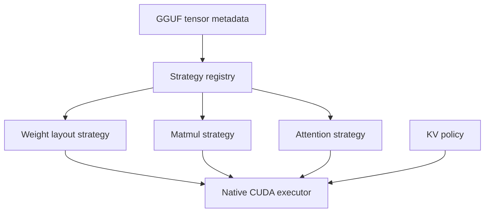

# Native GGUF Quantized Runtime Architecture

**Snapshot date:** March 9, 2026
**Status:** active foundation, broad fused kernel coverage, throughput gap remaining
**See also:** [../GEMV_KERNEL_ARCHITECTURE](../GEMV_KERNEL_ARCHITECTURE.md) for kernel geometry and TDD details.

## 1) Core Architecture

## 2) Runtime Contract

| Plane | Contract |
|---|---|
| Weights | Stay in GGUF-native precision/layout as the source of truth |
| Dequant policy | `none`, `batch`, or `model`; native quantized default is memory-first `none` |
| KV cache | Separate lifecycle from weights; precision is fixed at model-load scope |
| Strategy selection | Deterministic by tensor type, KV precision, and GPU capability |
| API model | Stateless by default; optional session lease sits above the runtime |

## 3) Current Code Reality

| Area | Implemented now | Still missing |
|---|---|---|
| Loader selection | Loader detected from artifact structure/metadata | None at the contract level |
| GEMV kernel coverage | 40+ fused kernels: standard, dp4a, RmsNorm-fused, packed int8, Q8_1 pre-quantized (single/pair/triple/rowpair/rowquad), MMQ down-proj. All via 2D grid `dim3(ceil(N/8), M)`. | Weight bandwidth utilization ~40% vs llama.cpp ~60% |
| Activation quantization | Q8_1 pre-quantized path (per-32-element blocks matching llama.cpp format). Fused RmsNorm+Quantize kernels for norm groups. Activation reuse across sibling projections via L2 cache. | No persistent thread GEMV or kernel fusion across projections |
| Batched decode | BatchedRoPE, BatchedKvAppend, FlashDecodeMultiSeq verified working with 8 concurrent Qwen2.5-3B requests. CUDA graphs captured for B=1-4. Row-pair/quad dispatch active. Opt-in via `INFERFLUX_ENABLE_BATCHED_DECODE=1`. | Promote to default-on after sustained load testing |
| Dispatch policy | Adaptive threshold `base_threshold(SM) * 16/bpw` with geometry-aware boosts. Priority: Q8_1 > packed > fused RmsNorm+GEMV > standard GEMV > cuBLAS. | Threshold tuning is empirical, not auto-calibrated |
| Memory policy | `dequant_cache_policy=none` is the default. Q8_1 path needs zero dequantized caches. | None at the policy level |
| KV policy | KV precision is load-scoped; planner auto-tunes sequence budget against VRAM. `INFERFLUX_NATIVE_KV_MAX_BATCH` / `INFERFLUX_NATIVE_KV_MAX_SEQ` for explicit sizing. | Lower-precision KV needs proof |
| TDD coverage | 100+ kernel correctness tests, 15+ dispatch geometry tests, 7 batched decode tests, 8 metrics tests | GPU CI lane not yet required |

## 4) Design Rules

1. Do not pre-dequantize whole models by default.
2. Keep weight precision and KV precision decoupled.
3. Treat batching quality as the throughput lever; async is not the design target here.
4. Use GGUF metadata, not filenames, as the source of truth for behavior.
5. Mirror vendored `llama.cpp` at the operator-family level: keep a small-envelope path and a tiled path, then select explicitly by geometry.

## 5) Next Gates

| Priority | Gate | Status |
|---|---|---|
| P0 | Close weight bandwidth gap (40% -> 60%+ utilization) | In progress: Q8_1 improved 49%, further vectorization needed |
| P0 | Promote batched decode to default-on | Ready: verified with 8 concurrent Qwen2.5-3B requests + CUDA graph capture. Needs sustained load testing. |
| P0 | Enable CUDA graph capture by default for batched decode | Ready: graphs captured and replayed for B=1-4. Promote alongside batched decode. |
| P1 | Keep memory-first dequant as the default | Done: Q8_1 path needs zero dequant caches |
| P1 | Promote lower-precision KV only after quality proof | Not started |

## 6) Related Docs

- [../GEMV_KERNEL_ARCHITECTURE](../GEMV_KERNEL_ARCHITECTURE.md)
- [NATIVE_CUDA_SGLANG_INSPIRED_EXECUTION_PLAN](NATIVE_CUDA_SGLANG_INSPIRED_EXECUTION_PLAN.md)
- [../GGUF_NATIVE_KERNEL_IMPLEMENTATION](../GGUF_NATIVE_KERNEL_IMPLEMENTATION.md)
- [../MODERNIZATION_AUDIT](../MODERNIZATION_AUDIT.md)
