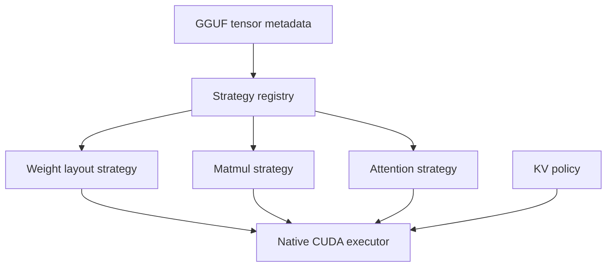

# Native GGUF Quantized Runtime Architecture

**Snapshot date:** March 9, 2026  
**Status:** active foundation, partial hot-path maturity

## 1) Core Architecture

## 2) Runtime Contract

| Plane | Contract |
|---|---|
| Weights | Stay in GGUF-native precision/layout as the source of truth |
| Dequant policy | `none`, `batch`, or `model`; native quantized default is memory-first `none` |
| KV cache | Separate lifecycle from weights; precision is fixed at model-load scope |
| Strategy selection | Deterministic by tensor type, KV precision, and GPU capability |
| API model | Stateless by default; optional session lease sits above the runtime |

## 3) Current Code Reality

| Area | Implemented now | Still missing |
|---|---|---|
| Loader selection | Loader is detected from artifact structure/metadata | None at the contract level |
| Strategy layer | Weight-layout, matmul, and attention strategy selection scaffolding exists | End-to-end execution is not yet fully strategy-driven on every hot path |
| Memory policy | `dequant_cache_policy=none` is the native default; `lm_head` scratch/caching behavior is policy-aware | Wider fused coverage so `none` remains the fast path instead of a conservative path |
| KV policy | KV precision is load-scoped; planner can auto-tune max sequence against a VRAM budget | Lower-precision KV defaults still need proof before promotion |
| Supported GGUF families | `F16`, `Q4_K`, `Q6_K`, `Q8_0`, `Q8_K` foundations are present in parsing/strategy/handler coverage | Sustained quantized heavy-batch performance proof |

## 4) Design Rules

1. Do not pre-dequantize whole models by default.
2. Keep weight precision and KV precision decoupled.
3. Treat batching quality as the throughput lever; async is not the design target here.
4. Use GGUF metadata, not filenames, as the source of truth for behavior.

## 5) Next Gates

| Priority | Gate |
|---|---|
| P0 | Complete fused native hot paths for common quantized decode/prefill envelopes |
| P0 | Keep memory-first dequant as the default while improving throughput |
| P1 | Add graph capture/reuse for repeatable native envelopes |
| P1 | Promote lower-precision KV only after quality and allocator ABI are proven |

## 6) Related Docs

- [NATIVE_CUDA_SGLANG_INSPIRED_EXECUTION_PLAN](NATIVE_CUDA_SGLANG_INSPIRED_EXECUTION_PLAN.md)
- [../GGUF_NATIVE_KERNEL_IMPLEMENTATION](../GGUF_NATIVE_KERNEL_IMPLEMENTATION.md)
- [../MODERNIZATION_AUDIT](../MODERNIZATION_AUDIT.md)
