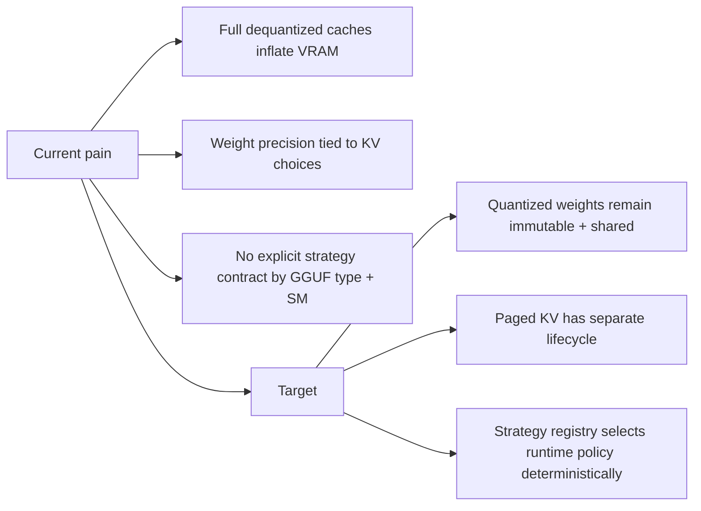
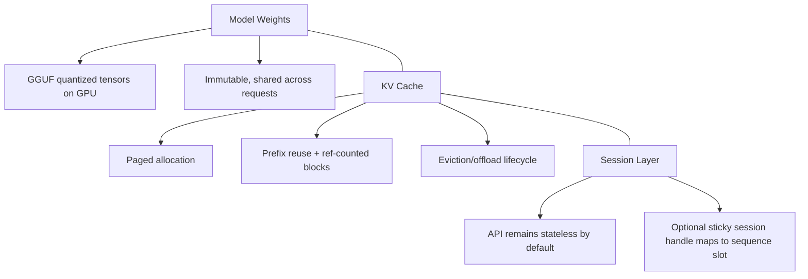
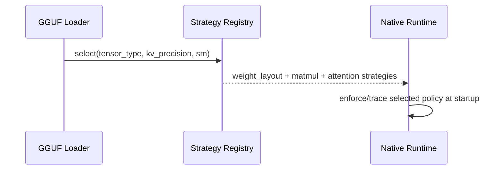

# Native GGUF Quantized Runtime (Foundational Design)

Status: active design + foundational scaffolding merged

## 1) Why this architecture

## 2) Core runtime split

## 3) Strategy contracts (implemented foundation)

- `IWeightLayoutStrategy`: tensor layout policy per GGUF tensor type (`Q4_K`, `Q6_K`, `Q8_0`, `F16`, ...).
- `IMatmulStrategy`: compute policy (`fused dequantize-tile+GEMM` vs compatibility path).
- `IAttentionStrategy`: paged-KV attention policy keyed by KV precision + GPU SM capability.
- `QuantizedRuntimeStrategyRegistry`: deterministic selection by `(tensor_type, kv_precision, sm_major/minor)`.

## 4) Precision policy contract

| Plane | Policy | Current implementation |
|---|---|---|
| Weights | From GGUF tensor metadata | Enabled |
| KV cache | `auto|fp16|bf16|int8|fp8` | `auto/fp16/bf16` active; `int8/fp8` declared + guarded fallback |
| Dequantized temp cache | `batch|model` | `batch` default (memory-efficient), `model` opt-in |

Decision: KV precision is fixed at model-load (server lifecycle), not per request.

Rationale:
- avoids mixed-page ABI fragmentation,
- avoids per-request kernel graph churn,
- keeps scheduler admission deterministic.

## 5) Stateless API + sessions

Default request model remains stateless.

Session-capable behavior is layered above it:
- request without session handle => ephemeral sequence slot,
- request with session handle => stable slot mapping + TTL/eviction policy,
- KV pages remain shared infra, while ownership/refcount controls lifecycle.

This keeps OpenAI-compatible APIs simple while enabling stateful optimization paths.

## 6) Rollout phases

1. Foundation (this change): strategy contracts + registry + KV precision policy decoupling.
2. Runtime enforcement: strict gate to reject unsupported quantized paths when fused kernels required.
3. Kernel progression: replace compatibility matmul path with fused dequantize-tile GEMM by GGUF type.
4. Session layer: optional sticky-session contract with TTL + observability.
5. KV quantization: add INT8/FP8 KV as opt-in once quality/perf gates pass.
