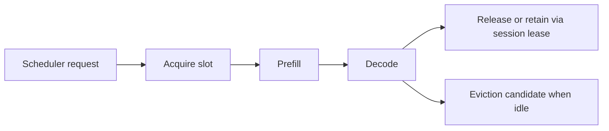

# Sequence Slot Manager

**Snapshot date:** March 9, 2026  
**Status:** implemented foundation, cleanup debt remains

## 1) Purpose

The slot manager is the scheduler-owned source of truth for sequence-slot allocation across backend paths.

## 2) Current Contract

| Capability | Current state |
|---|---|
| Slot acquisition/release | Implemented |
| Idle-timeout eviction candidates | Implemented |
| Processing/last-access tracking | Implemented |
| Token-count tracking | Implemented |
| Thread safety | Implemented |
| Backend cleanup on eviction | Still partial and ownership-sensitive |

## 3) What It Is Not

| Not this | Why |
|---|---|
| A full backend KV manager | Backends still own their private sequence/KV state |
| A distributed ownership registry | That work is still open |
| A guarantee that evicted state is already fully freed everywhere | Cleanup semantics still need tightening |

## 4) Current Design Rules

1. All scheduler-side sequence allocation should route through this manager.
2. Idle eviction should stay conservative until backend ownership cleanup is closed.
3. Session leases may retain slot/sequence state, but only under explicit feature flags.

## 5) Next Gates

| Priority | Gate |
|---|---|
| P1 | Wire deterministic backend cleanup for evicted sequences |
| P1 | Close scheduler ownership gaps before broader distributed rollout |
| P2 | Consider richer eviction policy only after correctness and observability are settled |

## 6) Related Docs

- [KV_CACHE_ARCHITECTURE_DEEP_DIVE_2026_03_04](KV_CACHE_ARCHITECTURE_DEEP_DIVE_2026_03_04.md)
- [SESSION_HANDLE_LAYER_PHASE1](SESSION_HANDLE_LAYER_PHASE1.md)
