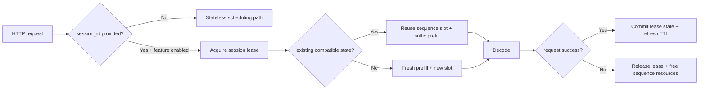
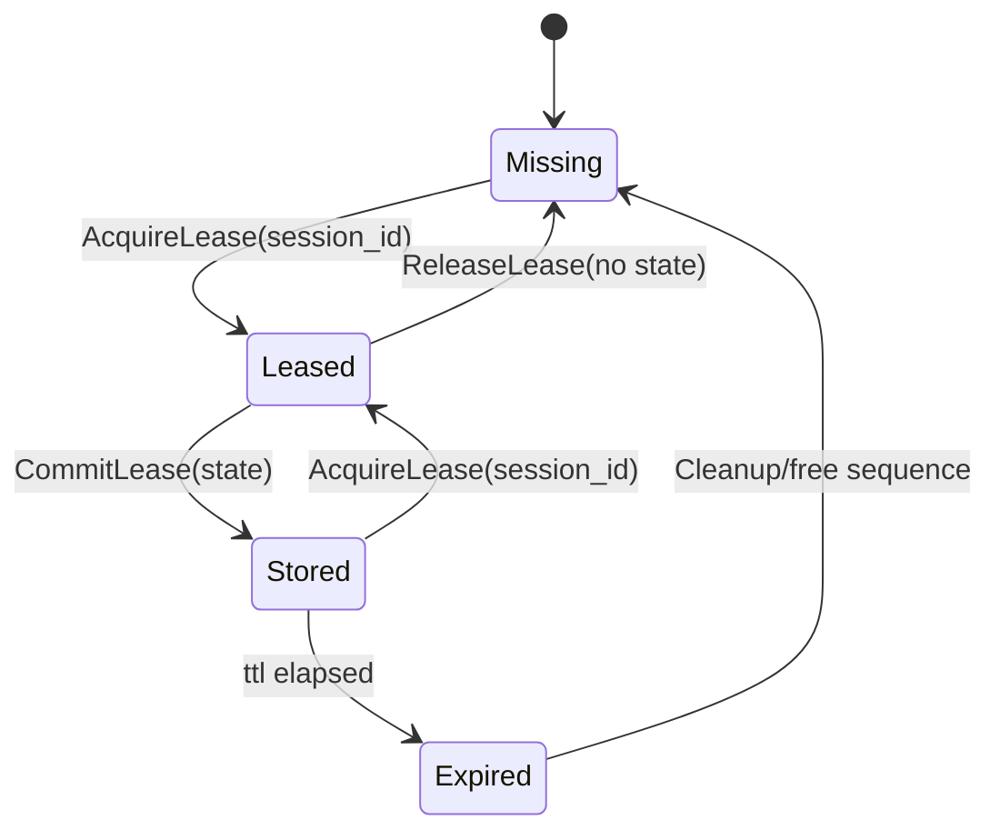

# Session Handle Layer (Phase 1)

## Contract Snapshot

| Item | Contract |
|---|---|
| Default API mode | Stateless (OpenAI-compatible) |
| Optional stateful mode | `session_id` on request + `runtime.scheduler.session_handles.enabled=true` |
| Session mapping | `session_id -> {sequence_slot, sequence_id, block_table, prompt_tokens}` |
| TTL | Configurable (`ttl_ms`), with background expiry cleanup |
| KV precision | Server/model-load scoped (`runtime.cuda.kv_cache_dtype`), never per-session |
| Scope | Unified scheduler mode (decode-worker pool path is out-of-scope for Phase 1) |

## Flow



## Lease State Machine



## Request Contract

- `session_id` may be passed in JSON body (`session_id`) or header (`x-inferflux-session-id`).
- If omitted, server behavior is unchanged and fully stateless.
- Phase 1 expects prompt continuity semantics (new prompt extends previous prompt token prefix for reuse).

## Config

```yaml
runtime:
  scheduler:
    session_handles:
      enabled: false
      ttl_ms: 300000
      max_sessions: 1024
```

Environment overrides:

- `INFERFLUX_SESSION_HANDLES_ENABLED`
- `INFERFLUX_SESSION_TTL_MS`
- `INFERFLUX_SESSION_MAX`
