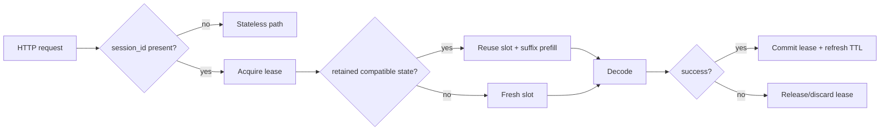

# Session Handle Layer (Phase 1)

**Snapshot date:** March 9, 2026  
**Status:** implemented in unified scheduler mode

## 1) Contract Snapshot

| Item | Contract |
|---|---|
| Default API mode | Stateless (OpenAI-compatible) |
| Optional stateful mode | `session_id` + `runtime.scheduler.session_handles.enabled=true` |
| Session mapping | `session_id -> {model_id, sequence_id, prompt_tokens, block_table}` |
| TTL | Configurable (`ttl_ms`) with expiry cleanup |
| Scope | Unified scheduler mode only; decode-worker mode remains out of scope |
| KV precision | Fixed at model-load scope, never per session |

## 2) Flow



## 3) Current Code Reality

| Area | Implemented now |
|---|---|
| Request surface | `session_id` accepted in JSON body or `x-inferflux-session-id` header |
| Lease semantics | single in-flight lease per session |
| Retained state | model ID, sequence ID, prompt tokens, block table |
| Cleanup | TTL expiry, capacity eviction, and drain-on-shutdown paths exist |
| Test coverage | focused manager and scheduler unit tests exist |

## 4) Current Limits

1. Disabled when decode-worker mode is enabled.
2. Not a distributed session ownership protocol.
3. Meant to preserve optional sticky reuse, not to redefine the API as stateful.

## 5) Config

```yaml
runtime:
  scheduler:
    session_handles:
      enabled: false
      ttl_ms: 300000
      max_sessions: 1024
```

Environment overrides:

- `INFERFLUX_SESSION_HANDLES_ENABLED`
- `INFERFLUX_SESSION_TTL_MS`
- `INFERFLUX_SESSION_MAX`

## 6) Related Docs

- [SEQUENCE_SLOT_MANAGER_PLAN](SEQUENCE_SLOT_MANAGER_PLAN.md)
- [../Architecture](../Architecture.md)
- [../MODERNIZATION_AUDIT](../MODERNIZATION_AUDIT.md)
