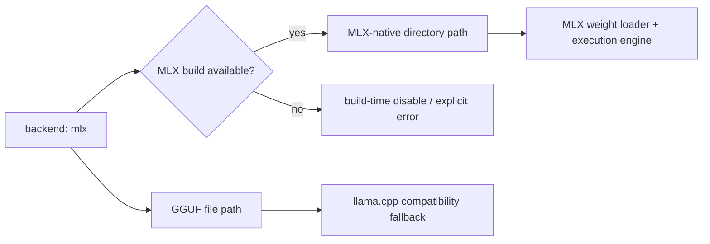

# MLX Backend Design Note

**Snapshot date:** March 9, 2026  
**Status:** implemented foundation, not yet a top-priority performance path

## 1) Current Shape

## 2) Current Code Reality

| Area | Current state |
|---|---|
| Build toggle | `ENABLE_MLX` and `INFERFLUX_HAS_MLX` are wired in CMake |
| Backend class | `MlxBackend` exists and is selectable through backend factory |
| Native artifact path | Directory-based MLX/safetensors path is handled by `MlxWeightLoader` + `MlxExecutionEngine` |
| GGUF path | GGUF file paths delegate to the llama.cpp base path |
| Tests | MLX loader/backend/execution tests exist, guarded by build capability |

## 3) What This Backend Is For

| Use | Current reading |
|---|---|
| Apple Silicon / Metal-aligned path | Valid long-term hardware breadth direction |
| Near-term throughput leadership | Not the current priority; native CUDA and distributed work matter more |
| Compatibility | Useful, but GGUF compatibility is still stronger through llama.cpp-backed paths |

## 4) Current Limits

1. MLX is present as a real backend, but it is still not the main optimization focus.
2. GGUF still rides the compatibility path here.
3. Feature and perf maturity are behind the core CUDA work.

## 5) Design Rules

1. Keep MLX behind the shared backend factory and common contracts.
2. Do not fork the control plane for MLX-specific behavior.
3. Grow capability flags only when the backend truly owns the feature.

## 6) Next Gates

| Priority | Gate |
|---|---|
| P1 | Clarify and harden the MLX-native artifact contract |
| P1 | Expand capability reporting only for features MLX truly owns |
| P2 | Revisit performance work once CUDA throughput and distributed foundations are stronger |

## 7) Related Docs

- [Backend_Parity_LlamaCpp_CUDA_MLX](Backend_Parity_LlamaCpp_CUDA_MLX.md)
- [../Architecture](../Architecture.md)
